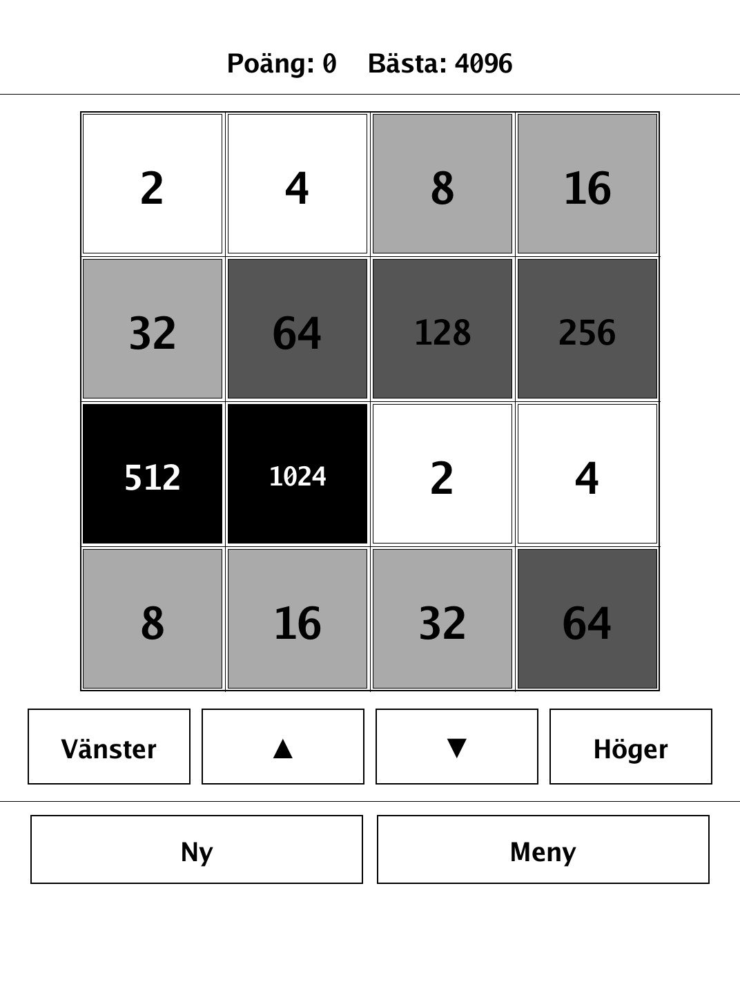
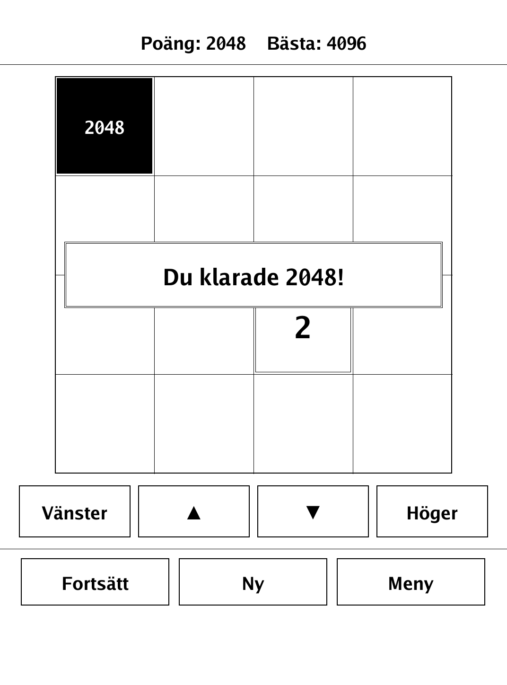
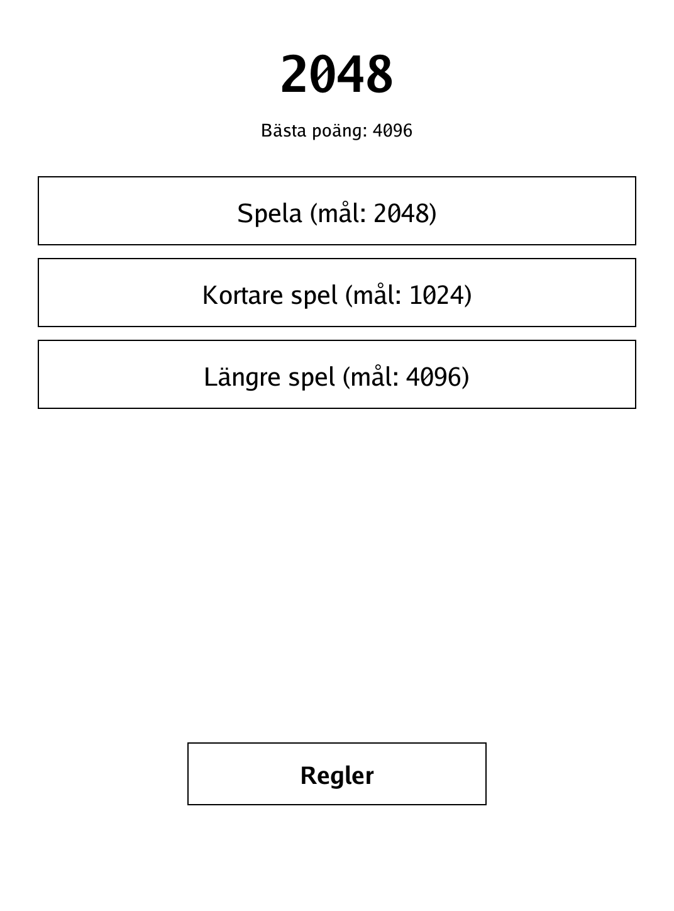
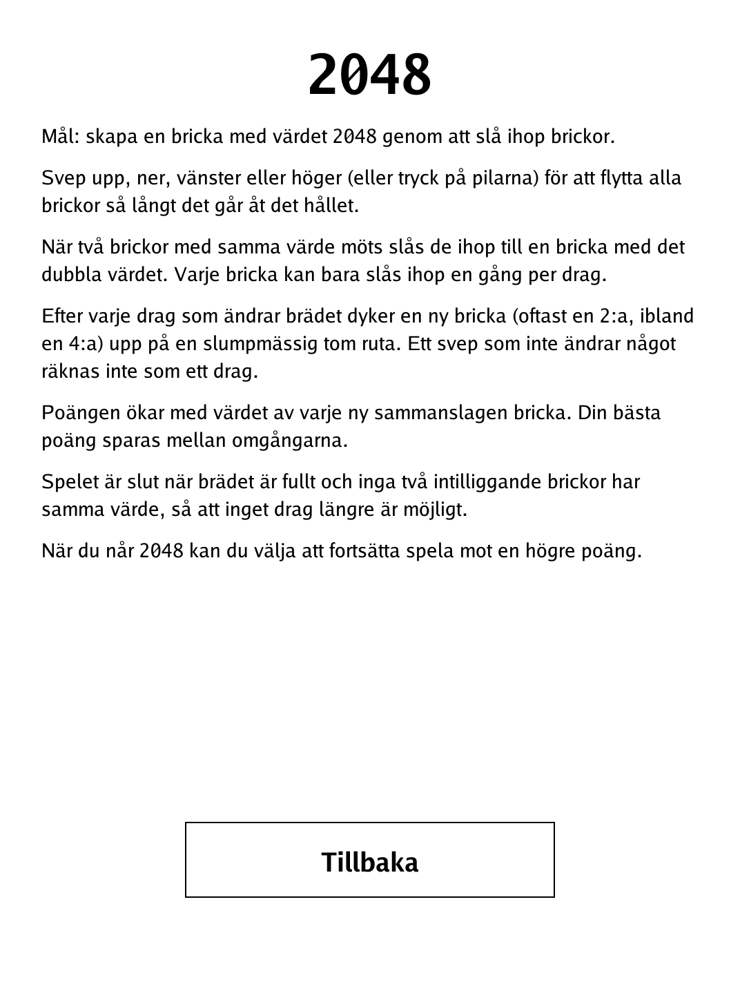

# 2048 (`2048.app`)

Slide and merge numbered tiles on a 4x4 grid until one reads 2048.

<p align="center"></p>

## About

2048 is the single-player sliding-tile puzzle popularised by Gabriele Cirulli in 2014. Every move slides all tiles in one direction and merges equal pairs into their sum; a fresh tile appears after each move, and the board slowly fills. This PocketBook build is untimed, keeps a persistent best score between rounds, and offers shorter and longer variants alongside the classic goal of reaching 2048.

## How to play

- **Goal:** merge tiles to create a tile worth 2048. When you reach it you may keep playing for a higher score.
- **Moving:** swipe up, down, left or right on the touchscreen — or tap the on-screen arrow buttons — to push every tile as far as it goes in that direction.
- **Merging:** two tiles of the same value that collide fuse into one tile of double the value. Each tile can only merge once per move.
- **New tiles:** after any move that changes the board, a new tile (usually a 2, sometimes a 4) appears on a random empty square. A swipe that changes nothing is not counted as a move.
- **Scoring:** your score rises by the value of each merged tile, and your best score is saved between rounds.
- **Game over:** the game ends when the board is full and no two neighbouring tiles are equal, so no move is possible.
- **Modes:** choose the standard goal of 2048, a shorter game (goal 1024), or a longer game (goal 4096) from the menu.

## Screenshots

<table>
  <tr>
    <td align="center"><br><sub>A game in progress</sub></td>
    <td align="center"><br><sub>Reaching the 2048 tile</sub></td>
  </tr>
  <tr>
    <td align="center"><br><sub>Menu with game modes</sub></td>
    <td align="center"><br><sub>In-app rules</sub></td>
  </tr>
</table>

## Building

Built against the PocketBook Go SDK — see the repo [README](../README.md) and [POCKETBOOK_GAMEDEV_GUIDE.md](../POCKETBOOK_GAMEDEV_GUIDE.md).

```bash
docker run --rm -v "$PWD/2048:/app" -w /app sunsung/pocketbook-go-sdk:latest build -o 2048.app .
```

Copy `2048.app` into the device's `applications/` folder. Headless tests: `playtest/play.sh 2048`.

*Based on 2048 by Gabriele Cirulli (2014).*
