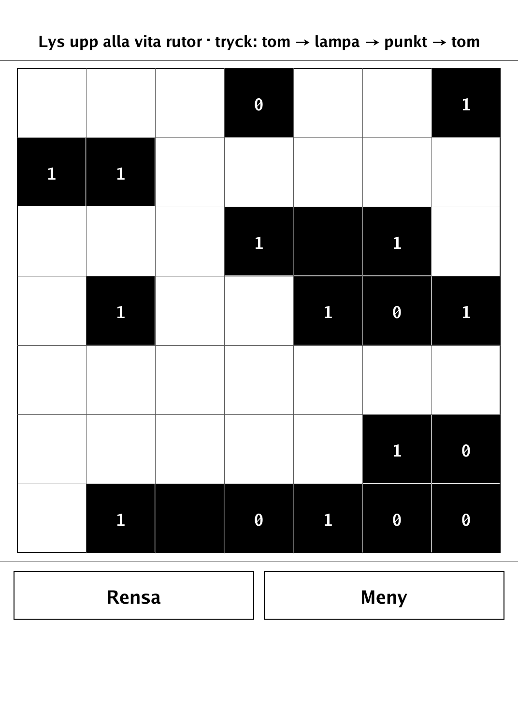
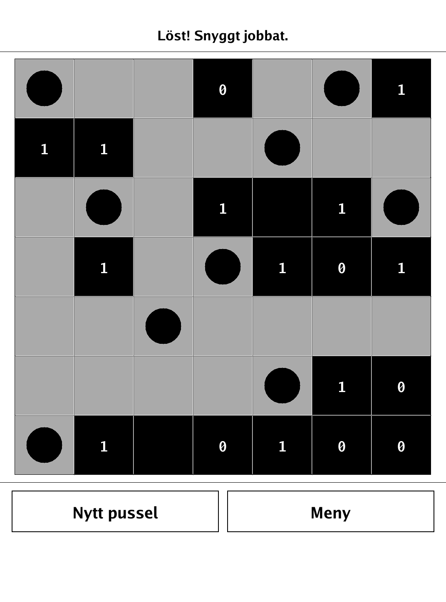
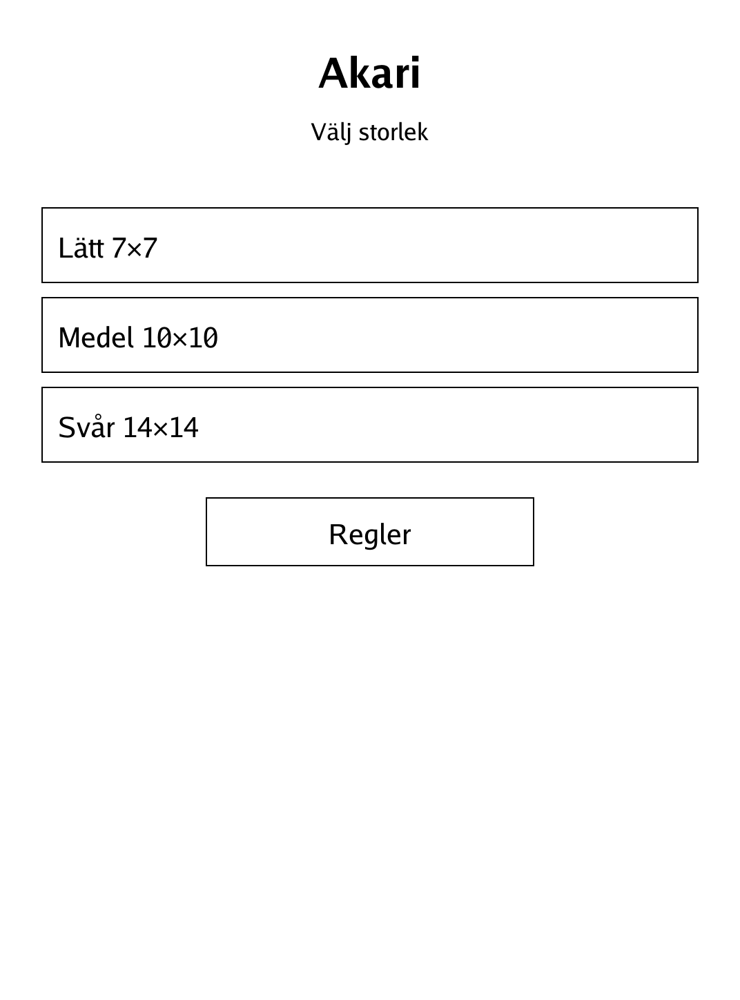

# Akari (Light Up) (`akari.app`)

Place light bulbs so every white cell is lit, without any two bulbs shining on each other.

<p align="center"></p>

## About

Akari — also known as Light Up — is a solo logic puzzle from the Japanese publisher Nikoli. You light up a grid of white cells by placing bulbs, obeying numbered wall clues, with no guessing ever required. This PocketBook build generates every puzzle to be uniquely solvable by pure logic and offers three sizes; the in-app rules and a "known-empty" dot marker help you reason your way to the single solution.

## How to play

- **Goal:** place bulbs so that every white cell is lit and no bulb shines on another.
- **Lighting:** a bulb lights its own cell and shines along its row and column until a wall blocks it.
- **The no-see rule:** two bulbs may never light each other — no bulb may sit in another bulb's line of sight.
- **Wall clues:** a numbered wall must have exactly that many bulbs in the cells directly adjacent to it.
- **Input:** tapping a white cell cycles it through empty → bulb → dot ("known empty", a note to yourself) → empty. Wall cells are inert. Use **Rensa** to clear the board and **Meny** to leave.
- **Winning:** you win when every white cell is lit and all rules hold; conflicting bulbs are flagged so you can spot mistakes.
- **Modes:** choose Lätt 7×7, Medel 10×10, or Svår 14×14 from the menu. Every generated puzzle has exactly one logical solution.

## Screenshots

<table>
  <tr>
    <td align="center"><br><sub>A fresh puzzle</sub></td>
    <td align="center"><br><sub>Solved — every cell lit</sub></td>
  </tr>
  <tr>
    <td align="center"><br><sub>Menu with puzzle sizes</sub></td>
    <td align="center"><br><sub>In-app rules</sub></td>
  </tr>
</table>

## Building

Built against the PocketBook Go SDK — see the repo [README](../README.md) and [POCKETBOOK_GAMEDEV_GUIDE.md](../POCKETBOOK_GAMEDEV_GUIDE.md).

```bash
docker run --rm -v "$PWD/akari:/app" -w /app sunsung/pocketbook-go-sdk:latest build -o akari.app .
```

Copy `akari.app` into the device's `applications/` folder. Headless tests: `playtest/play.sh akari`.

*Based on Akari (Light Up), a puzzle by Nikoli.*
