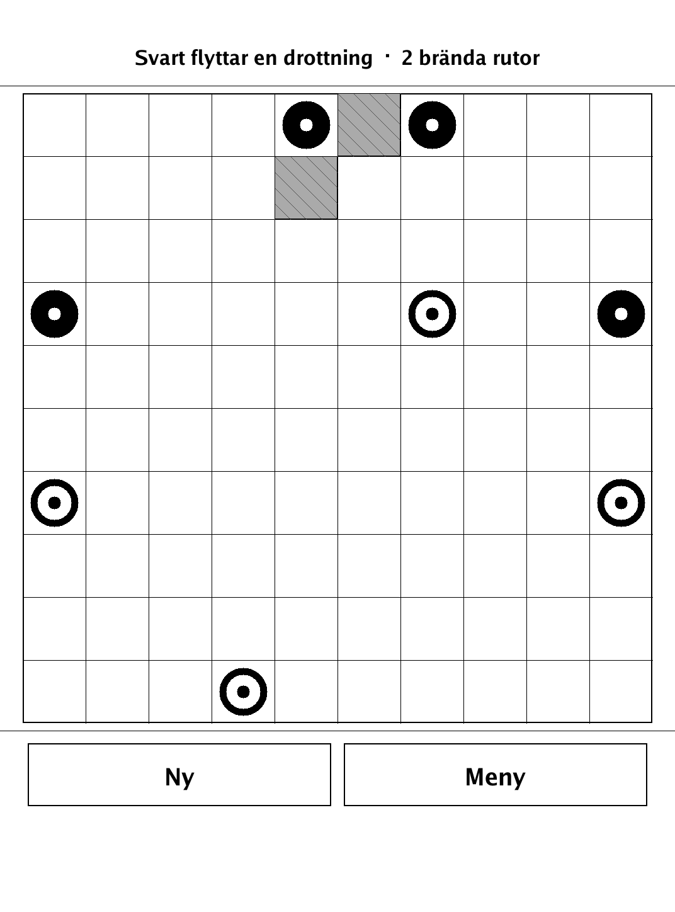
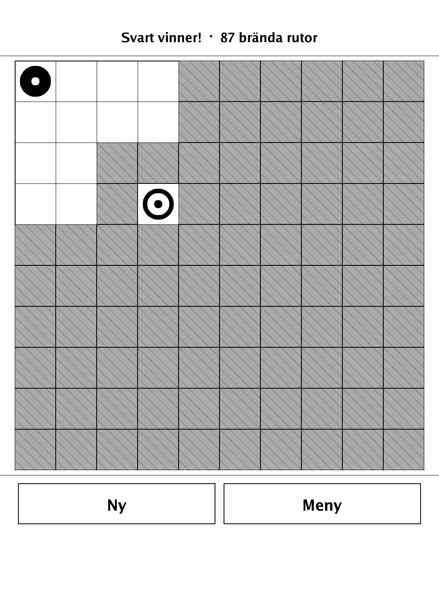
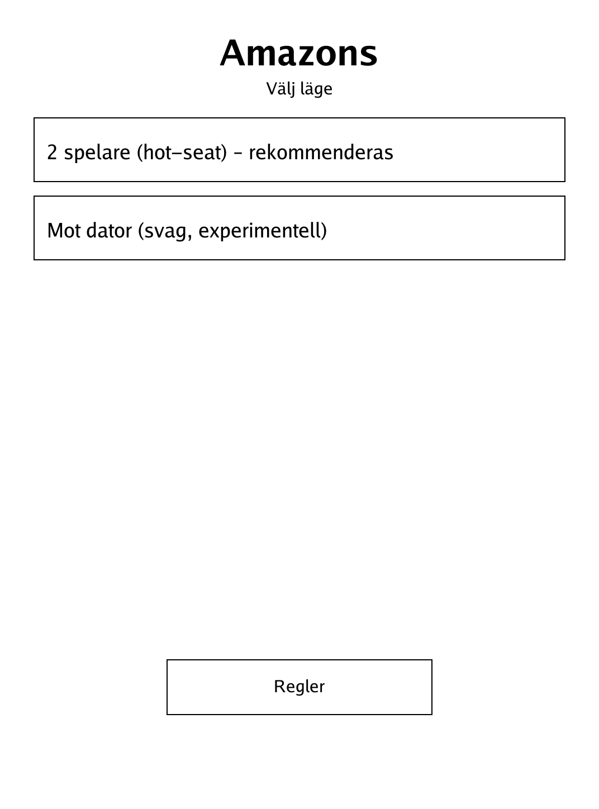
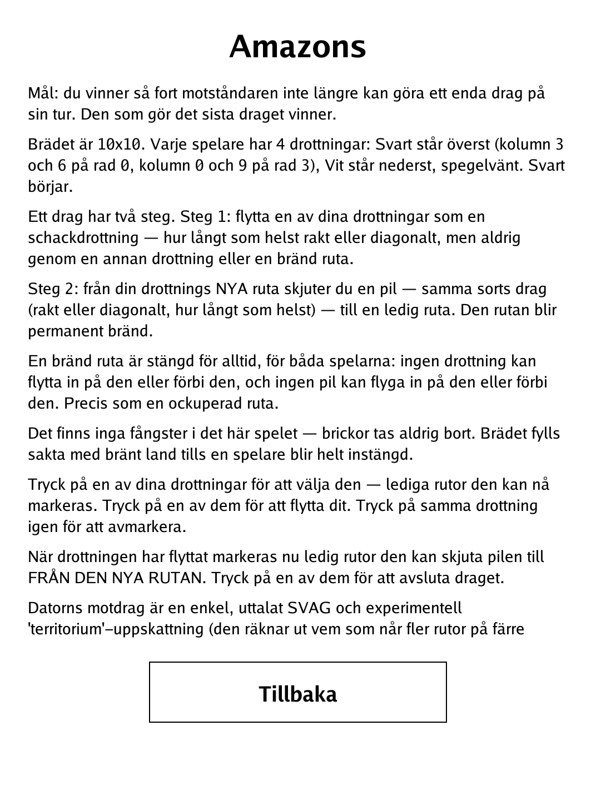

# Amazons (Game of the Amazons) (`amazons.app`)

Move your queens and burn away the board until your opponent has no move left.

<p align="center"></p>

## About

The Game of the Amazons is an abstract territory game invented in 1988 by Walter Zamkauskas in Argentina. Each side commands four chess-queen-like pieces on a 10x10 board; every turn a queen moves and then shoots an arrow that permanently burns a square out of play, so the board steadily shrinks until one side is trapped. This PocketBook build is best played two-player hot-seat, but also offers a deliberately weak, experimental territory-heuristic AI (honestly labelled as such in-app).

## How to play

- **Goal:** you win the moment your opponent cannot make a single legal move. The player who makes the last move wins.
- **Setup:** the board is 10x10 with four queens per side. Black moves first.
- **A turn has two steps** (all by tapping the touchscreen):
  - **Move:** tap one of your queens to select it (reachable squares are highlighted), then tap a destination. A queen moves like a chess queen — any distance, straight or diagonal — but never through another queen or a burned square. Tap the same queen again to deselect.
  - **Shoot:** from the queen's new square, tap an empty square to fire an arrow (same straight-or-diagonal movement). That square becomes permanently burned.
- **Burned squares:** a burned square is closed forever, for both players — no queen or arrow may land on it or pass through it. There are no captures; pieces are never removed.
- **Modes:** play hot-seat against a friend (the recommended mode) or against the built-in AI, which is intentionally weak and experimental rather than a deep search.

## Screenshots

<table>
  <tr>
    <td align="center"><br><sub>A game in progress</sub></td>
    <td align="center"><br><sub>A player is boxed in — game over</sub></td>
  </tr>
  <tr>
    <td align="center"><br><sub>Menu: hot-seat or AI</sub></td>
    <td align="center"><br><sub>In-app rules</sub></td>
  </tr>
</table>

## Building

Built against the PocketBook Go SDK — see the repo [README](../README.md) and [POCKETBOOK_GAMEDEV_GUIDE.md](../POCKETBOOK_GAMEDEV_GUIDE.md).

```bash
docker run --rm -v "$PWD/amazons:/app" -w /app sunsung/pocketbook-go-sdk:latest build -o amazons.app .
```

Copy `amazons.app` into the device's `applications/` folder. Headless tests: `playtest/play.sh amazons`.

*Based on the Game of the Amazons, invented by Walter Zamkauskas (1988) — a freely available abstract game with no owner or licence.*
