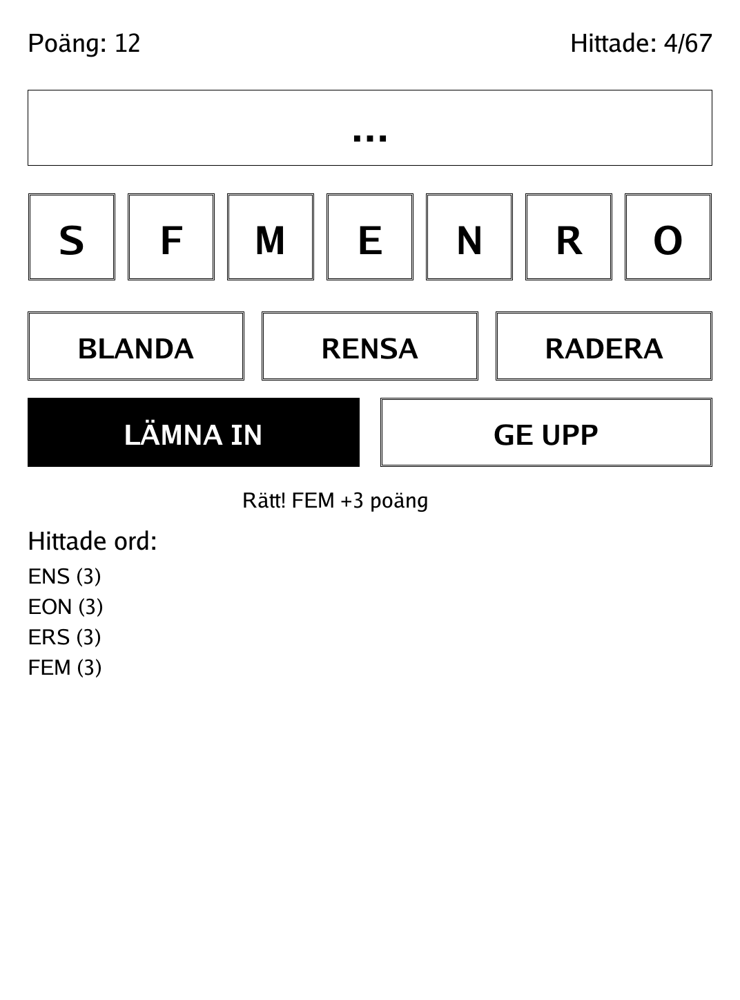
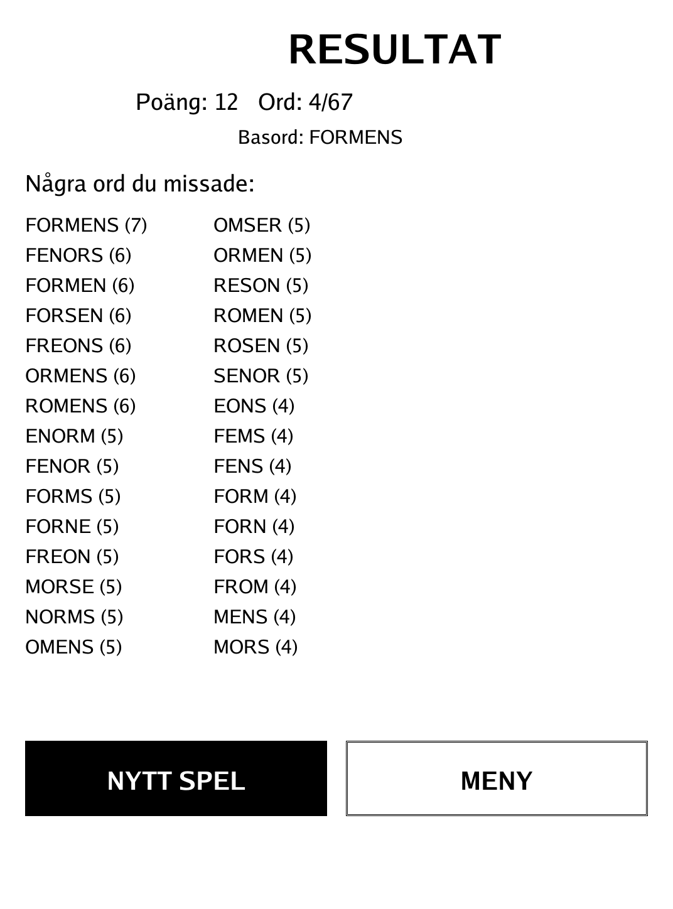
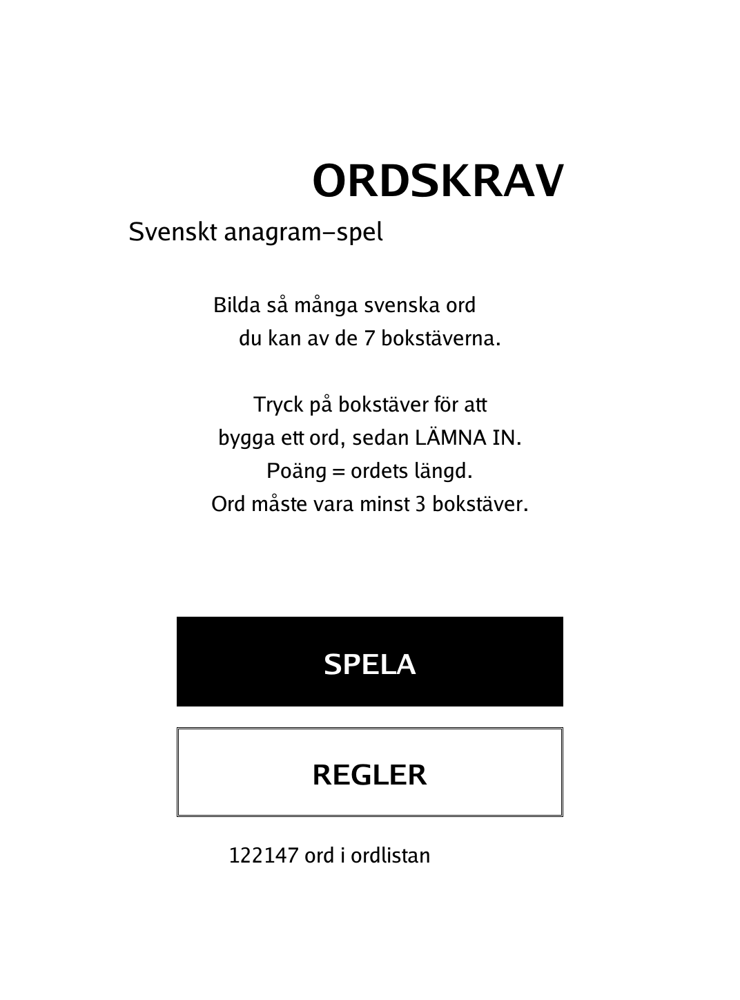
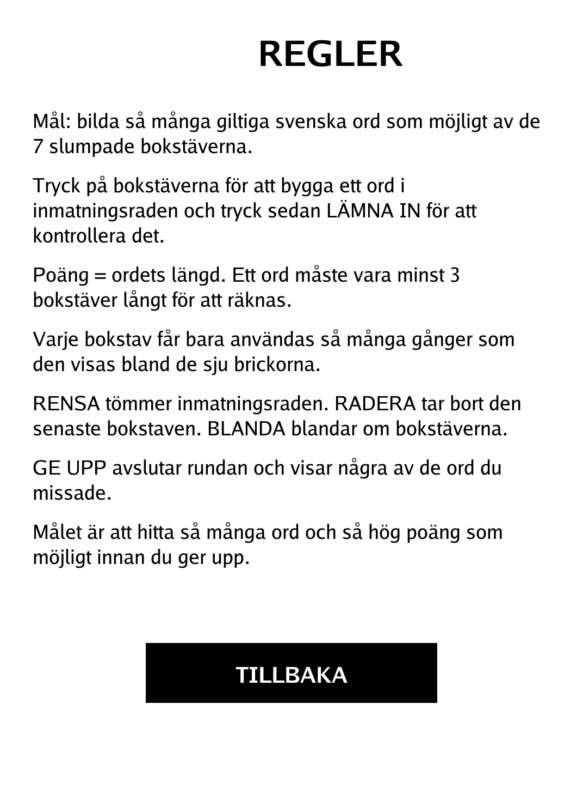

# Ordskrav (Anagram) (`anagram.app`)

Build as many valid Swedish words as you can from seven shuffled letters.

<p align="center"></p>

## About

Ordskrav is a solo Swedish anagram word game: you are dealt seven letters and race to spell out every real word hiding inside them. Each round draws from a built-in Swedish dictionary, tracks how many of the possible words you have found, and lets you give up to reveal the ones you missed. This PocketBook build is a relaxed, single-player, untimed word hunt.

## How to play

- **Goal:** form as many valid Swedish words as possible from the seven randomly drawn letters, for as high a score as you can.
- **Building a word:** tap the letter tiles to spell a word in the input row, then tap **LÄMNA IN** to submit it. Each letter may be used only as many times as it appears among the seven tiles.
- **Scoring:** a word scores its length in points. Words must be at least 3 letters long; too-short entries, non-words, and words you have already found are rejected.
- **Helpers:** **RENSA** empties the input row, **RADERA** removes the last letter, and **BLANDA** shuffles the tiles (the letters stay the same).
- **Ending a round:** **GE UPP** ends the round and reveals some of the words you missed. The header shows your running score and how many of the possible words you have found.
- **Input:** everything is done by tapping the touchscreen.

## Screenshots

<table>
  <tr>
    <td align="center"><br><sub>A round in progress with found words</sub></td>
    <td align="center"><br><sub>Give-up screen with missed words</sub></td>
  </tr>
  <tr>
    <td align="center"><br><sub>Main menu</sub></td>
    <td align="center"><br><sub>In-app rules</sub></td>
  </tr>
</table>

## Building

Built against the PocketBook Go SDK — see the repo [README](../README.md) and [POCKETBOOK_GAMEDEV_GUIDE.md](../POCKETBOOK_GAMEDEV_GUIDE.md).

```bash
docker run --rm -v "$PWD/anagram:/app" -w /app sunsung/pocketbook-go-sdk:latest build -o anagram.app .
```

Copy `anagram.app` into the device's `applications/` folder. Headless tests: `playtest/play.sh anagram`.
