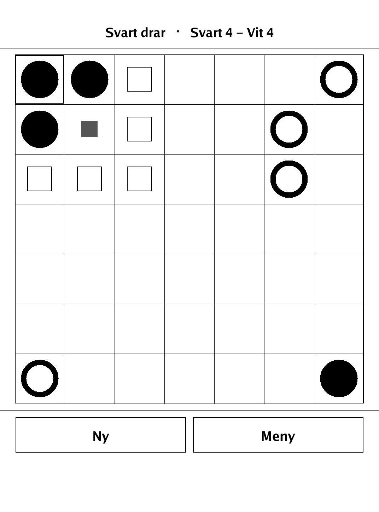
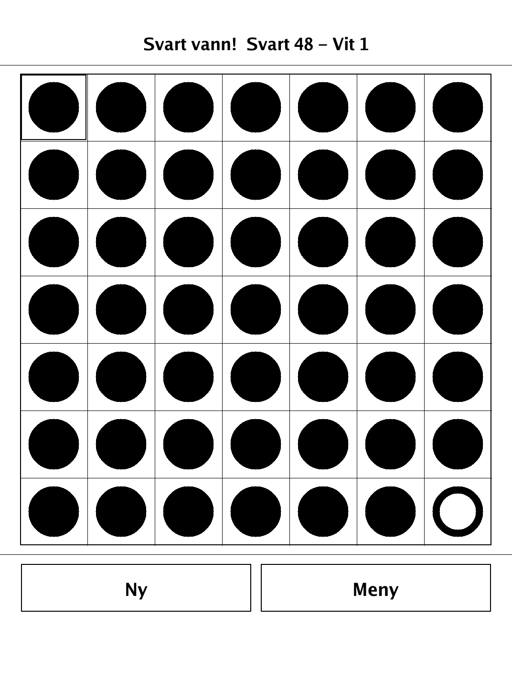
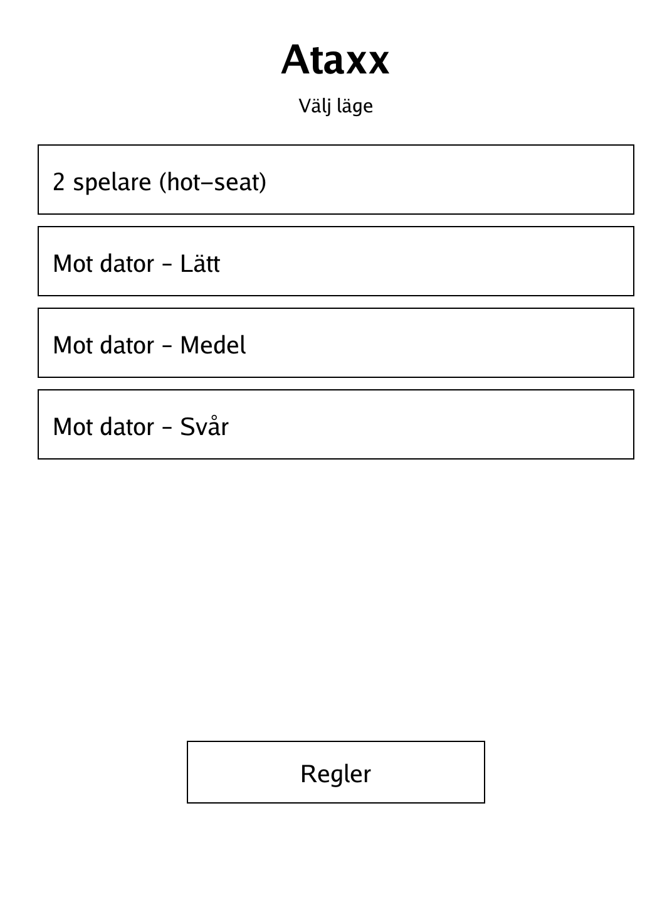
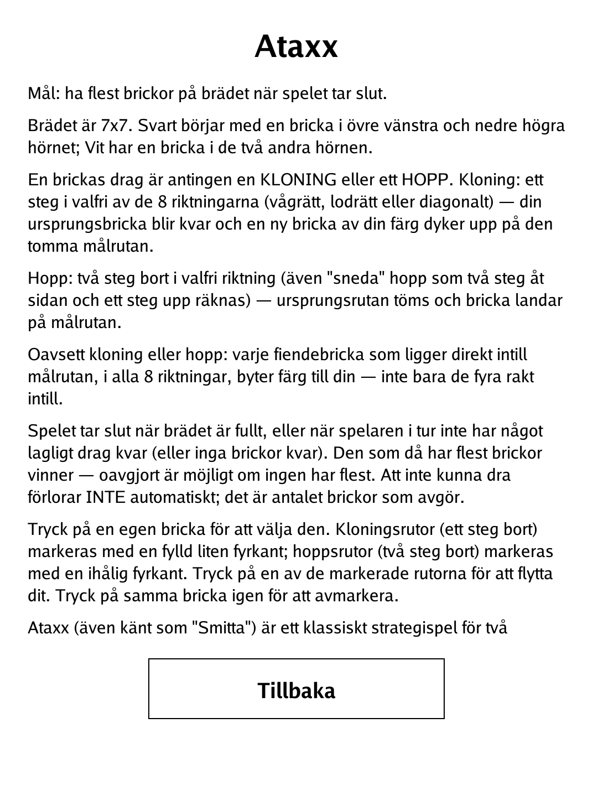

# Ataxx (`ataxx.app`)

Clone and jump your men across a 7x7 board, flipping your opponent's pieces to outnumber them.

<p align="center"></p>

## About

Ataxx (also known as "Smitta") is a classic two-player strategy game that originated in the arcades of the 1990s. Each turn you either clone a man to grow your force or jump one across the board, and any enemy man next to where you land is infected and switches to your colour. This PocketBook build supports hot-seat play against a friend or a built-in alpha-beta AI with three difficulty levels.

## How to play

- **Goal:** have the most men on the board when the game ends.
- **Setup:** the 7x7 board starts with Black in the top-left and bottom-right corners and White in the other two. Each move is a clone or a jump:
  - **Clone:** move one step in any of the 8 directions. Your original man stays put and a new man of your colour appears on the empty destination.
  - **Jump:** move two steps away in any direction (including "bent" jumps). The source cell is emptied and the man lands on the destination.
- **Infection:** clone or jump, every enemy man directly next to the destination — in all 8 directions, not just the four orthogonal ones — flips to your colour.
- **Input:** tap one of your men to select it; clone squares are marked with a filled square and jump squares with a hollow one. Tap a marked square to move there, or tap the same man again to deselect.
- **Ending:** the game ends when the board fills or the player to move has no legal move (or no pieces). Whoever has more men then wins — ties are possible, and being unable to move is *not* an automatic loss; only the piece count decides.
- **Modes:** play hot-seat, or against the AI at Easy, Medium, or Hard search depth.

## Screenshots

<table>
  <tr>
    <td align="center"><br><sub>A game in progress with move hints</sub></td>
    <td align="center"><br><sub>Board full — game over</sub></td>
  </tr>
  <tr>
    <td align="center"><br><sub>Menu: hot-seat or AI difficulty</sub></td>
    <td align="center"><br><sub>In-app rules</sub></td>
  </tr>
</table>

## Building

Built against the PocketBook Go SDK — see the repo [README](../README.md) and [POCKETBOOK_GAMEDEV_GUIDE.md](../POCKETBOOK_GAMEDEV_GUIDE.md).

```bash
docker run --rm -v "$PWD/ataxx:/app" -w /app sunsung/pocketbook-go-sdk:latest build -o ataxx.app .
```

Copy `ataxx.app` into the device's `applications/` folder. Headless tests: `playtest/play.sh ataxx`.

*Based on Ataxx, a classic 1990s arcade strategy game (also known as "Smitta").*
