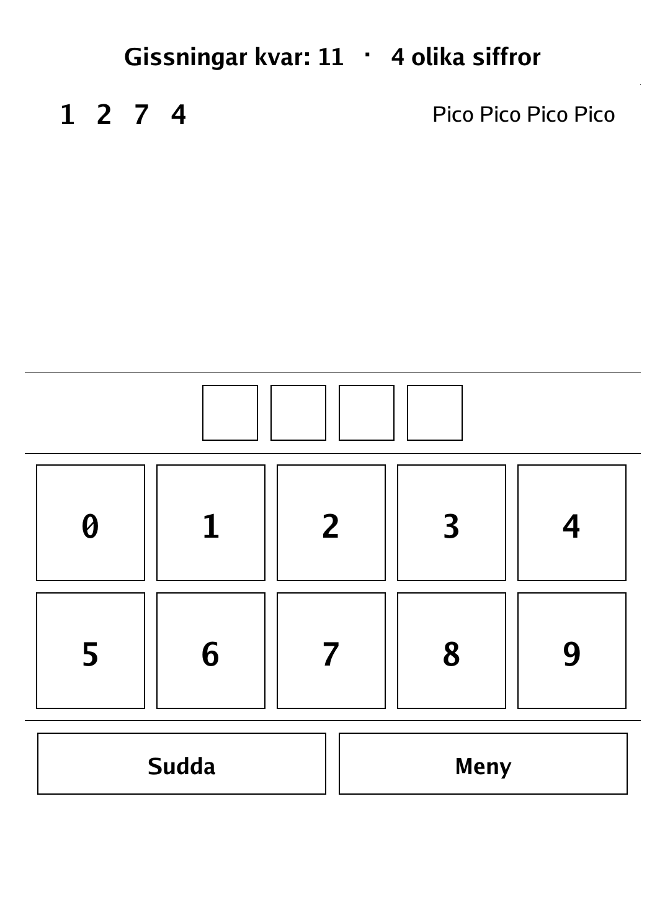
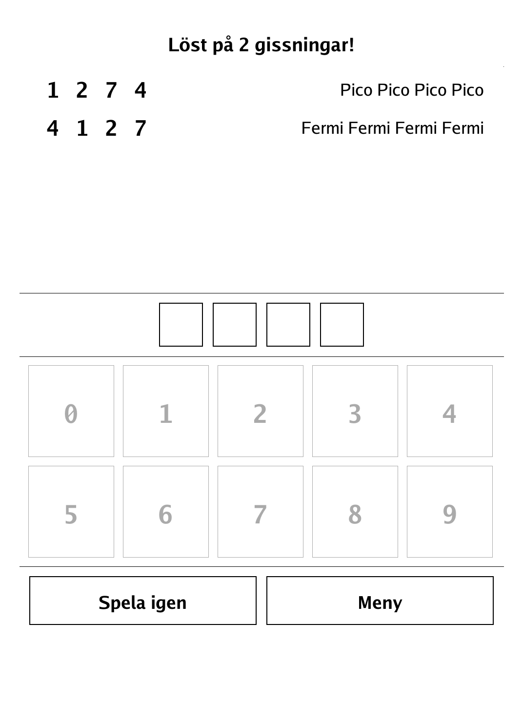
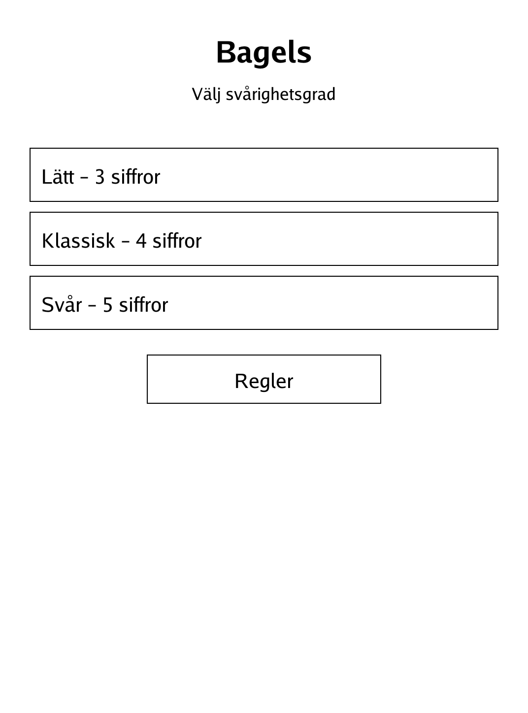
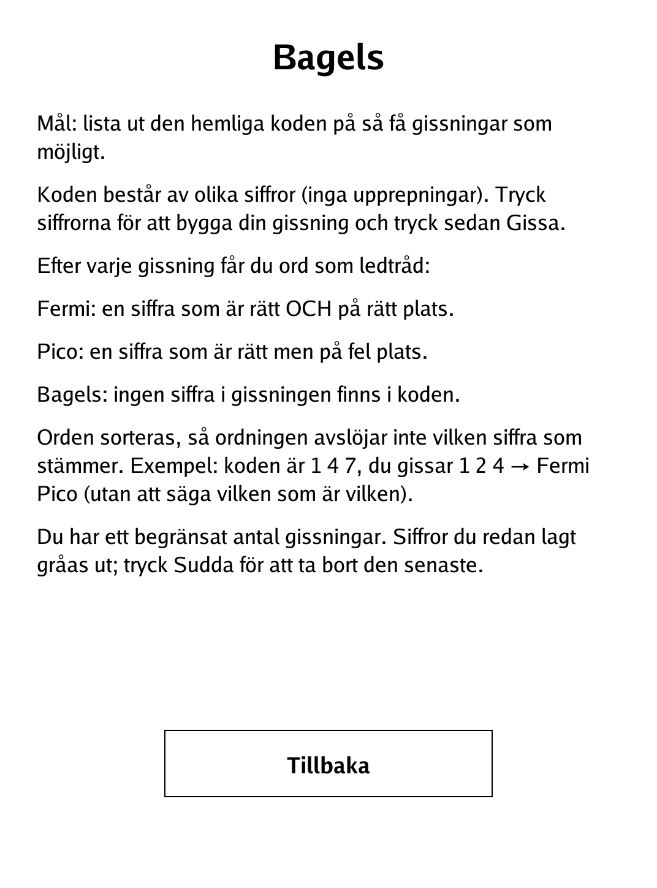

# Bagels (Pico-Fermi-Bagels) (`bagels.app`)

Crack a secret code of distinct digits from word clues, in as few guesses as you can.

<p align="center"></p>

## About

Bagels — also called Pico-Fermi-Bagels — is a classic solo code-breaking game. The game hides a secret code of distinct digits and answers each guess with sorted word clues that tell you how many digits are right, without revealing which. This PocketBook build offers three lengths and gives feedback as words deliberately sorted so their order never gives away which position matched.

## How to play

- **Goal:** work out the secret code in as few guesses as possible.
- **The code:** a sequence of distinct digits (no repeats).
- **Guessing:** tap digits on the keypad to build a guess (each digit you place is greyed out; **Sudda** removes the last one), then tap **Gissa**.
- **The clues**, given as sorted words after each guess:
  - **Fermi** — a digit that is right *and* in the right place.
  - **Pico** — a digit that is right but in the wrong place.
  - **Bagels** — no digit in the guess appears in the code at all.
  - The words are sorted, so their order never reveals which digit produced which clue.
- **Winning and losing:** match the code to win; you lose if you run out of guesses.
- **Modes:** Lätt (3 digits, 10 guesses), Klassisk (4 digits, 12 guesses), or Svår (5 digits, 14 guesses).

## Screenshots

<table>
  <tr>
    <td align="center"><br><sub>A guess scored Pico/Fermi</sub></td>
    <td align="center"><br><sub>Code cracked</sub></td>
  </tr>
  <tr>
    <td align="center"><br><sub>Menu with difficulty presets</sub></td>
    <td align="center"><br><sub>In-app rules</sub></td>
  </tr>
</table>

## Building

Built against the PocketBook Go SDK — see the repo [README](../README.md) and [POCKETBOOK_GAMEDEV_GUIDE.md](../POCKETBOOK_GAMEDEV_GUIDE.md).

```bash
docker run --rm -v "$PWD/bagels:/app" -w /app sunsung/pocketbook-go-sdk:latest build -o bagels.app .
```

Copy `bagels.app` into the device's `applications/` folder. Headless tests: `playtest/play.sh bagels`.

*Based on the classic Pico-Fermi-Bagels deduction game.*
