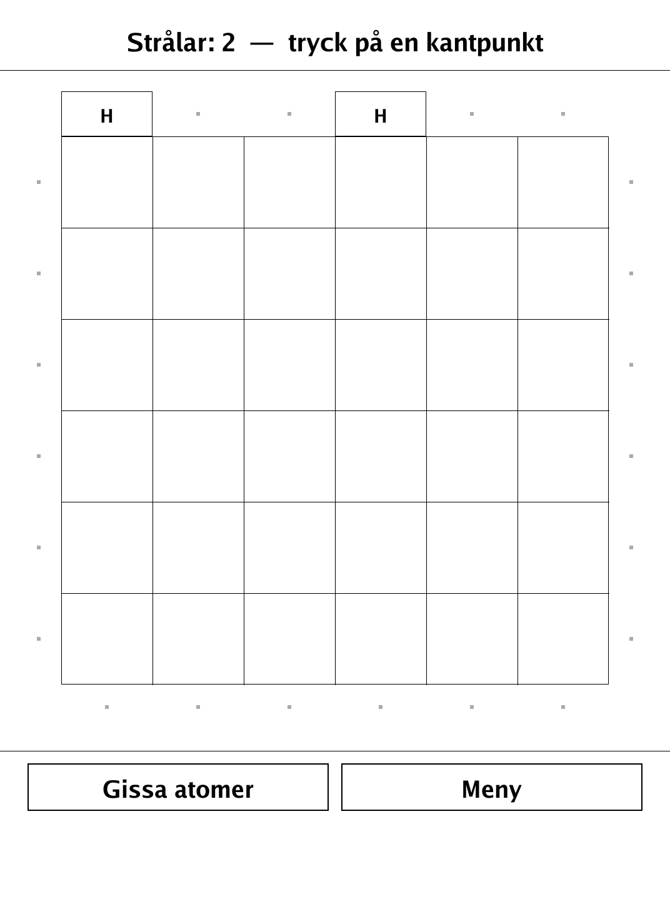
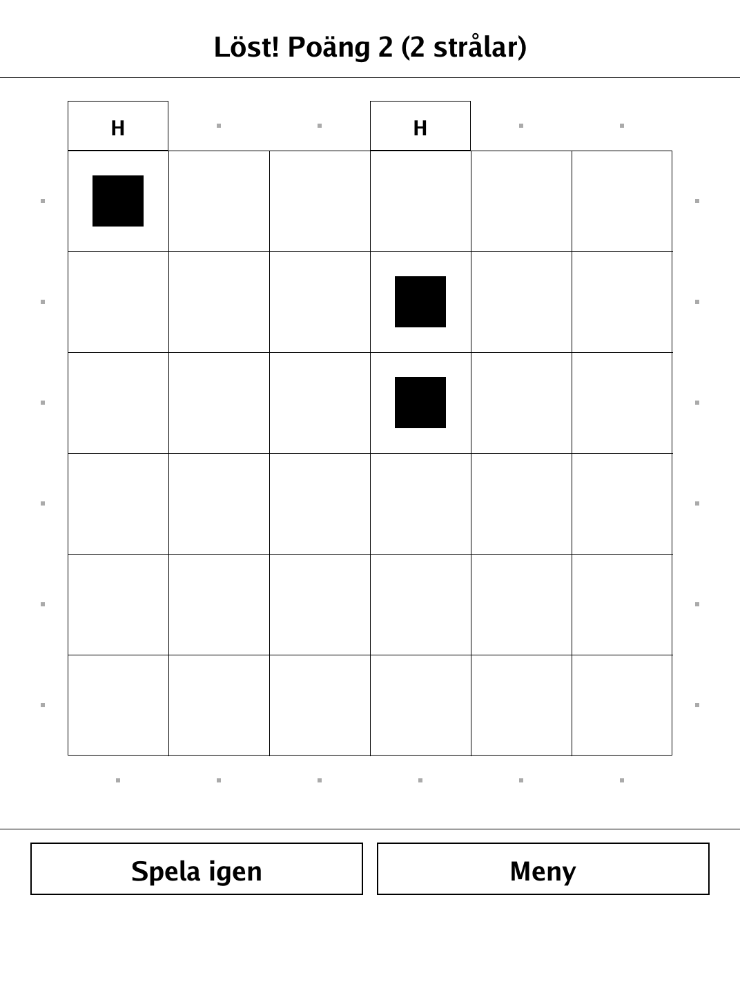
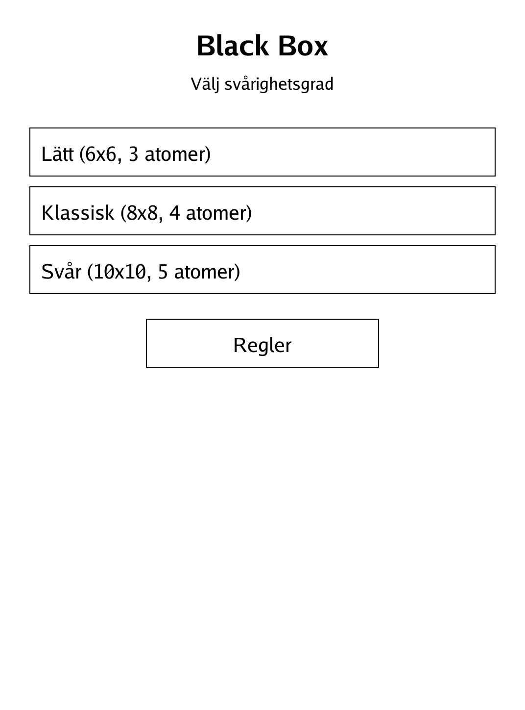
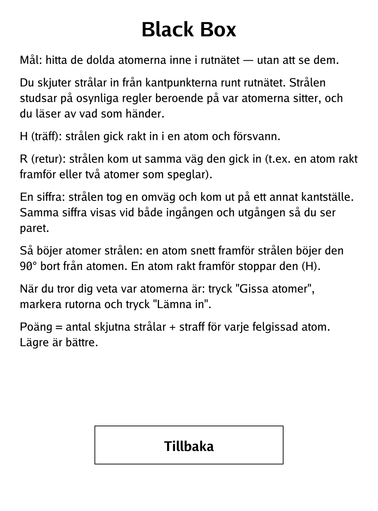

# Black Box (`blackbox.app`)

Fire rays into a hidden grid and deduce where the atoms are hiding.

<p align="center"></p>

## About

Black Box is the classic ray-tracing deduction game: hidden atoms sit somewhere in a grid, and you locate them purely by firing rays from the edges and reading how they emerge. This solo PocketBook build simulates the ray physics exactly, scores you on efficiency (fewer rays and no wrong guesses is better), and offers three grid sizes.

## How to play

- **Goal:** find every hidden atom in the grid — without ever seeing it.
- **Firing rays:** tap an edge point to shoot a ray in. Reading how it comes out tells you about the atoms:
  - **H (Hit)** — the ray flew straight into an atom and vanished.
  - **R (Reflection)** — the ray came back out the same edge point it entered.
  - **A number** — the ray took a detour and exited elsewhere; the same number is shown at both its entry and exit so you can pair them.
- **How atoms bend rays:** an atom diagonally in front of a ray deflects it 90° away; an atom directly in front stops it (a Hit).
- **Guessing:** when you think you know, tap **Gissa atomer**, tap the cells you suspect, and tap **Lämna in**. You solve it when every atom is marked with no wrong or missing guesses.
- **Scoring:** score = rays fired + a penalty for each wrongly-guessed atom. Lower is better.
- **Modes:** Lätt (6x6, 3 atoms), Klassisk (8x8, 4 atoms), or Svår (10x10, 5 atoms).

## Screenshots

<table>
  <tr>
    <td align="center"><br><sub>Probing with rays (two hits)</sub></td>
    <td align="center"><br><sub>Solved — all atoms found</sub></td>
  </tr>
  <tr>
    <td align="center"><br><sub>Menu with grid sizes</sub></td>
    <td align="center"><br><sub>In-app rules</sub></td>
  </tr>
</table>

## Building

Built against the PocketBook Go SDK — see the repo [README](../README.md) and [POCKETBOOK_GAMEDEV_GUIDE.md](../POCKETBOOK_GAMEDEV_GUIDE.md).

```bash
docker run --rm -v "$PWD/blackbox:/app" -w /app sunsung/pocketbook-go-sdk:latest build -o blackbox.app .
```

Copy `blackbox.app` into the device's `applications/` folder. Headless tests: `playtest/play.sh blackbox`.

*Based on the classic Black Box deduction game.*
