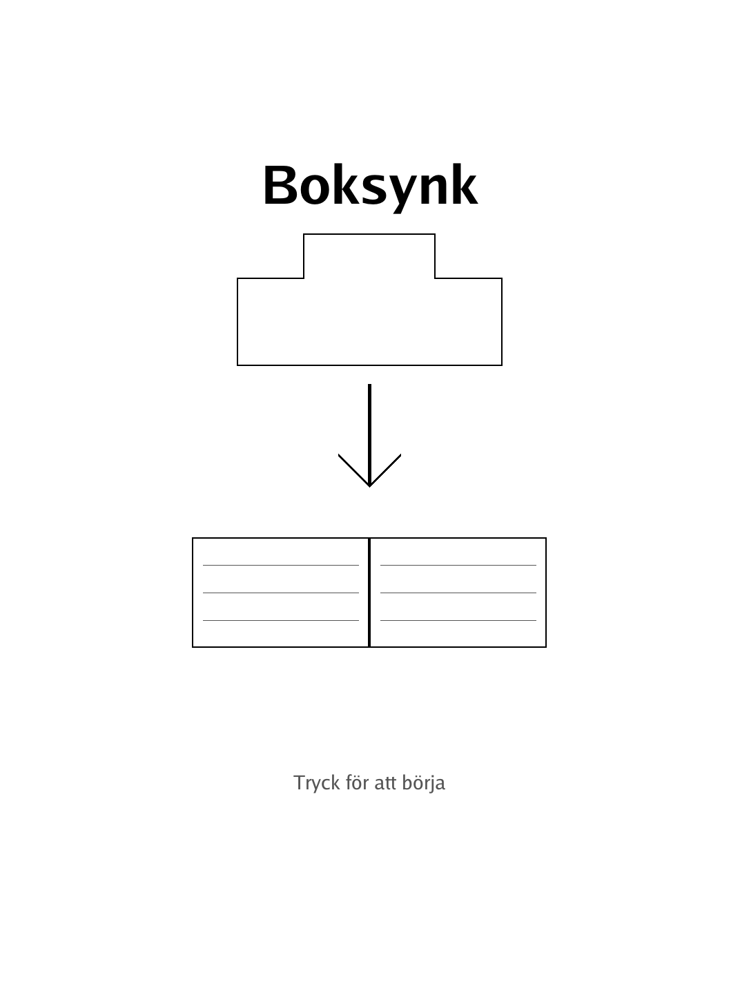
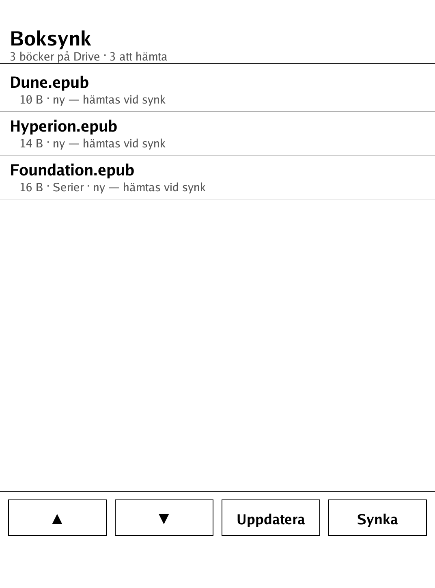
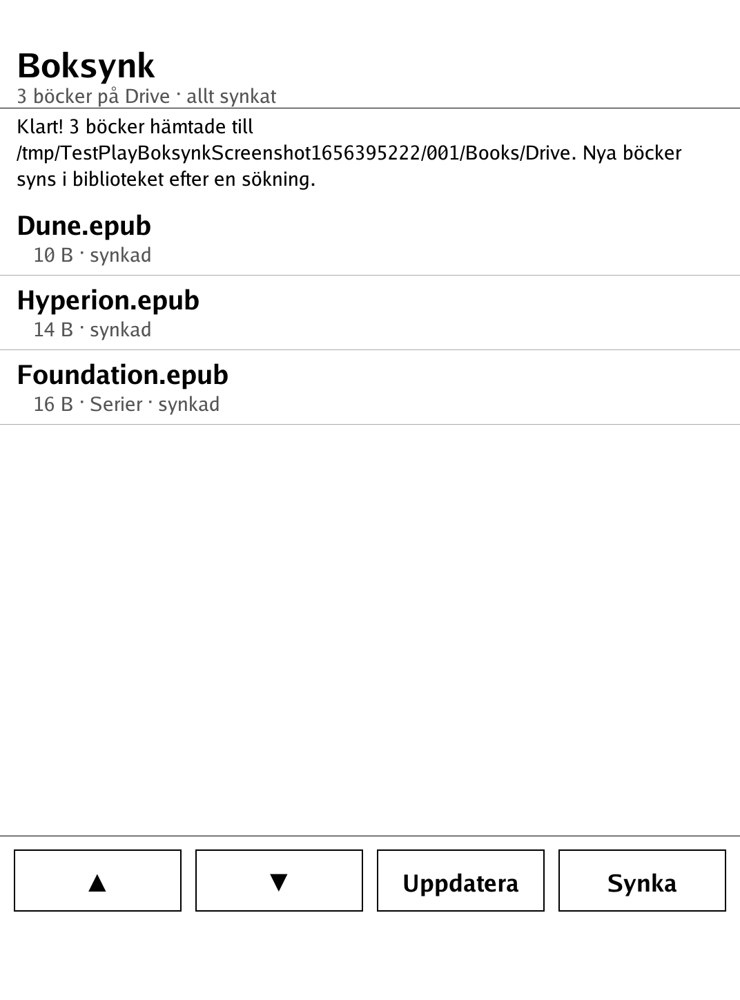

# Boksynk (`boksynk.app`)

Sync the Google Drive folder where you keep your books **straight onto the
PocketBook — no computer needed**. Turn on Wi-Fi, open the app, tap **Synka**:
every epub/pdf/fb2/… in your shared Drive folder that is new or has changed on
Drive is downloaded into `Books/Drive/` (subfolders preserved), where the
library finds it. Books already on the device are recognized by checksum and
never downloaded twice.

| Splash | Book list | After a sync |
|---|---|---|
|  |  |  |

## One-time setup

Google's OAuth login needs a real browser, which an e-ink reader doesn't have
(and Google's limited-input "device flow" doesn't allow read access to Drive).
So Boksynk uses the simplest thing that works: a **link-shared folder + a free
API key**. Setup takes ~5 minutes on a computer or phone, once. After that the
reader never needs anything but its own Wi-Fi.

### 1. Share your book folder

In [Google Drive](https://drive.google.com), right-click the folder with your
books → **Share** → under *General access* choose **Anyone with the link**
(Viewer is enough) → **Copy link**.

> Privacy note: "anyone with the link" means exactly that — the folder is not
> listed publicly anywhere, but anyone you give the link (or the ID in it) to
> can read it. Keep a dedicated folder for books; don't share your whole Drive.

### 2. Create a Google API key

1. Go to [console.cloud.google.com](https://console.cloud.google.com) (any
   Google account works) and create a project (any name).
2. **APIs & Services → Library** → search for **Google Drive API** → **Enable**.
3. **APIs & Services → Credentials** → **Create credentials → API key** and
   copy the key. (Recommended: edit the key and restrict it to the
   *Google Drive API* only.)

The key is free; reading your own folder stays far below any quota.

### 3. Put both on the reader

Start Boksynk once — it writes a fill-in-the-blanks `boksynk.json` next to
itself and shows these instructions on screen. Connect the reader over USB,
open `applications/boksynk.json` in any text editor, and paste your two values:

```json
{
  "folder": "https://drive.google.com/drive/folders/…?usp=sharing",
  "apiKey": "AIza…"
}
```

`folder` takes the share link as-is (or just the folder ID). Optional extras:
`"booksDir"` to change where books land (default `/mnt/ext1/Books/Drive`) and
`"extensions"` to override which file types count as books (default: epub,
pdf, fb2, fb2.zip, mobi, azw, azw3, txt, rtf, djvu, doc, docx, html, htm,
cbz, cbr).

## Daily use

1. Open **Boksynk** (Wi-Fi connects automatically, the system dialog pops if
   no network is configured yet).
2. Tap **Synka**. Done — the status line reports what was fetched, and new
   books show up in the library after its usual scan.

**Uppdatera** just refreshes the list so you can see what's new/changed
(*ny*, *ändrad på Drive*, *synkad*) without downloading; tapping a single row
fetches only that book. Scroll long lists with ▲/▼ or a swipe.

## How it works

- The folder is listed through the Drive API (`files.list`, paginated,
  subfolders walked breadth-first) using only the share link + API key.
- Sync state is decided per file: the MD5 recorded at download time is kept in
  `boksynk_synced.json` next to the binary; a book that exists locally but
  isn't in the manifest (e.g. copied over USB) is checksummed on the spot, so
  identical copies are never re-downloaded. A differing checksum shows as
  *ändrad på Drive* and is replaced on the next sync.
- Downloads stream to a temp file, verify the Drive-reported MD5, and rename
  into place — a dropped Wi-Fi connection can never leave a torn book (or
  clobber a good one).
- Boksynk only ever **adds or updates** files under its books dir. It never
  deletes anything, and nothing outside `booksDir` is touched (Drive file
  names are sanitized against path tricks).

The pure logic (config, Drive API client, sync planning, atomic downloads,
manifest) lives in the SDK-free [`drive/`](drive/) package with unit tests;
the play-test suite drives the whole flow — first launch, cold-start sync,
row taps, changed books, USB copies, bad API key, scrolling — through the
real touch UI against a local fake Drive server (`playtest/play.sh boksynk`).

## Building & installing

Built against the PocketBook Go SDK like every other module — see the repo
[README](../README.md) and
[POCKETBOOK_GAMEDEV_GUIDE.md](../POCKETBOOK_GAMEDEV_GUIDE.md) (§7). Once a
release includes it, [Spelbutiken](../spelbutiken/) installs and updates
`boksynk.app` on the device over Wi-Fi like any game.
