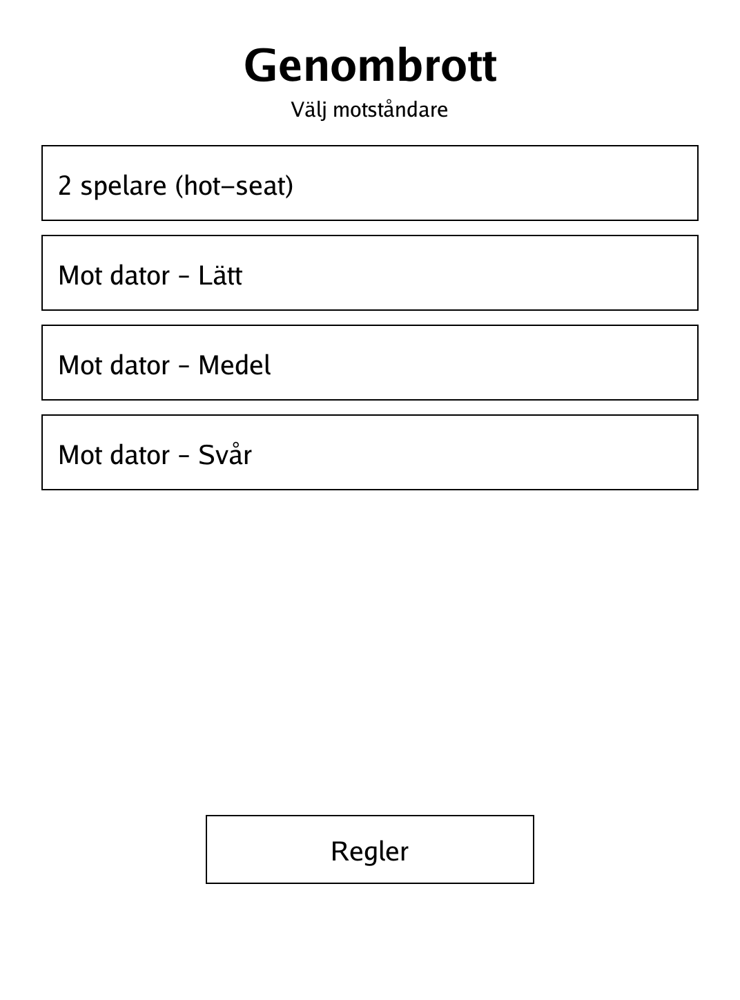
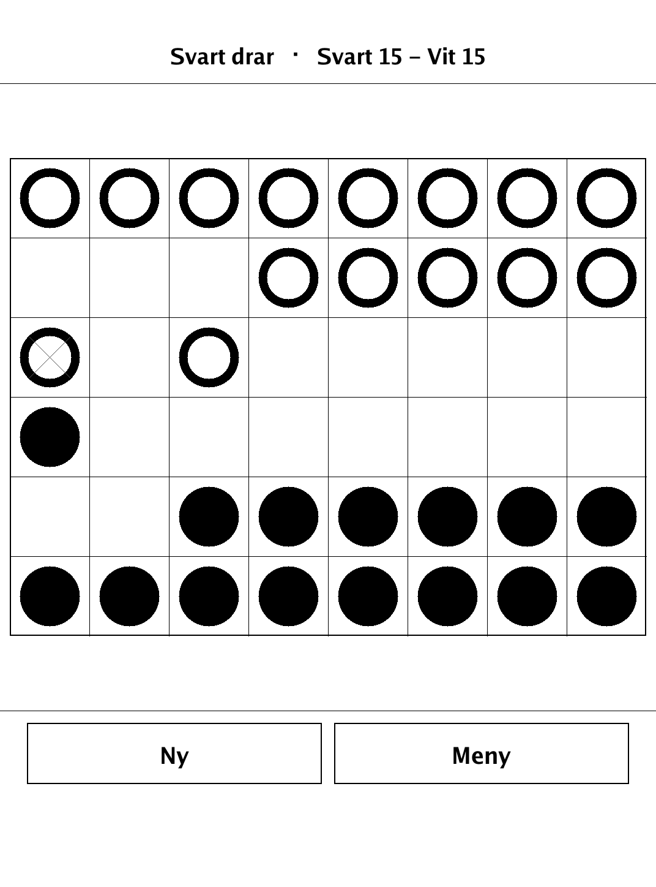
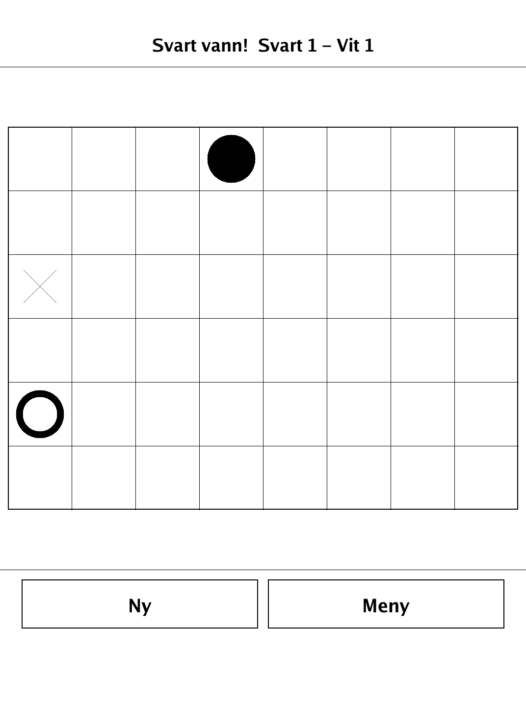

# Genombrott — Breakthrough (`breakthrough.app`)

A sharp little race game where pawns push toward the far edge — get one across and you win.

<p align="center"></p>

## About

Genombrott is an implementation of **Breakthrough**, a modern, widely known abstract board game with no dice and no hidden information, built for the PocketBook Verse Pro (PB634) on the dennwc/inkview SDK. Play hot-seat against a friend or against a built-in alpha-beta AI with selectable difficulty. All game logic (board, moves, win conditions, AI) lives in a pure, SDK-free, unit-tested `game` package, and the board renders cleanly in monochrome for the e-ink display.

## How to play

- **Goal:** get one of your pawns to the opponent's far rank, capture all of the opponent's pawns, or leave the opponent with no legal move.
- The board is 8×6. Each player fills their two nearest ranks with pawns. Black sits at the bottom and moves toward rank 0 (top); White sits at the top and moves toward the bottom rank. **Black moves first.**
- A pawn moves exactly one step **straight forward onto an empty square** — a straight move can **never** capture.
- A pawn may instead move exactly one step **diagonally forward onto a square holding an enemy pawn**, which always captures it. A diagonal move onto an empty square is never allowed.
- Note the reversal from chess: here straight never captures and diagonal always captures. There is no double-step, no en passant, and no promotion.
- **Controls:** tap one of your pawns to select it — legal moves are marked (a small filled square for a plain step, a small ring for a capturing move). Tap a marker to make the move, or tap the pawn again to deselect.
- Win the moment a pawn reaches the far rank, the opponent runs out of pawns, or the opponent has no legal move on their turn.

## Screenshots

<table>
  <tr>
    <td align="center"><br><sub>Menu: opponent and difficulty</sub></td>
    <td align="center"><br><sub>Mid-game with a pawn selected</sub></td>
    <td align="center"><br><sub>Victory banner</sub></td>
  </tr>
</table>

## Building

Built against the PocketBook Go SDK — see the repo [README](../README.md) and [POCKETBOOK_GAMEDEV_GUIDE.md](../POCKETBOOK_GAMEDEV_GUIDE.md).

```bash
docker run --rm -v "$PWD/breakthrough:/app" -w /app sunsung/pocketbook-go-sdk:latest build -o breakthrough.app .
```

Copy `breakthrough.app` into the device's `applications/` folder. Headless tests: `playtest/play.sh breakthrough`.

Based on Breakthrough, the abstract strategy game designed by Dan Troyka.
