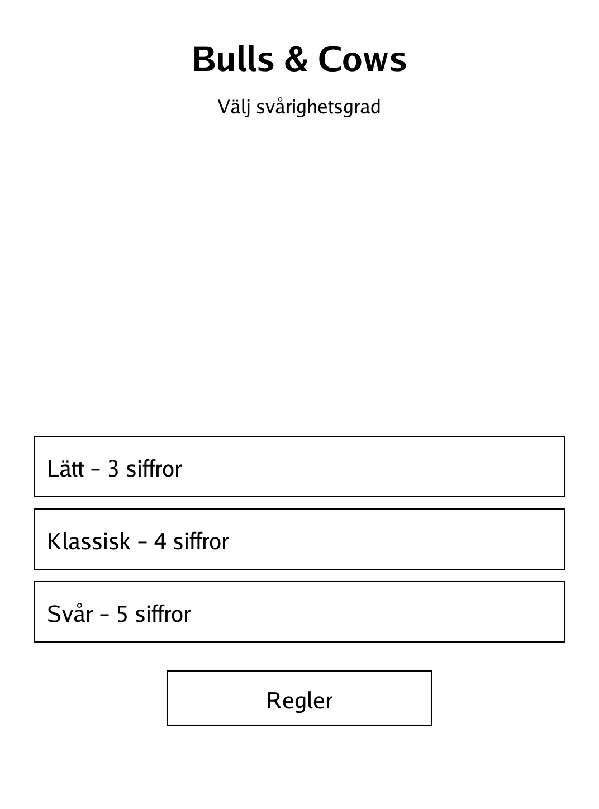
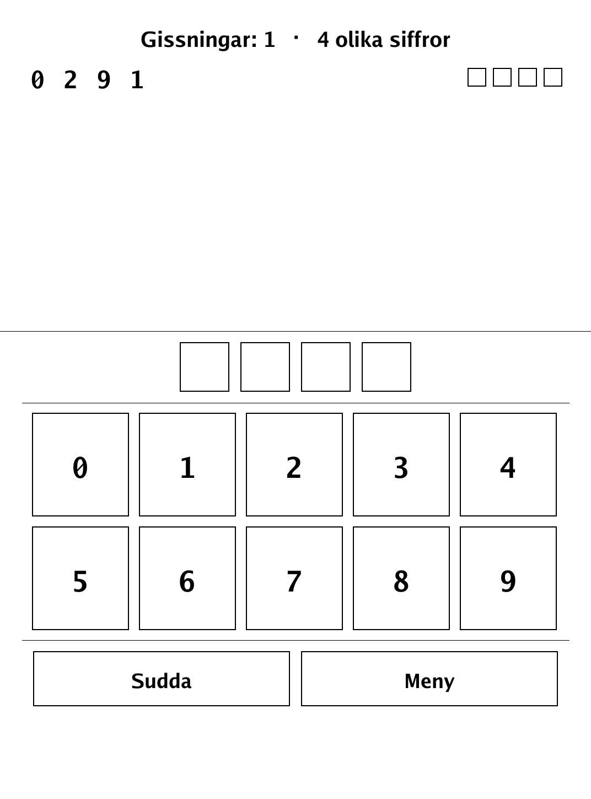
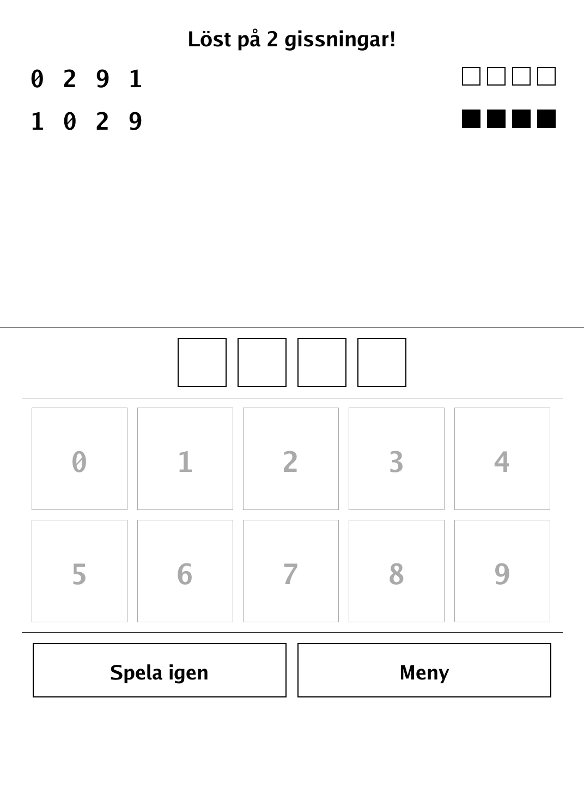

# Bulls & Cows (`bullscows.app`)

Crack the secret code of distinct digits in as few guesses as you can.

<p align="center"></p>

## About

Bulls & Cows is a digit-deduction game — the classic pen-and-paper ancestor of Mastermind — built for the PocketBook Verse Pro (PB634) on the dennwc/inkview SDK. The game holds a hidden code of distinct digits; you build guesses on an on-screen keypad and read back Bull/Cow feedback. Pure scoring and secret-generation logic lives in an SDK-free, unit-tested `game` package, and the keypad renders crisply for the e-ink screen.

## How to play

- **Goal:** work out the secret code in as few guesses as possible.
- The code is made of **distinct digits** (no repeats). Tap digits to build your guess, then tap **Gissa** (Guess).
- After each guess you get feedback:
  - **Bull** (filled square ■): right digit in the right place.
  - **Cow** (hollow square □): right digit in the wrong place.
  - Example: the code is 1 2 3 4 and you guess 1 4 5 6 → one bull (the 1) and one cow (the 4).
- Digits already placed in the current guess are greyed out on the keypad. Tap **Sudda** (Erase) to remove the last digit.
- There is no guess limit — you can keep going until you crack it. Difficulty presets on the menu change the code length.

## Screenshots

<table>
  <tr>
    <td align="center"><br><sub>Menu: difficulty presets</sub></td>
    <td align="center"><br><sub>Guessing on the keypad</sub></td>
    <td align="center"><br><sub>Solved!</sub></td>
  </tr>
</table>

## Building

Built against the PocketBook Go SDK — see the repo [README](../README.md) and [POCKETBOOK_GAMEDEV_GUIDE.md](../POCKETBOOK_GAMEDEV_GUIDE.md).

```bash
docker run --rm -v "$PWD/bullscows:/app" -w /app sunsung/pocketbook-go-sdk:latest build -o bullscows.app .
```

Copy `bullscows.app` into the device's `applications/` folder. Headless tests: `playtest/play.sh bullscows`.

Based on the traditional code-breaking game Bulls and Cows.
