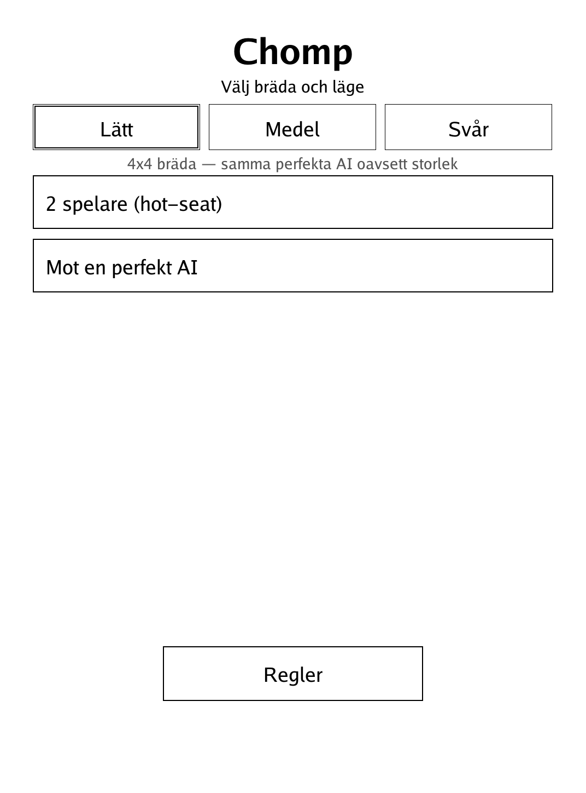
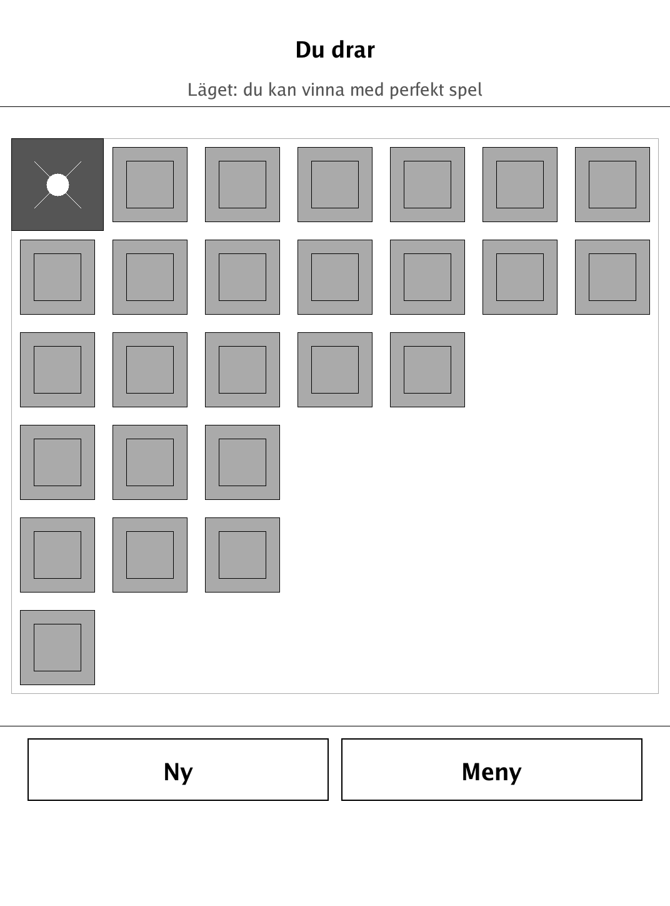
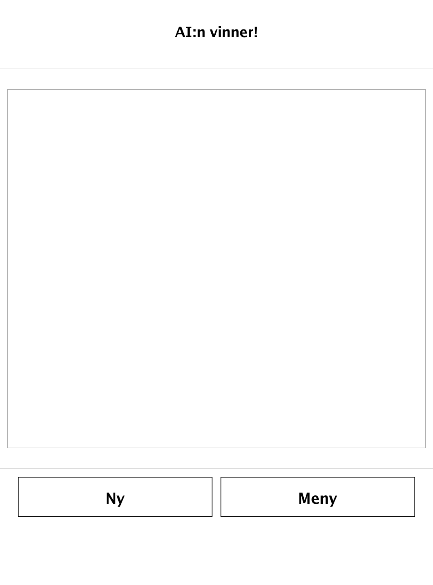

# Chomp (`chomp.app`)

A poisoned-chocolate game of pure strategy — never be the one forced to eat the top-left square.

<p align="center"></p>

## About

Chomp is the classic mathematical "poisoned chocolate bar" game, built for the PocketBook Verse Pro (PB634) on the dennwc/inkview SDK. Play hot-seat against a friend, or against a built-in AI that exhaustively solves the tiny state space by minimax — an unbeatable, perfect-play opponent, just like Nim's Sprague-Grundy AI. All game logic (board, moves, win/loss, AI) lives in an SDK-free, unit-tested `game` package, and the bar redraws instantly with no animation for the e-ink display.

## How to play

- **Goal:** force your opponent to eat the poisoned square.
- The board is a rectangle of squares — a chocolate bar. The top-left square (row 0, column 0) is poisoned.
- On your turn you choose **one** remaining square and eat it. Every remaining square on the **same row or below, AND the same column or to the right**, is removed too — as if you snapped the chocolate off down-and-to-the-right from your square.
- Whoever is forced to eat the poisoned square **loses immediately**. You may pick it yourself if you want to concede.
- **Board size** is chosen on the menu: Lätt (4×4), Medel (5×6), or Svår (6×7). A bigger bar makes the game longer, not the AI weaker — it plays perfectly at every size. Against the AI, a line appears when you currently hold a winning position.
- **Controls:** tap any remaining square to eat it (and everything it takes with it). The board updates directly.

## Screenshots

<table>
  <tr>
    <td align="center"><br><sub>Menu: board size and opponent</sub></td>
    <td align="center"><br><sub>Bar being chomped down</sub></td>
    <td align="center"><br><sub>Game over</sub></td>
  </tr>
</table>

## Building

Built against the PocketBook Go SDK — see the repo [README](../README.md) and [POCKETBOOK_GAMEDEV_GUIDE.md](../POCKETBOOK_GAMEDEV_GUIDE.md).

```bash
docker run --rm -v "$PWD/chomp:/app" -w /app sunsung/pocketbook-go-sdk:latest build -o chomp.app .
```

Copy `chomp.app` into the device's `applications/` folder. Headless tests: `playtest/play.sh chomp`.

Based on Chomp, the mathematical game described by David Gale and Fred Schuh.
