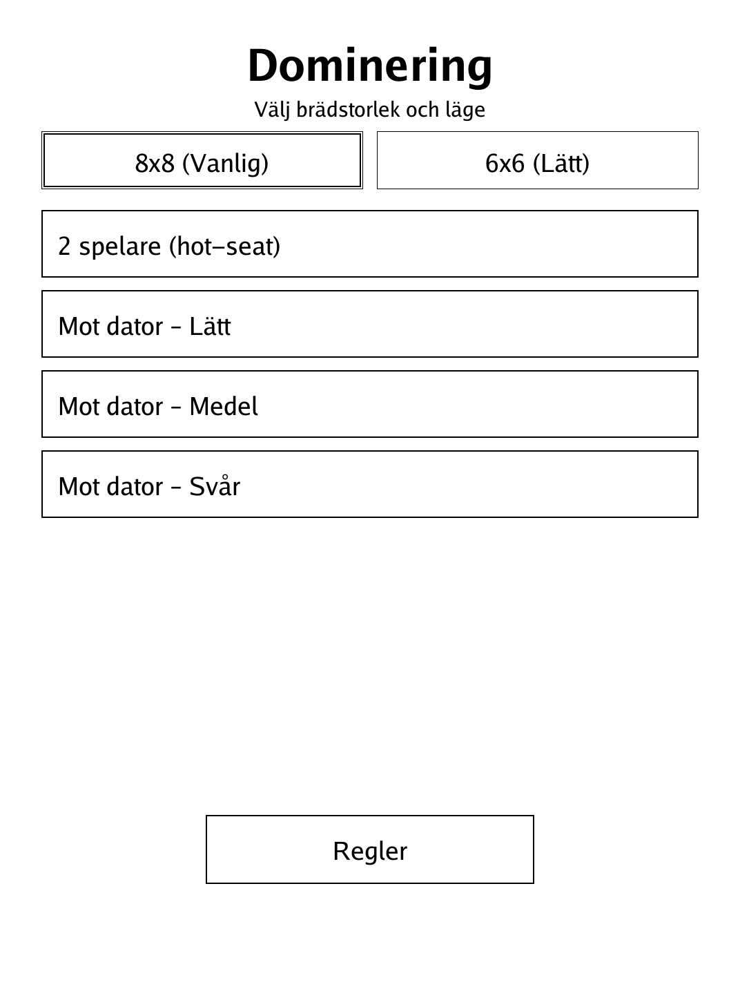
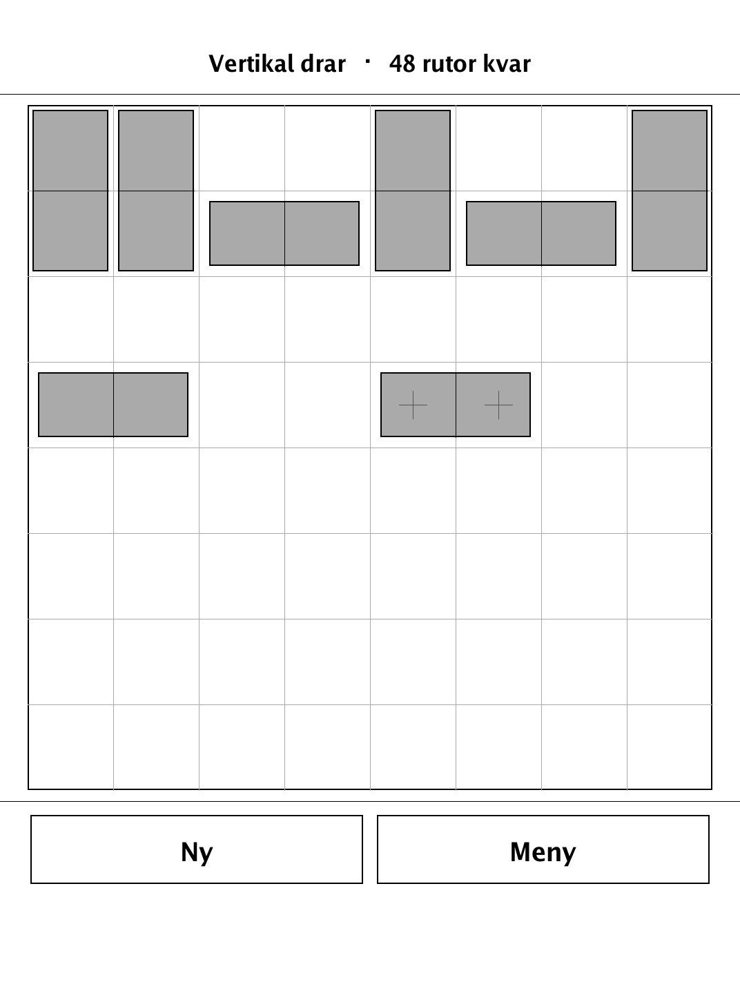
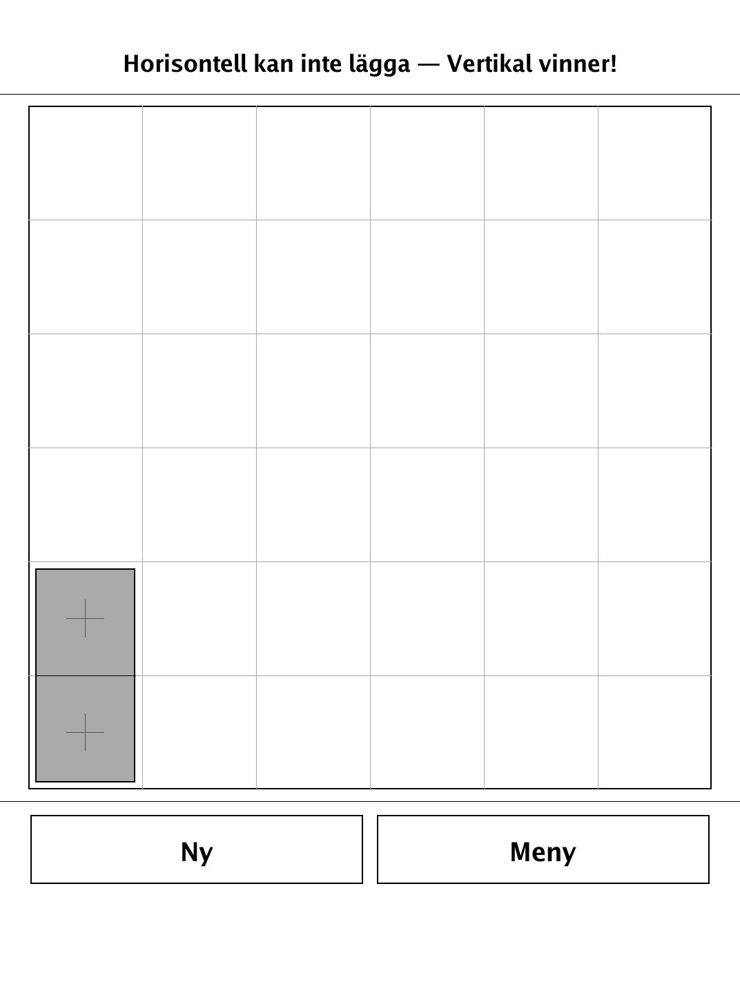

# Dominering — Domineering (`dominering.app`)

A tile-laying duel where one player places dominoes only upright and the other only sideways — run your opponent out of room.

<p align="center"></p>

## About

Dominering is an implementation of **Domineering**, a combinatorial game invented by Göran Andersson and popularised by mathematician John Horton Conway, built for the PocketBook Verse Pro (PB634) on the dennwc/inkview SDK. Play hot-seat against a friend, or against a built-in alpha-beta AI (you play Vertical, the AI plays Horizontal). All game logic (board, legal moves, win condition, AI) lives in an SDK-free, unit-tested `game` package, rendered as a clean monochrome grid.

## How to play

- **Goal:** the player who **cannot** place a domino on their turn loses (normal-play convention). It isn't the last move that decides — it's being left with no legal move.
- The board is 8×8 ("Vanlig") or 6×6 ("Lätt"), empty to start. Players alternate placing a 1×2 domino on two empty cells. **Vertical (V) always starts.**
- **Vertical (V)** may only place its domino **upright** — two cells in the same column, one directly above the other. **Horizontal (H)** may only place it **sideways** — two cells in the same row, side by side. Neither player may ever place in the other direction, no matter the board state.
- A placed domino is never moved or removed, so the board shrinks with every move until a player finds no two free cells in their own direction — that player loses immediately.
- **Controls:** tap an empty cell to pick it as an anchor — the cell(s) that would complete a legal domino in your direction are highlighted automatically. Tap a highlighted cell to confirm the placement, or tap the anchor again to deselect.
- **Vs. computer:** you always play Vertical, the computer always plays Horizontal. Difficulty sets how deep it searches — but because the board shrinks, it often plays very strongly in the endgame regardless of level.

## Screenshots

<table>
  <tr>
    <td align="center"><br><sub>Menu: board size and opponent</sub></td>
    <td align="center"><br><sub>Dominoes filling the board</sub></td>
    <td align="center"><br><sub>Vertical wins</sub></td>
  </tr>
</table>

## Building

Built against the PocketBook Go SDK — see the repo [README](../README.md) and [POCKETBOOK_GAMEDEV_GUIDE.md](../POCKETBOOK_GAMEDEV_GUIDE.md).

```bash
docker run --rm -v "$PWD/dominering:/app" -w /app sunsung/pocketbook-go-sdk:latest build -o dominering.app .
```

Copy `dominering.app` into the device's `applications/` folder. Headless tests: `playtest/play.sh dominering`.

Based on Domineering, invented by Göran Andersson and popularised by John Horton Conway.
