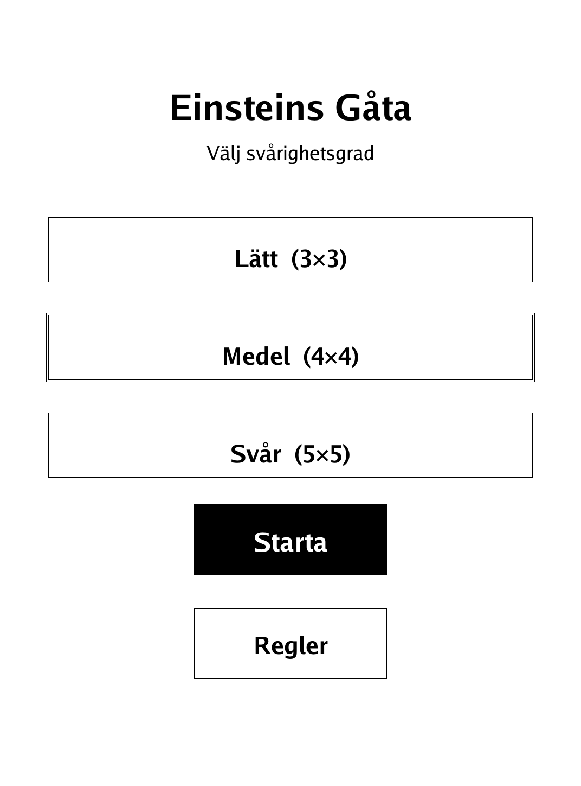
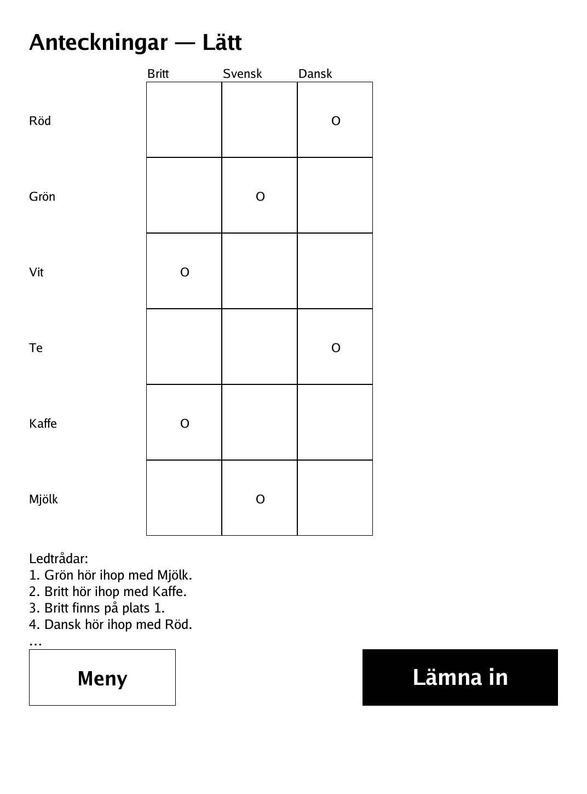
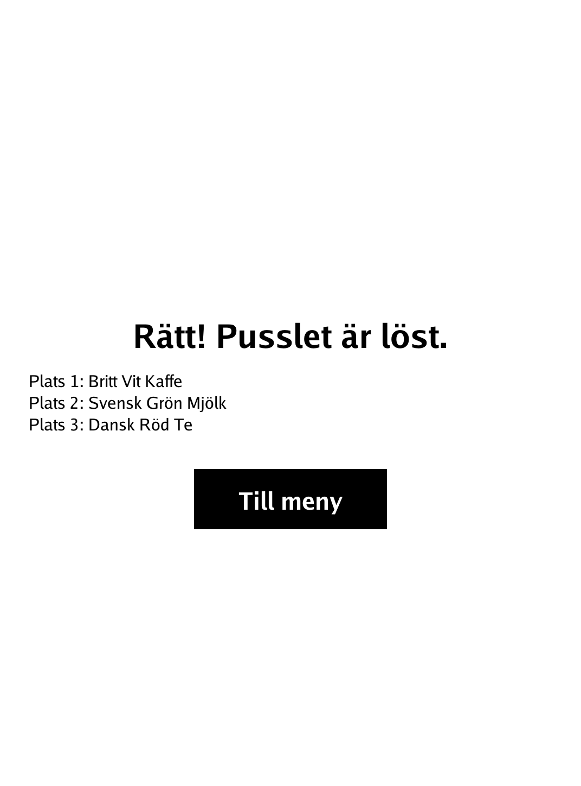

# Einsteins Gåta — Einstein's Riddle (`einstein.app`)

A logic-grid deduction puzzle: from a handful of clues, work out the one and only correct combination.

<p align="center"></p>

## About

Einsteins Gåta is a logic-grid deduction puzzle in the style of the famous "Einstein's Riddle" / Zebra Puzzle, built for the PocketBook Verse Pro (PB634) on the dennwc/inkview SDK. Each puzzle is generated to have exactly one solution reachable by pure logic — no guessing required — and the generator invariant is checked in tests. You mark deductions on a notes grid; the game verifies your answer. Difficulty (Easy / Medium / Hard) scales the puzzle size.

## How to play

- **Goal:** deduce the single correct combination — which values belong together — using only logic from the clues.
- Each category (e.g. house, colour, animal) has the same number of values. Exactly one value from each category belongs to each row, and no value is used twice.
- The grid is your notepad. Every cell crosses two values. Tap a cell to cycle its mark:
  - **O** = these two values belong together.
  - **X** = they do **not** belong together.
  - **blank** = still undecided.
- When you place an **O**, every other cell in the same row and column should become **X** — just like a logic puzzle.
- Read the clues below the grid and mark off what you can deduce. Every puzzle has exactly one solution and needs no guessing.
- When everything is filled in, tap **Lämna in** (Submit) to check whether your solution is correct.

## Screenshots

<table>
  <tr>
    <td align="center"><br><sub>Menu: difficulty select</sub></td>
    <td align="center"><br><sub>Marking deductions on the grid</sub></td>
    <td align="center"><br><sub>Correct solution</sub></td>
  </tr>
</table>

## Building

Built against the PocketBook Go SDK — see the repo [README](../README.md) and [POCKETBOOK_GAMEDEV_GUIDE.md](../POCKETBOOK_GAMEDEV_GUIDE.md).

```bash
docker run --rm -v "$PWD/einstein:/app" -w /app sunsung/pocketbook-go-sdk:latest build -o einstein.app .
```

Copy `einstein.app` into the device's `applications/` folder. Headless tests: `playtest/play.sh einstein`.

Based on the classic logic-grid deduction puzzle known as Einstein's Riddle (the Zebra Puzzle).
