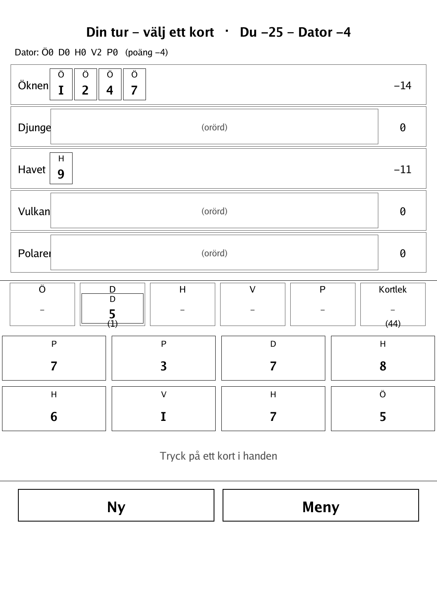
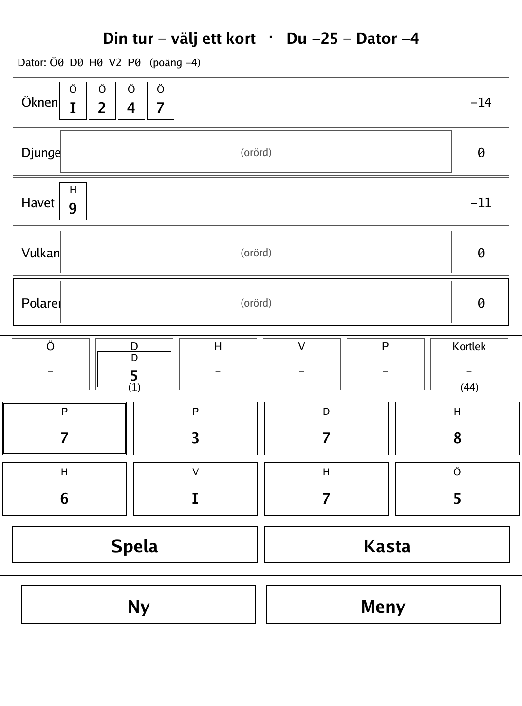
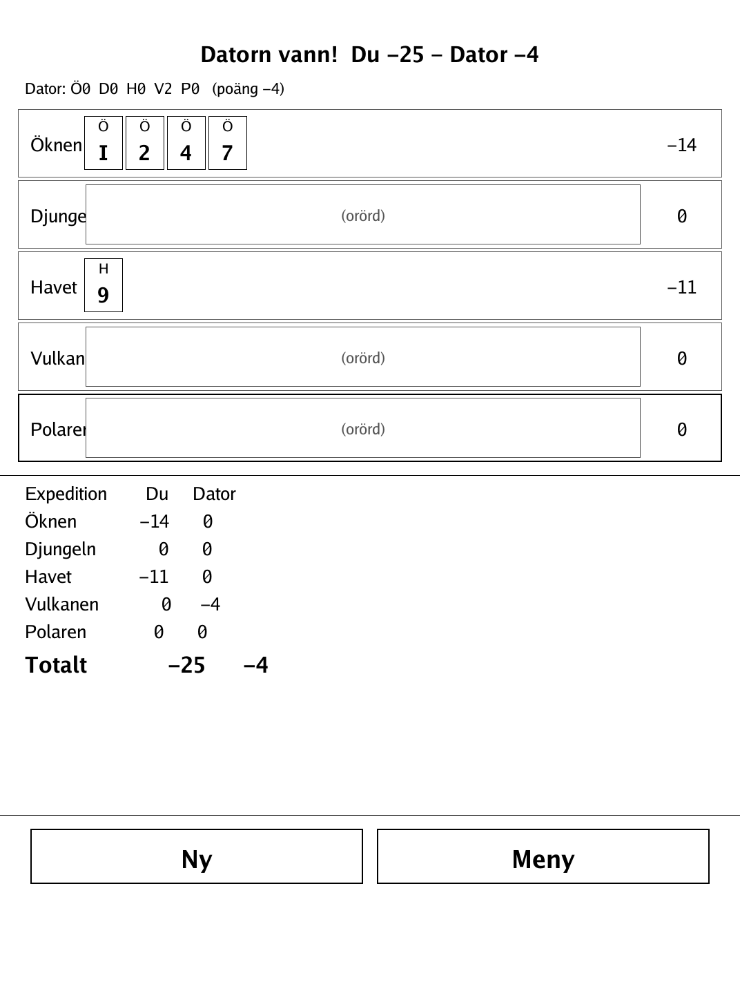

# Expeditionen — Lost Cities (`expeditionen.app`)

Fund five daring expeditions, play your cards in rising order, and outscore the AI when the deck runs dry.

<p align="center"></p>

## About

Expeditionen is a 2-player hand-management card game based on **Lost Cities** (Kosmos / Reiner Knizia), reimplemented here with a neutral working title and original card rendering, for the PocketBook Verse Pro (PB634) on the dennwc/inkview SDK. One human plays against one AI opponent — the game's hidden hands rule out a meaningful hot-seat mode. All game logic (deck, rows, legality, scoring, AI) lives in an SDK-free, unit-tested `game` package. Discard piles are drawn face-up and visible to both players; only the hands are hidden.

## How to play

- **Goal:** the highest score when the deck runs out.
- There are 5 expeditions (Desert, Jungle, Sea, Volcano, Polar). Each has 12 cards: 3 investment cards (marked **I**) and nine number cards, 2–10.
- On your turn you do **one** of two things: play a card to your **own** expedition of that colour, or lay the card **face up** on that expedition's discard pile. Then draw exactly one card — either from the deck or from the top of **any** discard pile.
- **Order within an expedition:** number cards must be played in **non-decreasing** order (equal to the last played is allowed, never lower).
- **Investment rule:** all investment cards for an expedition must be played **before** any number card there. Once a number card is played, no more investment cards may be added.
- **Scoring per expedition:** an untouched expedition (no cards played) scores 0. Otherwise: **(sum of number cards − 20) × (1 + number of investment cards)**. If you played 8 or more cards in that expedition, add a **20-point bonus afterwards** — after the multiplication, not before.
  - Example: sum 25, 1 investment card, 9 cards played → (25−20) × (1+1) = 10, plus 20 bonus = 30 points. A barely-started expedition can score **negative**, and investment cards amplify a loss too.
- The game ends when the deck runs out; the higher total across all 5 expeditions wins.

## Screenshots

<table>
  <tr>
    <td align="center"><br><sub>Hand and expedition rows</sub></td>
    <td align="center"><br><sub>A card selected to play</sub></td>
    <td align="center"><br><sub>Final score</sub></td>
  </tr>
</table>

## Building

Built against the PocketBook Go SDK — see the repo [README](../README.md) and [POCKETBOOK_GAMEDEV_GUIDE.md](../POCKETBOOK_GAMEDEV_GUIDE.md).

```bash
docker run --rm -v "$PWD/expeditionen:/app" -w /app sunsung/pocketbook-go-sdk:latest build -o expeditionen.app .
```

Copy `expeditionen.app` into the device's `applications/` folder. Headless tests: `playtest/play.sh expeditionen`.

Based on Lost Cities (Kosmos / Reiner Knizia).
