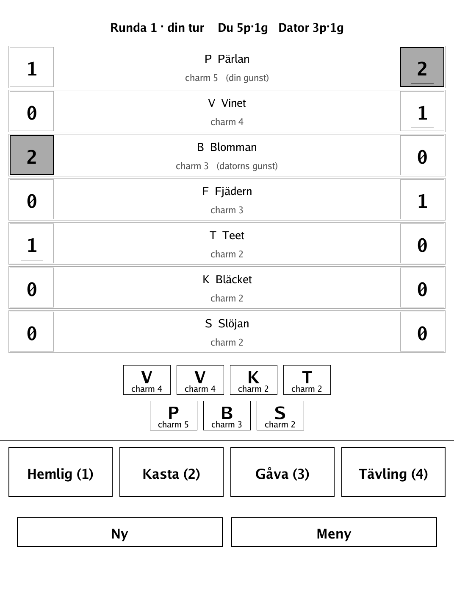
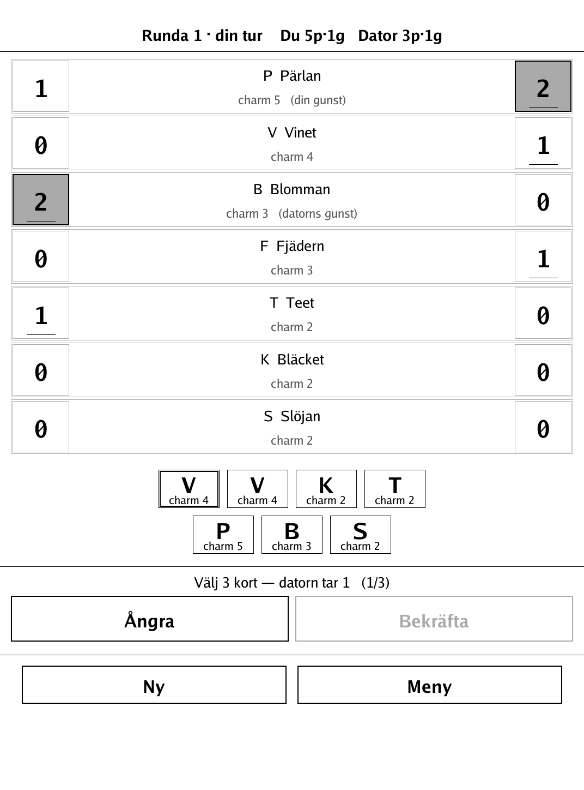
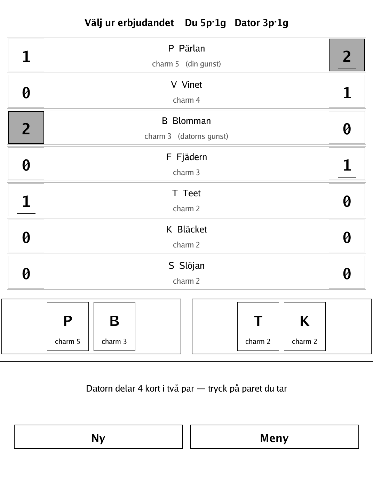
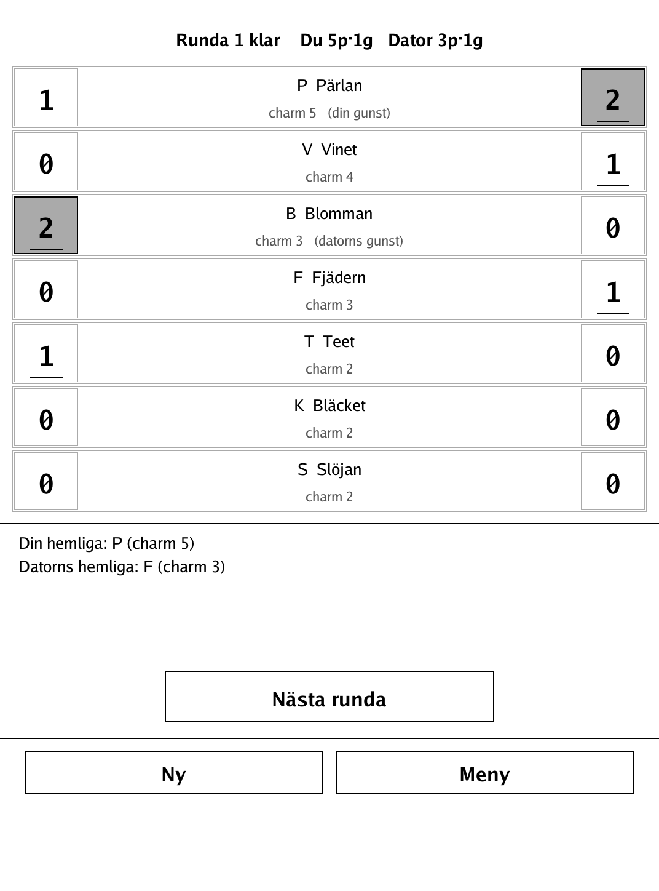

# Geishorna — Hanamikoji (`geishorna.app`)

A tense card duel of bluff and timing: spend four one-shot actions each round to win the favor of the geishas.

<p align="center"></p>

## About

Geishorna is a 2-player hidden-hand card duel based on **Hanamikoji** (Kota Nakayama / EmperorS4), reimplemented here with a neutral working title and an original geisha roster, for the PocketBook Verse Pro (PB634) on the dennwc/inkview SDK. One human plays against one AI opponent — the round's hidden hands and face-down Secret card rule out a meaningful hot-seat mode. All game logic (deck, round engine, scoring, favor, AI) lives in an SDK-free, unit-tested `game` package.

## How to play

- **Goal:** win the geishas' favor. First to the favor of **4 geishas**, or geishas totalling **at least 11 charm** (of 21), wins the match. Favor markers stay put between rounds.
- There are 7 geishas with charm 2, 2, 2, 3, 3, 4, 5. Each geisha has as many item cards as her charm — 21 cards in all. Each round, 1 card is set aside face-down and both players get 6 cards.
- Each round you have four action markers, one use each (you choose the order). **Before each action you draw 1 card.**
  - **Hemlig / Secret (1 card):** placed face-down, counts for you at round end.
  - **Kasta / Trade-off (2 cards):** discarded from the round, counts for no one.
  - **Gåva / Gift (3 cards):** you reveal 3 cards, the opponent takes 1, you keep 2.
  - **Tävling / Competition (4 cards):** you reveal 4 cards in two pairs, the opponent takes one pair, you keep the other.
- **Round end:** flip the secret cards. For each geisha, whoever placed the **most** item cards of her type wins her favor and the marker moves there. A tie leaves the marker where it is (no one wins her).

## Screenshots

<table>
  <tr>
    <td align="center"><br><sub>Choosing an action</sub></td>
    <td align="center"><br><sub>Selecting cards for an action</sub></td>
    <td align="center"><br><sub>Responding to the AI's offer</sub></td>
    <td align="center"><br><sub>Round-end favor tally</sub></td>
  </tr>
</table>

## Building

Built against the PocketBook Go SDK — see the repo [README](../README.md) and [POCKETBOOK_GAMEDEV_GUIDE.md](../POCKETBOOK_GAMEDEV_GUIDE.md).

```bash
docker run --rm -v "$PWD/geishorna:/app" -w /app sunsung/pocketbook-go-sdk:latest build -o geishorna.app .
```

Copy `geishorna.app` into the device's `applications/` folder. Headless tests: `playtest/play.sh geishorna`.

Based on Hanamikoji (Kota Nakayama / EmperorS4).
