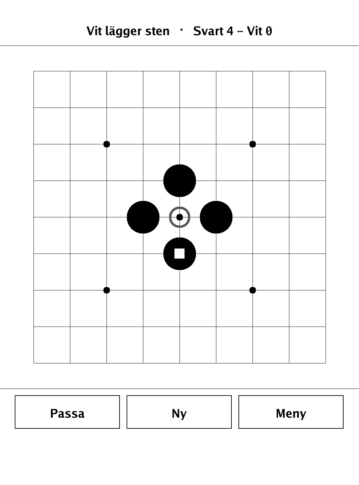
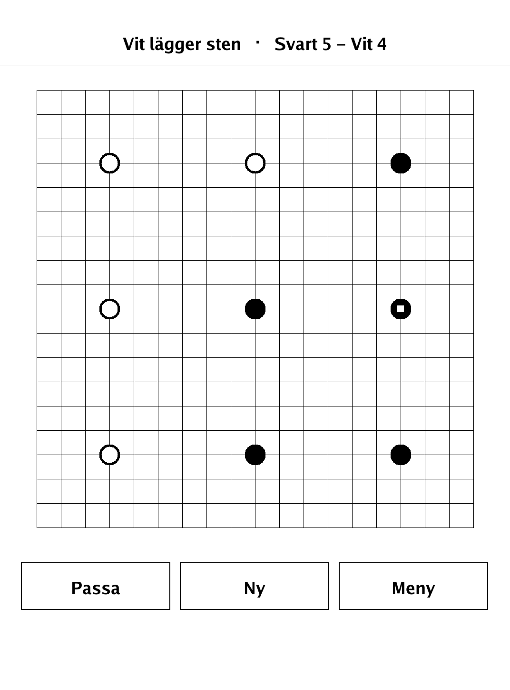
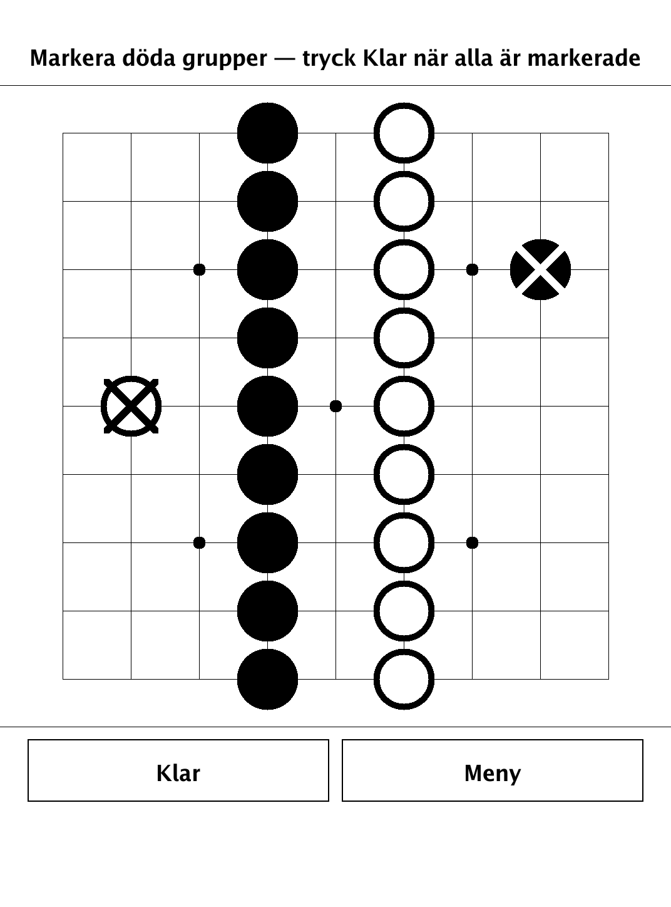
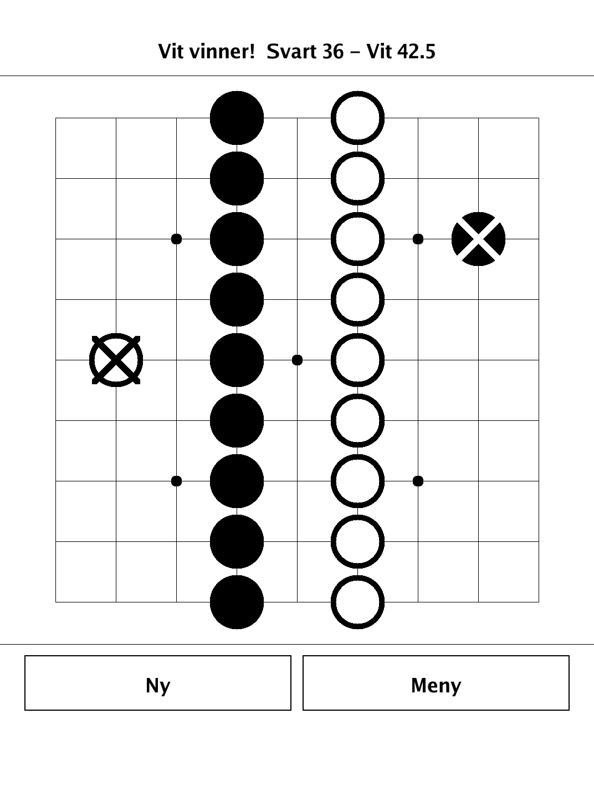

# Go (`goban.app`)

Go (baduk/weiqi) — surround territory and capture stones on a 9×9, 13×13, or 19×19 board.

<p align="center"></p>

## About

`goban` is a build of the ancient board game Go for the PocketBook Verse Pro (PB634), built on the dennwc/inkview SDK. It is named "goban" (the term for a Go board) to avoid clashing with the Go toolchain's own name. Play hot-seat against a friend on any of the three standard board sizes, or take on a weak built-in AI (offered on 9×9 only). The pure game logic — board, groups, captures, ko, area scoring, and AI — lives in an SDK-free `goban/game` package that is unit-tested independently of the e-ink front end.

## How to play

- **Goal:** surround the largest area with your stones. Black and White take turns placing a stone on an empty intersection; Black starts.
- **Capture:** a group with no liberties (empty adjacent points) is removed from the board. You may not play a move that captures your own stones without also capturing at least one enemy stone (suicide is forbidden).
- **Ko:** you may not recreate the exact board position from before the opponent's last move. The restriction lifts as soon as you play elsewhere.
- **Passing:** two passes in a row end normal play. You then tap dead groups to mark them before the score is counted.
- **Scoring:** area (Chinese) scoring — your score is your stones on the board plus empty points surrounded only by your color. A point bordering both colors counts for neither. White additionally receives *komi* to compensate for Black moving first.
- **Sizes & modes:** 9×9, 13×13, or 19×19; hot-seat on all sizes, versus the weak AI on 9×9 only.
- **Controls:** tap an intersection to place; use **Passa** to pass, **Ny** to restart, **Meny** to return to the menu, and **Klar** to finalize scoring.

## Screenshots

<table>
  <tr>
    <td align="center"><br><sub>Capturing a surrounded stone (9×9)</sub></td>
    <td align="center"><br><sub>A game in progress on 19×19</sub></td>
  </tr>
  <tr>
    <td align="center"><br><sub>Marking dead groups after two passes</sub></td>
    <td align="center"><br><sub>Final area score with komi</sub></td>
  </tr>
</table>

## Building

Built against the PocketBook Go SDK — see the repo [README](../README.md) and [POCKETBOOK_GAMEDEV_GUIDE.md](../POCKETBOOK_GAMEDEV_GUIDE.md).

```bash
docker run --rm -v "$PWD/goban:/app" -w /app sunsung/pocketbook-go-sdk:latest build -o goban.app .
```

Copy `goban.app` into the device's `applications/` folder. Headless tests: `playtest/play.sh goban`.

Based on Go (baduk/weiqi), the classic game of territory and capture.
