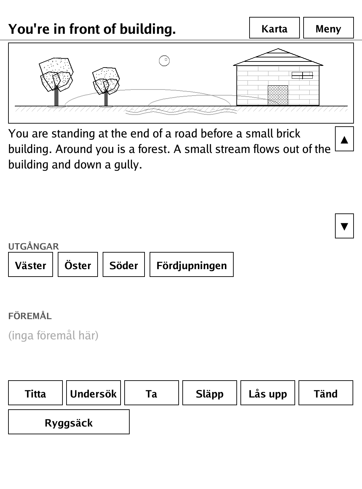
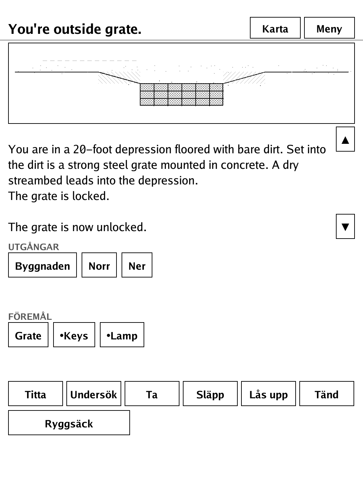
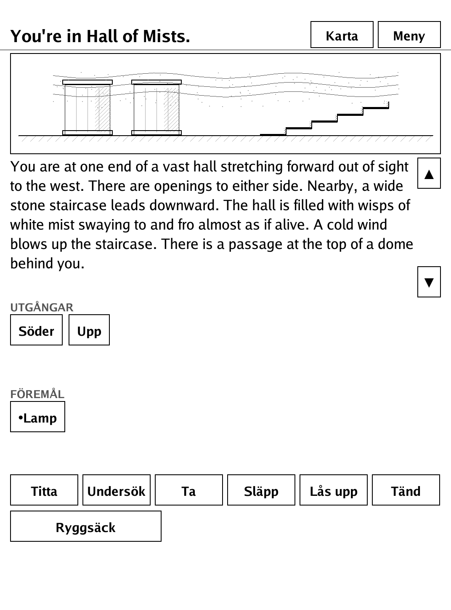
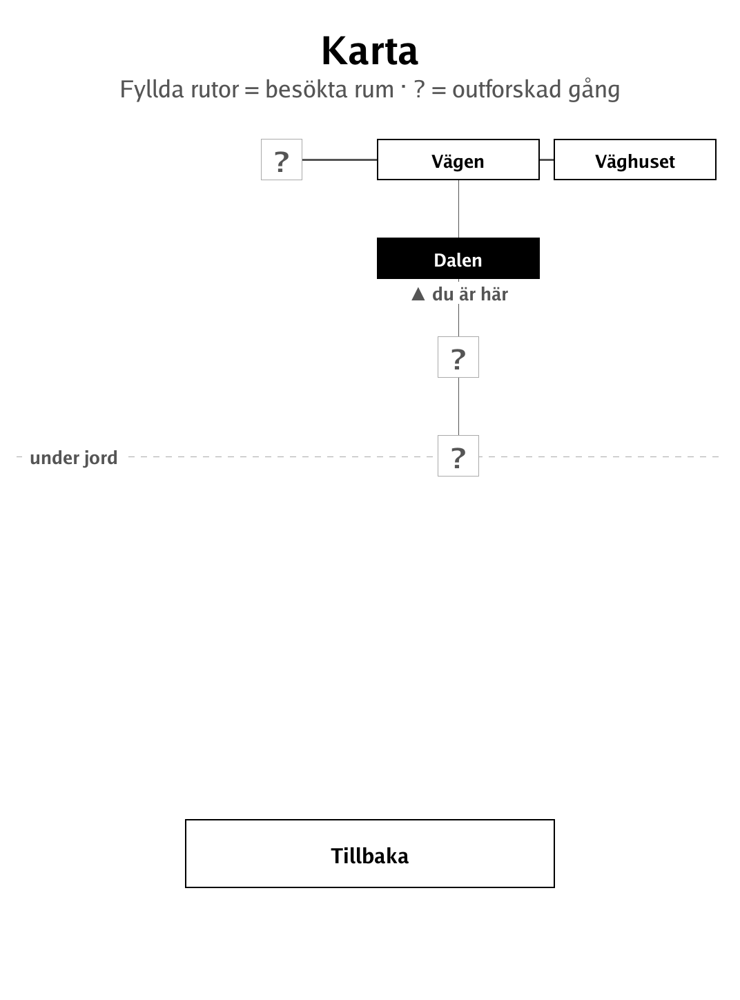

# Grottan (`grottan.app`)

Grottan ("the cave") — a tap-driven port of Colossal Cave Adventure for e-ink.

<p align="center"></p>

## About

`grottan` is a tap-driven port of *Colossal Cave Adventure* for the PocketBook Verse Pro (PB634), built on the dennwc/inkview SDK. The classic game uses a typed parser, but typing on e-ink is miserable — so the parser is replaced with a tap-verb + tap-noun interface (the Scott-Adams two-word model, which Colossal Cave already fits). You explore the great cave full of passages, objects, and secrets: get down into the cave, find the gold nugget and other treasures, and learn the layout. The game auto-saves after every action. All rules live in an SDK-free `grottan/story` package whose world data is generated from Open Adventure's `adventure.yaml`, so the engine unit-tests without a device.

## How to play

- **Goal:** explore Colossal Cave, descend into it, find the gold nugget and other treasures, and learn the ways. No text to type.
- **Move:** tap an **exit** to go that way.
- **Act:** tap a **verb** (e.g. *Ta* / Take) to arm it, then tap an **object** to perform the action. Tap the verb again to cancel.
- *Titta* (Look) and *Ryggsäck* (Inventory) run immediately — they need no object.
- Objects marked with • are ones you are carrying; the rest lie in the room.
- **Säg…** (Say) shows magic words you have discovered — try them out.
- The cave is dark: you need a lit lamp to see, or you may fall.
- The game saves automatically after every move — choose **Fortsätt** (Continue) in the menu to resume. A **Karta** (Map) button shows the rooms you have explored.

## Screenshots

<table>
  <tr>
    <td align="center"><br><sub>The road outside the well house</sub></td>
    <td align="center"><br><sub>Unlocking the grate with the keys</sub></td>
  </tr>
  <tr>
    <td align="center"><br><sub>The Hall of Mists, lamp lit</sub></td>
    <td align="center"><br><sub>The explored-cave map</sub></td>
  </tr>
</table>

## Building

Built against the PocketBook Go SDK — see the repo [README](../README.md) and [POCKETBOOK_GAMEDEV_GUIDE.md](../POCKETBOOK_GAMEDEV_GUIDE.md).

```bash
docker run --rm -v "$PWD/grottan:/app" -w /app sunsung/pocketbook-go-sdk:latest build -o grottan.app .
```

Copy `grottan.app` into the device's `applications/` folder. Headless tests: `playtest/play.sh grottan`.

Based on Colossal Cave Adventure by Will Crowther & Don Woods, via Open Adventure (Eric S. Raymond), BSD-2-Clause.
