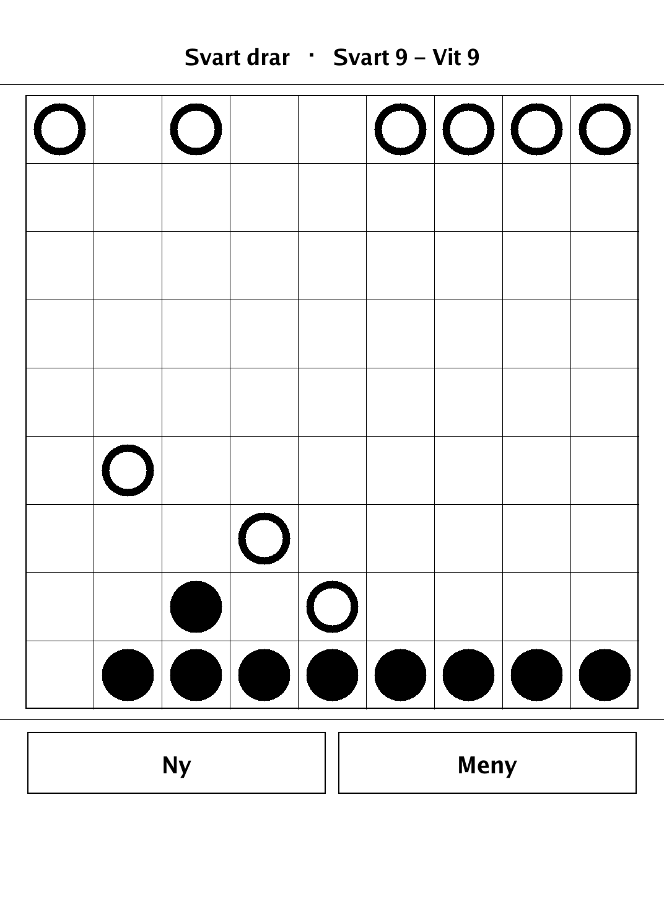
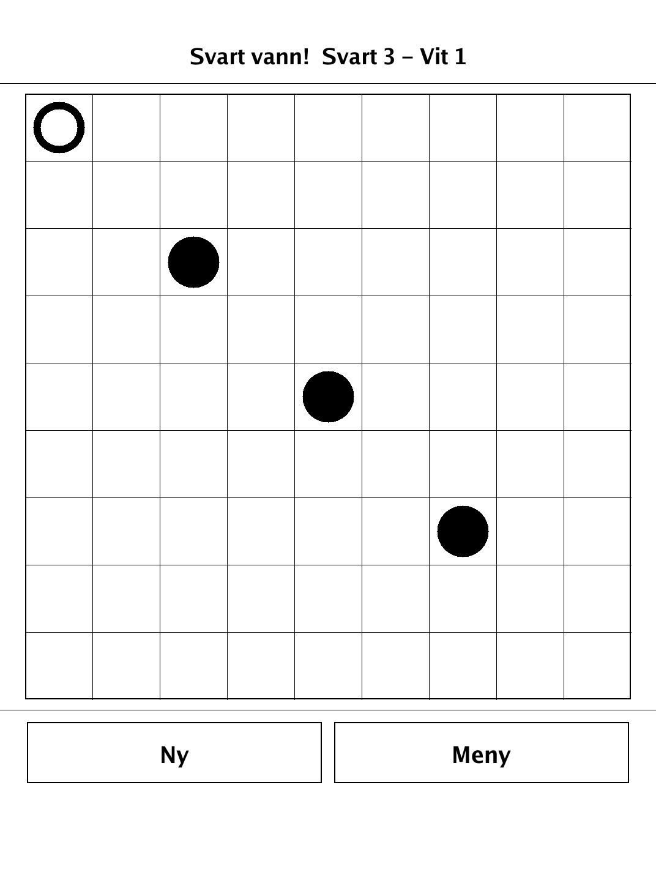
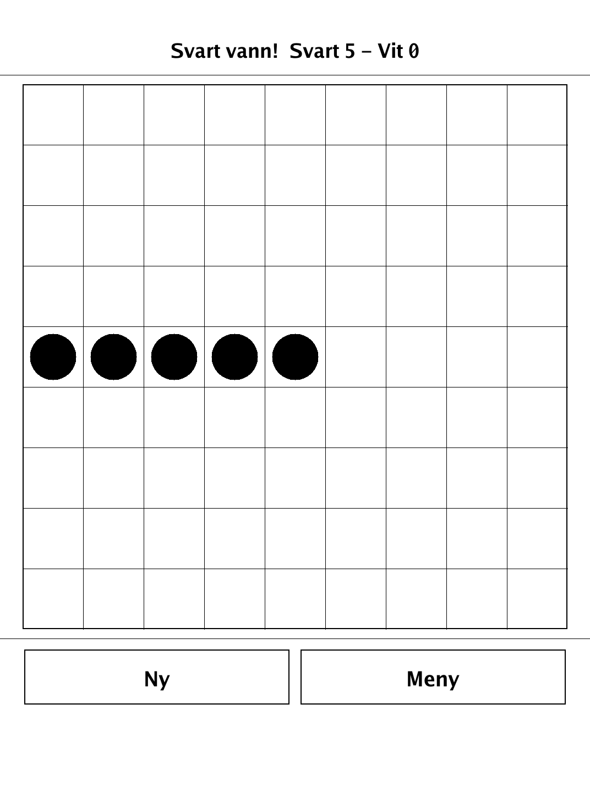
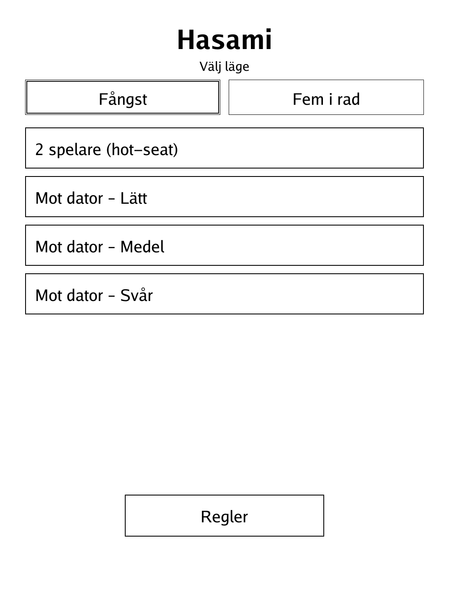

# Hasami (`hasami.app`)

Hasami shogi ("scissors shogi") — capture by sandwiching enemy men on a 9×9 board.

<p align="center"></p>

## About

`hasami` is Hasami shogi, a traditional Japanese board game, built for the PocketBook Verse Pro (PB634) on the dennwc/inkview SDK. Two players line up nine rook-moving men each and capture custodially — bracketing enemy men between two of their own. Play hot-seat against a friend or against a built-in minimax AI at three difficulty levels. The pure game logic (board, moves, captures, win conditions, AI) lives in an SDK-free `hasami/game` package and is unit-tested.

## How to play

- **Goal (Fångst / Capture):** reduce your opponent to a single man.
- **Setup:** 9×9 board; each player has nine men on their nearest row — Black at the bottom, White at the top. Black starts.
- **Movement:** a man moves like a rook — any distance straight (horizontally or vertically), never diagonally, and never through another man.
- **Custodial capture:** if your move brackets an unbroken run of one or more enemy men between two of your own, the whole run is removed. A single move can capture in several directions at once.
- **Corner capture:** an enemy man in a corner is taken when you occupy the two cells next to that corner.
- **Safe entry:** moving your own man into the gap between two enemy men is *not* self-capture — capture only ever applies to the men you just bracketed, never to your own moving man.
- **Optional mode (Fem i rad / Five in a row):** first to form an unbroken line of five of your own men — horizontal or vertical, anywhere outside your own starting row — wins.
- **Controls:** tap one of your men to select it (reachable cells are highlighted), then tap a destination. Tap the same man again to deselect. **Ny** restarts; **Meny** returns to the menu.

## Screenshots

<table>
  <tr>
    <td align="center"><br><sub>A game in progress vs the AI</sub></td>
    <td align="center"><br><sub>Fångst win — White down to one man</sub></td>
  </tr>
  <tr>
    <td align="center"><br><sub>Fem i rad — a line of five</sub></td>
    <td align="center"><br><sub>Menu: opponent, difficulty, win mode</sub></td>
  </tr>
</table>

## Building

Built against the PocketBook Go SDK — see the repo [README](../README.md) and [POCKETBOOK_GAMEDEV_GUIDE.md](../POCKETBOOK_GAMEDEV_GUIDE.md).

```bash
docker run --rm -v "$PWD/hasami:/app" -w /app sunsung/pocketbook-go-sdk:latest build -o hasami.app .
```

Copy `hasami.app` into the device's `applications/` folder. Headless tests: `playtest/play.sh hasami`.

Based on Hasami shogi, a traditional Japanese board game.
