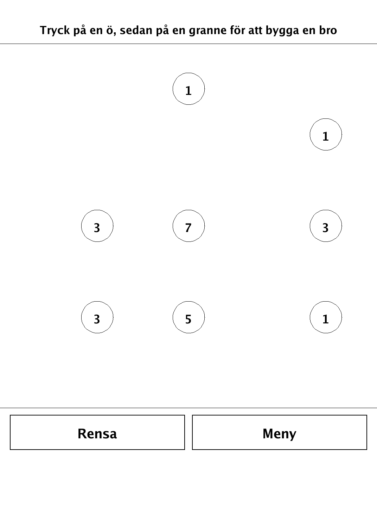
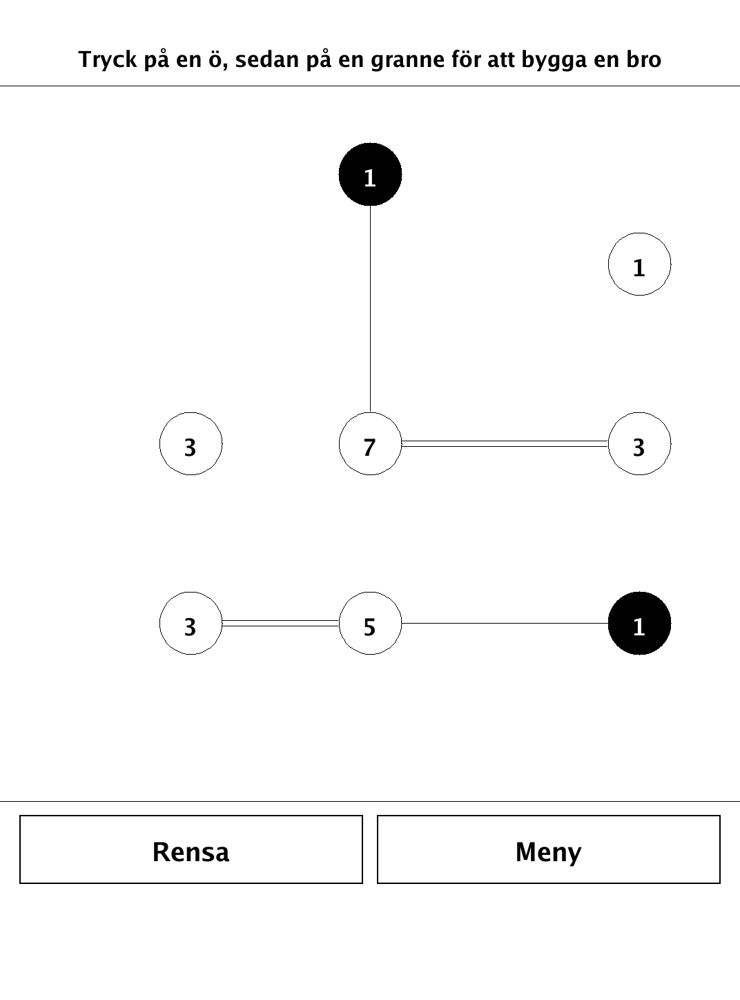
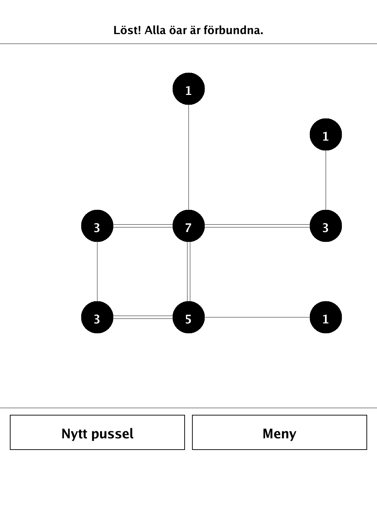

# Hashiwokakero (`hashiwokakero.app`)

Hashiwokakero (Bridges) — connect the numbered islands with the right count of bridges.

<p align="center"></p>

## About

`hashiwokakero` is the bridge-building logic puzzle Hashiwokakero (also known as Bridges or Hashi) for the PocketBook Verse Pro (PB634), built on the dennwc/inkview SDK. A grid of numbered islands must be linked with horizontal and vertical bridges so that every island's bridge count matches its number and the whole network is connected. Every generated puzzle is uniquely solvable by pure logic — no guessing required. The islands, bridges, crossing/connectivity checks, solver, and generator live in an SDK-free `hashiwokakero/game` package and are unit-tested.

## How to play

- **Goal:** connect all islands with bridges so each island's number of bridges matches its digit, and every island ends up in one connected network.
- **Bridges** run straight (horizontal or vertical) between two islands on the same row or column, with no other island in between.
- **Building:** tap an island to select it, then tap a neighbour to lay a bridge. Tap again to add a second bridge (at most two between the same pair), and a third time to clear the bridges.
- Bridges may **never cross** one another.
- When an island has its exact required number of bridges, it is filled in as a marker.
- **Rensa** removes all bridges if you want to start over; **Meny** returns to the menu.

## Screenshots

<table>
  <tr>
    <td align="center"><br><sub>A fresh puzzle: numbered islands</sub></td>
    <td align="center"><br><sub>Building single and double bridges</sub></td>
  </tr>
  <tr>
    <td align="center"><br><sub>Solved — all islands connected</sub></td>
    <td align="center"><br><sub>In-app rules</sub></td>
  </tr>
</table>

## Building

Built against the PocketBook Go SDK — see the repo [README](../README.md) and [POCKETBOOK_GAMEDEV_GUIDE.md](../POCKETBOOK_GAMEDEV_GUIDE.md).

```bash
docker run --rm -v "$PWD/hashiwokakero:/app" -w /app sunsung/pocketbook-go-sdk:latest build -o hashiwokakero.app .
```

Copy `hashiwokakero.app` into the device's `applications/` folder. Headless tests: `playtest/play.sh hashiwokakero`.

Based on Hashiwokakero (Bridges / Hashi), a Nikoli logic puzzle.
