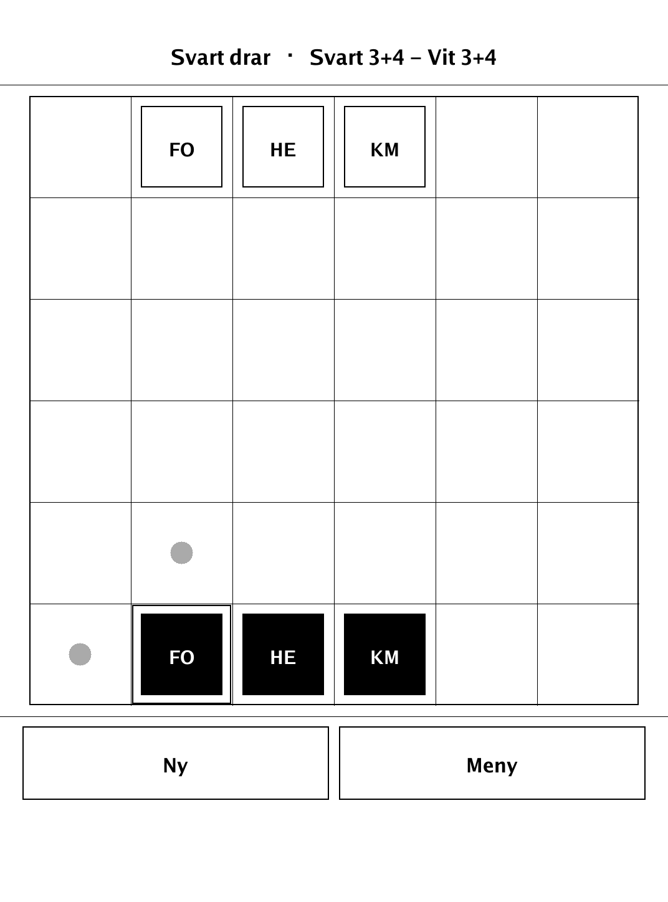
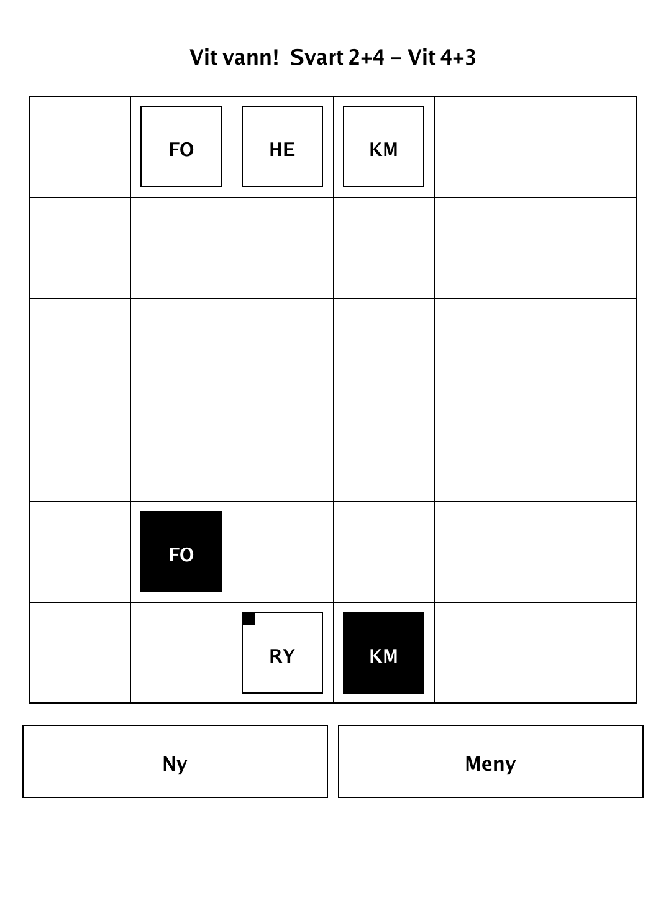
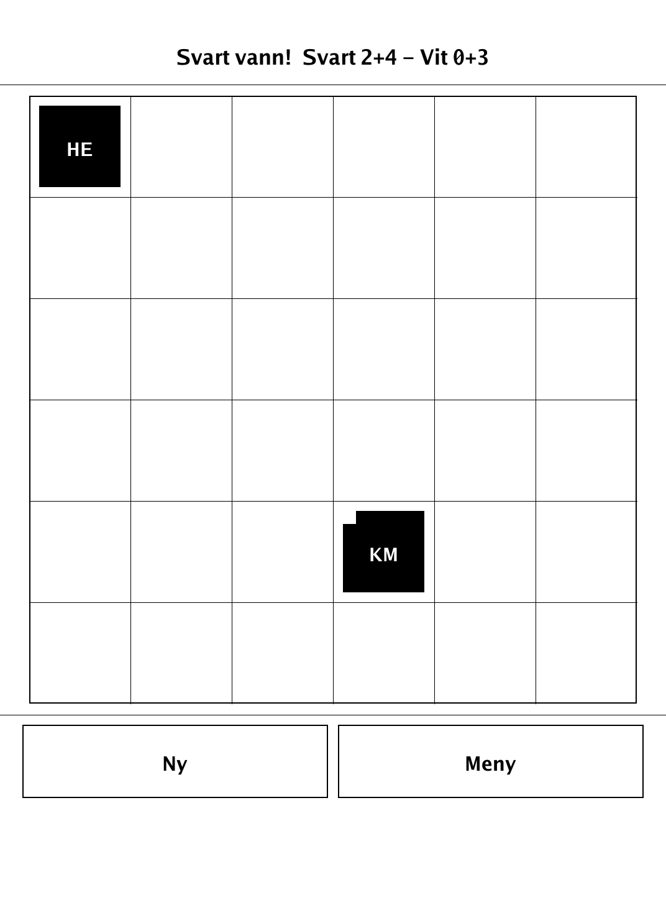
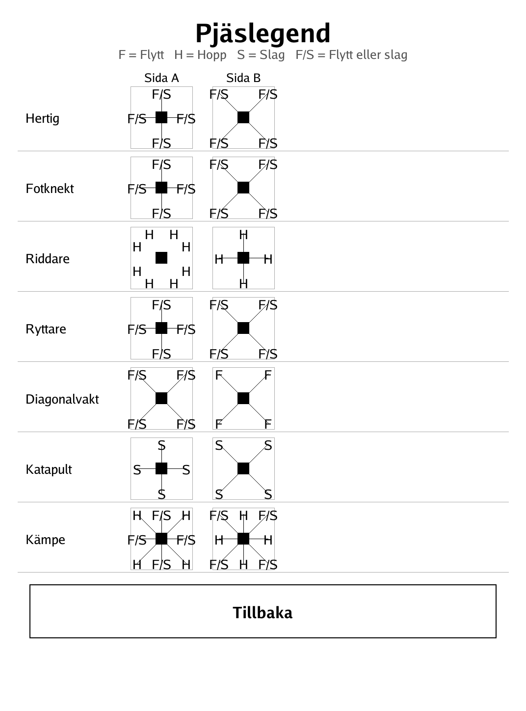

# Hertigen (`hertigen.app`)

Hertigen ("The Duke") — a tactical game of double-sided tiles that flip each time they act.

<p align="center"></p>

## About

`hertigen` is Hertigen ("The Duke") for the PocketBook Verse Pro (PB634), built on the dennwc/inkview SDK. Every tile — including each side's Duke — is double-sided, with a different printed move/jump/strike pattern on each face; acting flips the tile over, so the same piece behaves differently on its next move. Capture the enemy Duke to win. Play hot-seat against a friend or against a built-in alpha-beta AI at three difficulty levels. The board, tile patterns, actions, and AI live in an SDK-free `hertigen/game` package and are unit-tested. The tile roster is this game's own original invention — only the core mechanic is borrowed from the original.

## How to play

- **Goal:** capture the opponent's Duke.
- **Setup:** 6×6 board. Each side has a Duke (Hertig), a Footman (Fotknekt), and a Champion (Kämpe) on its home row; Knight (Riddare), Rider (Ryttare), Diagonal Guard (Diagonalvakt), and Catapult (Katapult) start in reserve. Black moves first.
- **Double-sided tiles:** each tile shows a movement pattern; which one applies depends on the face currently up.
- **Patterns:** *Flytt* (slide, blocked by anything in the way, destination must be empty), *Hopp* (jump straight over anything, capturing by landing), *Slag* (strike an enemy on that square *without* moving there), and *Flytt/Slag* (slide there, empty or onto an enemy to remove it).
- **Flip on act:** every time a tile acts, it flips to its other side afterward, so the other pattern applies next time. This includes the Duke.
- **Recruit (instead of moving):** place a reserve troop on an empty square next to your Duke's current square. This uses your whole turn.
- **Controls:** tap one of your tiles to select it — legal targets are marked (dot = move, double frame = strike). Tap a target to act. With the Duke selected, **Rekrytera** appears: tap it, choose a troop type, then tap a highlighted square. See **Pjäslegend** for an illustrated overview of all seven tiles' two faces.

## Screenshots

<table>
  <tr>
    <td align="center"><br><sub>A selected tile with its legal targets</sub></td>
    <td align="center"><br><sub>A game in progress vs the AI</sub></td>
  </tr>
  <tr>
    <td align="center"><br><sub>Capturing the enemy Duke wins</sub></td>
    <td align="center"><br><sub>Pjäslegend: every tile's two faces</sub></td>
  </tr>
</table>

## Building

Built against the PocketBook Go SDK — see the repo [README](../README.md) and [POCKETBOOK_GAMEDEV_GUIDE.md](../POCKETBOOK_GAMEDEV_GUIDE.md).

```bash
docker run --rm -v "$PWD/hertigen:/app" -w /app sunsung/pocketbook-go-sdk:latest build -o hertigen.app .
```

Copy `hertigen.app` into the device's `applications/` folder. Headless tests: `playtest/play.sh hertigen`.

Based on The Duke (Catalyst Game Labs) — only the core flip-on-act mechanic is borrowed, not the piece names, patterns, or setup.
