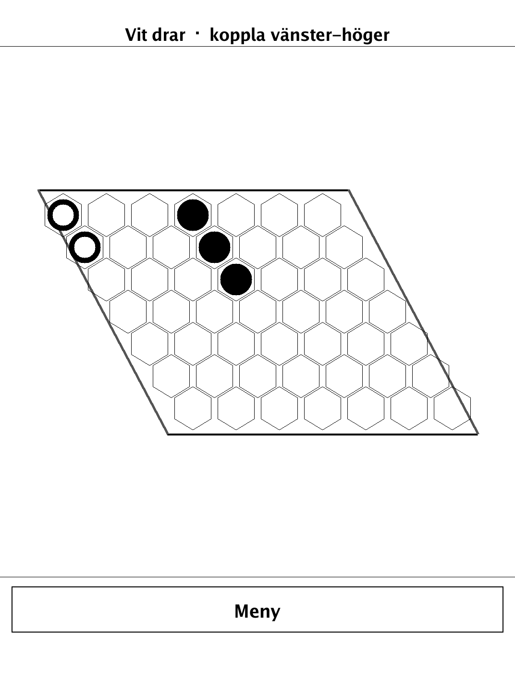
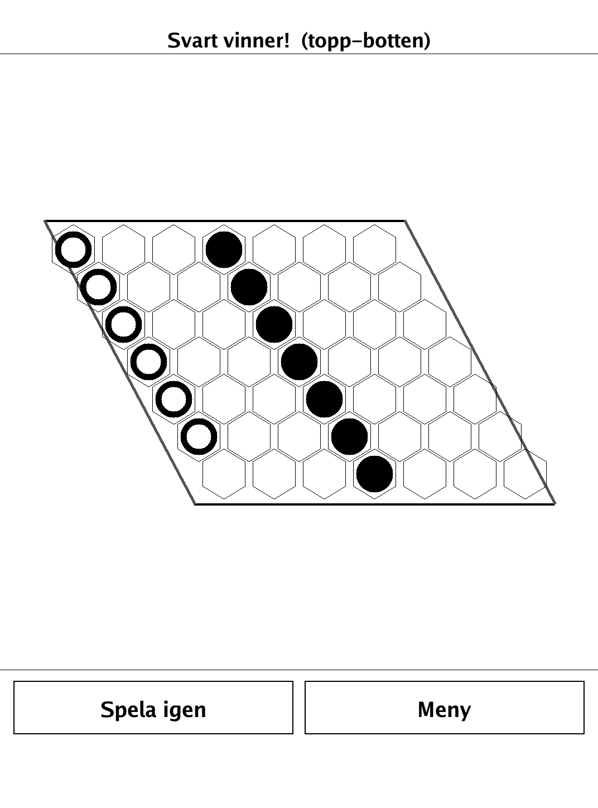

# Hex (`hex.app`)

Hex — the classic connection game; link your two edges before your opponent links theirs.

<p align="center"></p>

## About

`hex` is the classic connection game Hex for the PocketBook Verse Pro (PB634), built on the dennwc/inkview SDK. Two players place stones on an N×N rhombus of hexagons: Black links the top and bottom edges, White links the left and right edges. First to connect their two edges wins — in Hex a draw is impossible. Play hot-seat against a friend or against a built-in heuristic AI. The board, connectivity checks, and AI live in an SDK-free `hex/game` package and are unit-tested.

## How to play

- **Goal:** build an unbroken chain of your stones between your two sides of the board.
- Black connects the top and bottom edges (the solid edges); White connects the left and right edges (the grey edges).
- Players take turns placing one stone on any empty cell. Stones are never moved and never removed.
- Black starts. Two cells are connected if they border each other in the hexagonal pattern.
- In Hex the game can **never end in a draw** — exactly one player always succeeds in connecting their sides.
- **Modes:** hot-seat, or solo as Black against the AI. **Spela igen** starts a new game; **Meny** returns to the menu.

## Screenshots

<table>
  <tr>
    <td align="center"><br><sub>A game in progress on 7×7</sub></td>
    <td align="center"><br><sub>Black connects top to bottom and wins</sub></td>
  </tr>
</table>

## Building

Built against the PocketBook Go SDK — see the repo [README](../README.md) and [POCKETBOOK_GAMEDEV_GUIDE.md](../POCKETBOOK_GAMEDEV_GUIDE.md).

```bash
docker run --rm -v "$PWD/hex:/app" -w /app sunsung/pocketbook-go-sdk:latest build -o hex.app .
```

Copy `hex.app` into the device's `applications/` folder. Headless tests: `playtest/play.sh hex`.

Based on Hex, the connection game invented independently by Piet Hein and John Nash.
