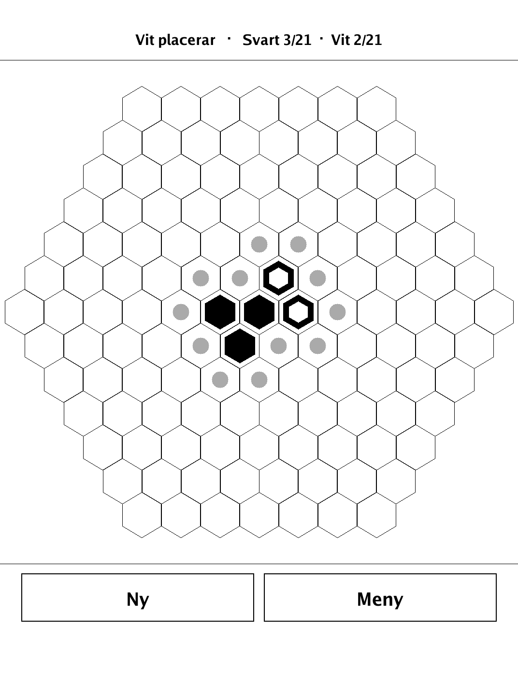
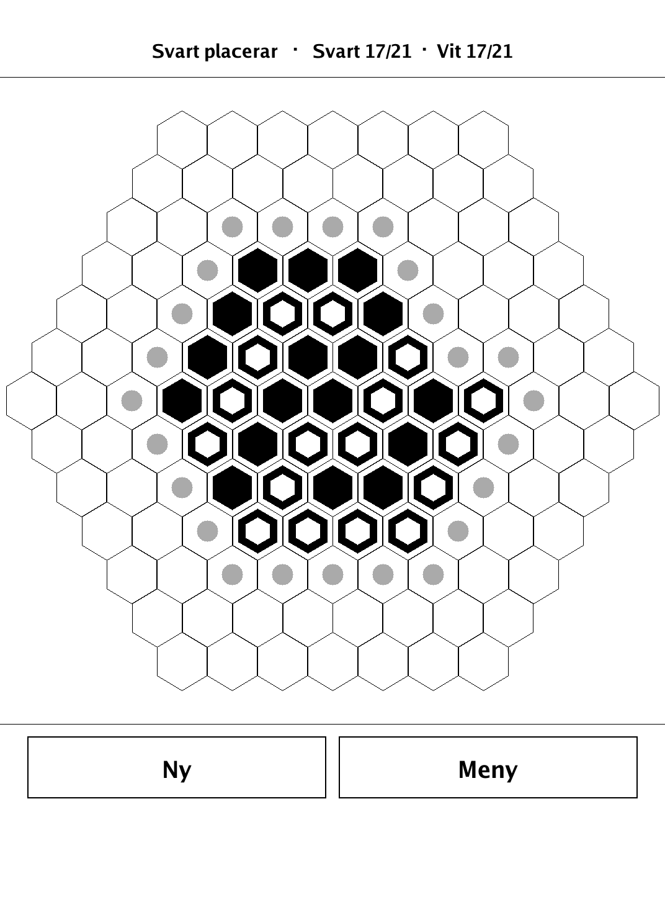
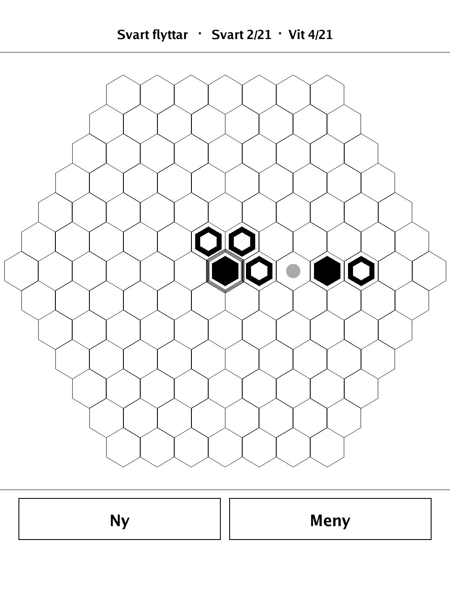
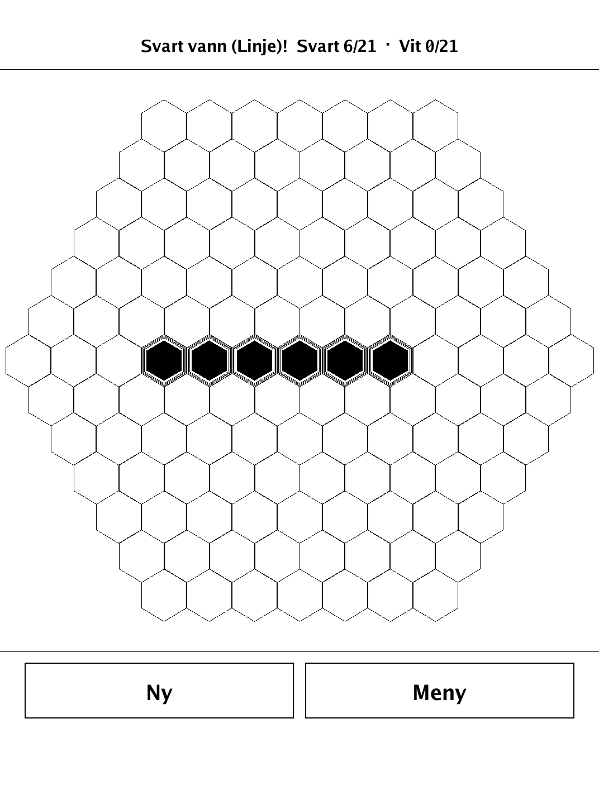
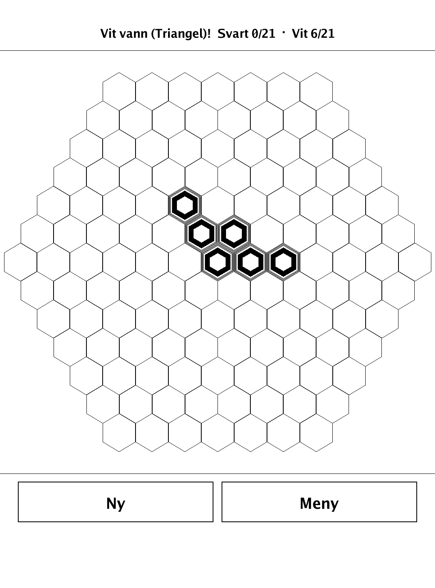
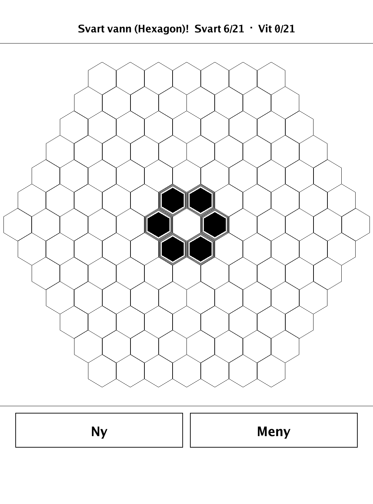

# Hexa (`hexa.app`)

Hexa — build a mosaic of hex tiles and be first to shape a line, triangle, or ring of six.

<p align="center"></p>

## About

`hexa` is Hexa, based on *Six* by Steffen Spiele (Steffen Mühlhäuser), built for the PocketBook Verse Pro (PB634) on the dennwc/inkview SDK. Two players place hex tiles of their own color edge-to-edge into a single, always-connected growing mosaic, then — once all 42 tiles are down — slide their tiles around the cluster's edge. First to arrange six of their own tiles into a line, a triangle, or a ring wins. Hot-seat is the primary experience; a deliberately casual built-in AI is also available. The hex geometry, placement/move legality, connectivity, the three shape checks, and the AI live in an SDK-free `hexa/game` package and are unit-tested.

## How to play

- **Goal:** form one of three figures with **six** of your own hex tiles — a straight **Linje** (line), a **Triangel** (triangle), or a **Hexagon** ring around a central cell.
- **Placement phase:** Black and White have 21 tiles each. Take turns laying a tile so it touches at least one tile already down — the whole mosaic must always stay connected. Black starts.
  - *Line:* six tiles in a row along one of the field's three directions.
  - *Triangle:* six tiles in a triangular form (rows of 3, 2, and 1), any direction.
  - *Hexagon:* six tiles surrounding a central cell — the center may be empty or any color; only the six around it count.
- **Movement phase:** once all 42 tiles are placed with no winner, players instead take turns sliding one of their own tiles to another empty spot on the mosaic's edge. The mosaic must stay connected after the move.
- **Advanced (optional):** a move *may* split the mosaic; every tile in a piece not containing the moved tile is removed. A side reduced to five or fewer tiles can never form a figure and loses.
- **Controls:** tap a highlighted empty cell to place. In the movement phase, tap one of your tiles (its legal targets are marked), then tap the target; tap the tile again to deselect.

## Screenshots

<table>
  <tr>
    <td align="center"><br><sub>Early placement, the mosaic growing</sub></td>
    <td align="center"><br><sub>A dense, near-full board</sub></td>
  </tr>
  <tr>
    <td align="center"><br><sub>Movement phase: a tile's legal destinations</sub></td>
    <td align="center"><br><sub>A completed Linje wins</sub></td>
  </tr>
  <tr>
    <td align="center"><br><sub>A Triangel of six tiles</sub></td>
    <td align="center"><br><sub>A Hexagon ring around a center cell</sub></td>
  </tr>
</table>

## Building

Built against the PocketBook Go SDK — see the repo [README](../README.md) and [POCKETBOOK_GAMEDEV_GUIDE.md](../POCKETBOOK_GAMEDEV_GUIDE.md).

```bash
docker run --rm -v "$PWD/hexa:/app" -w /app sunsung/pocketbook-go-sdk:latest build -o hexa.app .
```

Copy `hexa.app` into the device's `applications/` folder. Headless tests: `playtest/play.sh hexa`.

Based on Six by Steffen Spiele (Steffen Mühlhäuser).
