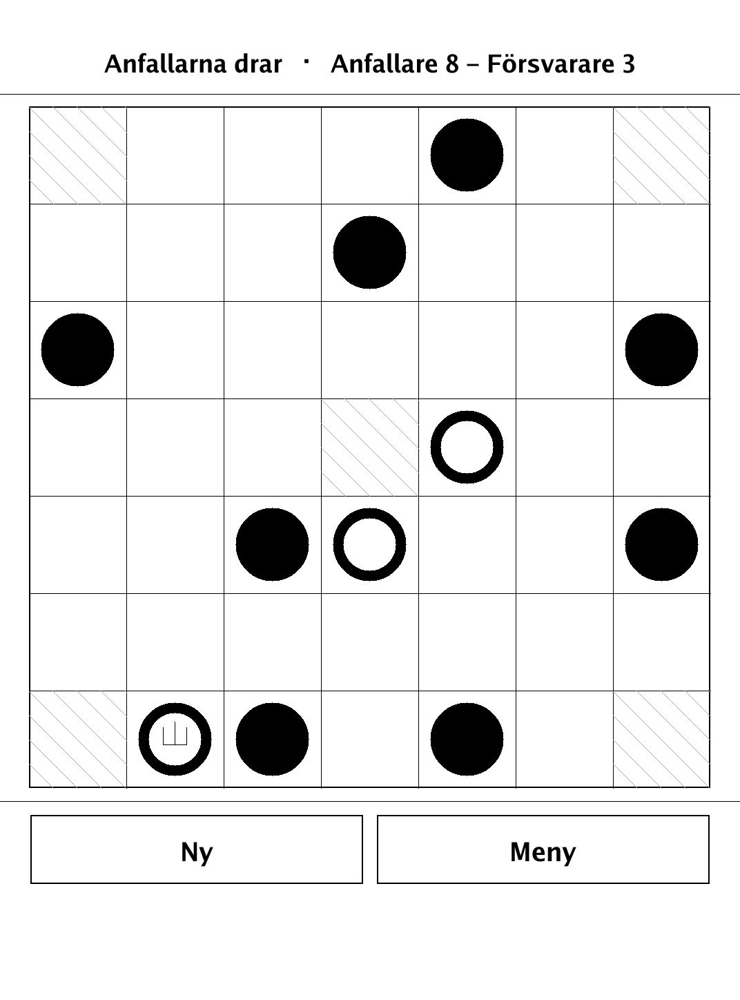
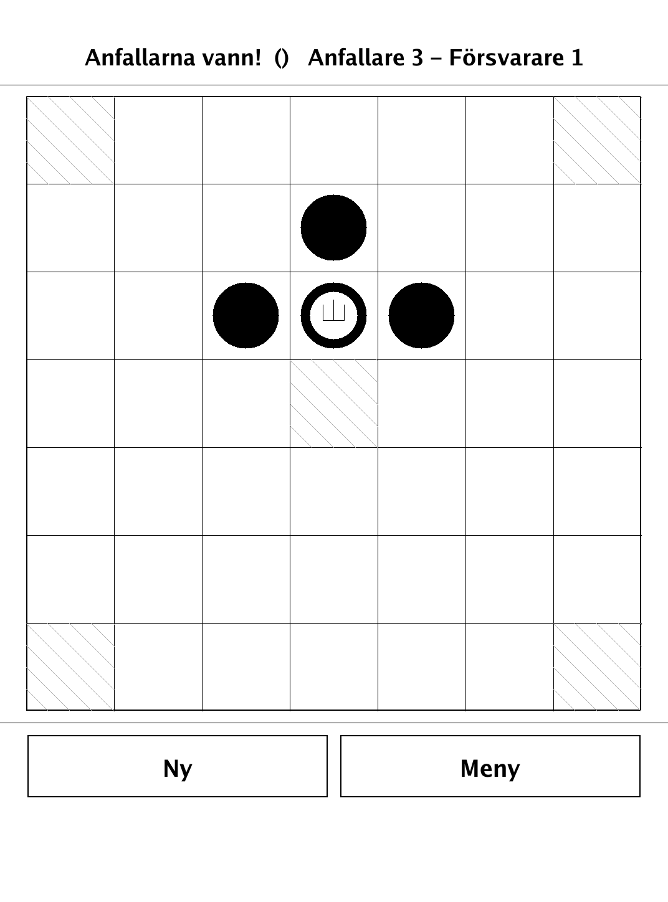
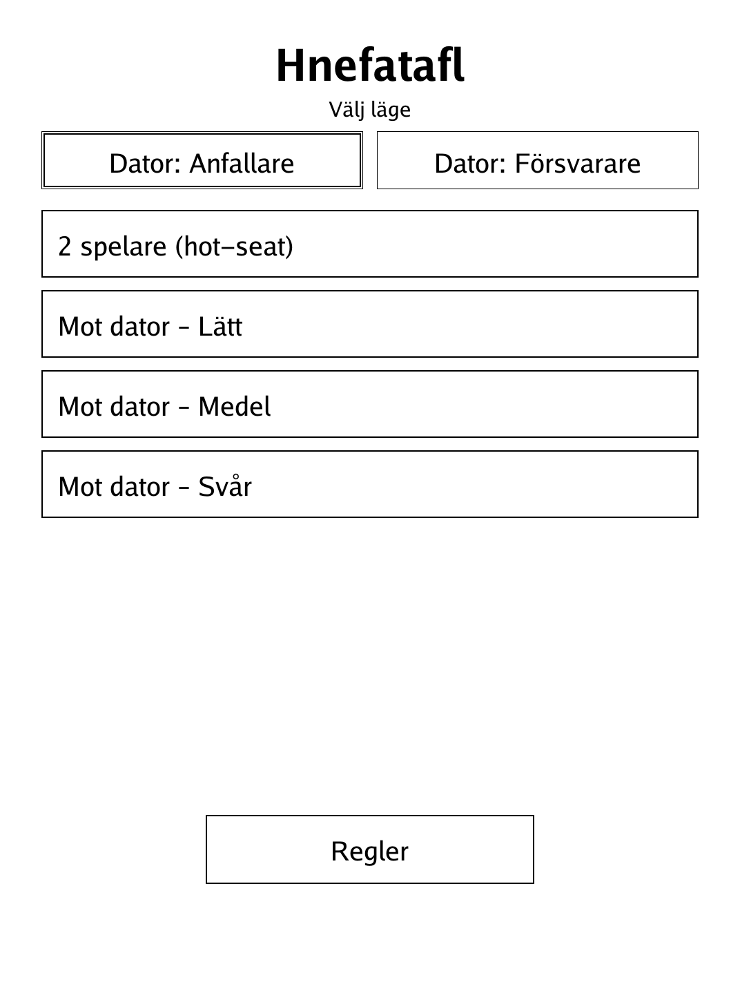
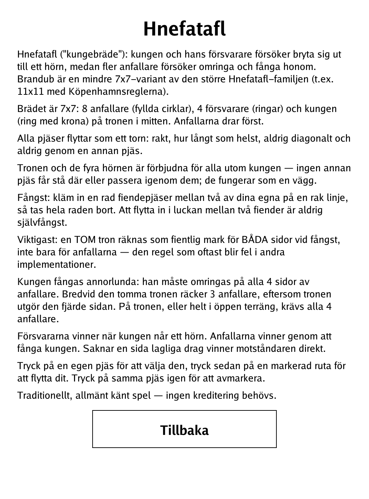

# Hnefatafl (`hnefatafl.app`)

The Viking siege game, in its 7x7 Brandub variant, for the PocketBook Verse Pro.

<p align="center"></p>

## About

Hnefatafl ("king's board") is an asymmetric Norse strategy game: a king and his defenders try to break out to a corner, while a larger attacking force tries to surround and capture the king first. This app plays Brandub, the smaller 7x7 member of the tafl family (the larger relatives use 11x11 boards and rules such as Copenhagen). Play hot-seat against a friend or against a built-in minimax AI that can take either side, at three difficulty levels. It is a traditional, widely known game — no attribution required.

## How to play

- **Sides:** 8 attackers (filled discs) surround 4 defenders (rings) plus the king (ringed disc with a crown) on the central throne. Attackers move first.
- **Movement:** every piece moves like a rook — orthogonally, any distance, never diagonally and never through another piece.
- **Restricted squares:** the throne and the four corners are forbidden to every piece except the king; no one else may stand on or pass through them, and they act as a wall.
- **Capture:** sandwich a line of enemy pieces between two of your own on a straight line and the whole line is removed. Moving into the gap between two enemies is never self-capture.
- **Hostile throne:** an *empty* throne counts as hostile ground for **both** sides when resolving a capture — the rule most other implementations get wrong.
- **Capturing the king:** the king must be surrounded on all four sides by attackers; next to the empty throne, three attackers suffice because the throne forms the fourth side.
- **Winning:** the defenders win when the king reaches a corner; the attackers win by capturing the king. If a side has no legal move, the opponent wins at once.
- **Controls:** tap one of your pieces to select it, then tap a highlighted square to move; tap the piece again to deselect. Choose "2 spelare (hot-seat)" or "Mot dator – Lätt / Medel / Svår" on the menu.

## Screenshots

<table>
  <tr>
    <td align="center"><br><sub>Mid-game: rook-like moves and custodial capture</sub></td>
    <td align="center"><br><sub>Game over</sub></td>
  </tr>
  <tr>
    <td align="center"><br><sub>Side and difficulty selection</sub></td>
    <td align="center"><br><sub>In-app rules (Swedish)</sub></td>
  </tr>
</table>

## Building

Built against the PocketBook Go SDK — see the repo [README](../README.md) and [POCKETBOOK_GAMEDEV_GUIDE.md](../POCKETBOOK_GAMEDEV_GUIDE.md).

```bash
docker run --rm -v "$PWD/hnefatafl:/app" -w /app sunsung/pocketbook-go-sdk:latest build -o hnefatafl.app .
```

Copy `hnefatafl.app` into the device's `applications/` folder. Headless tests: `playtest/play.sh hnefatafl`.

Based on Hnefatafl / Brandub, a traditional Norse tafl game in the public domain.
