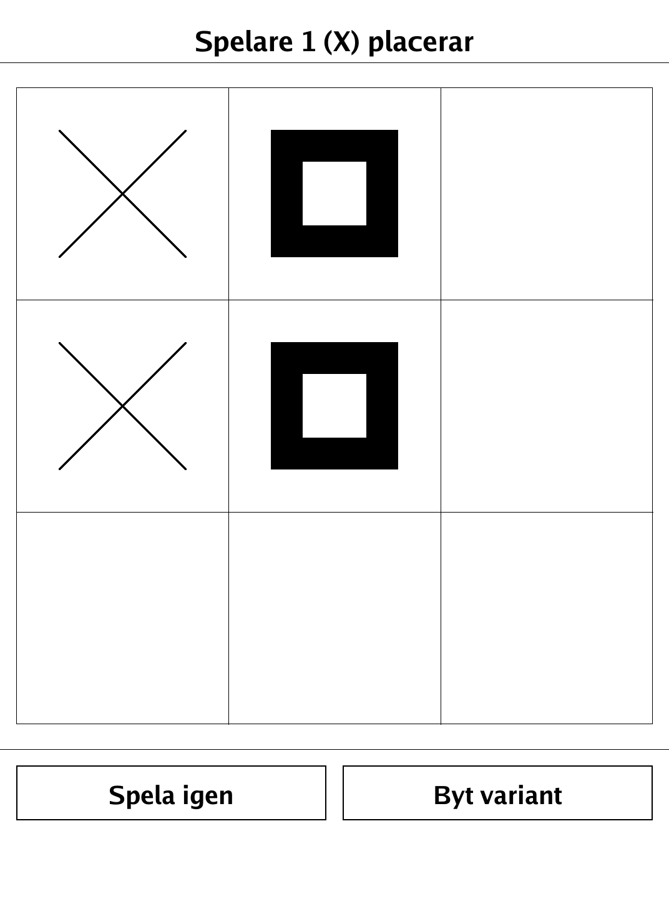
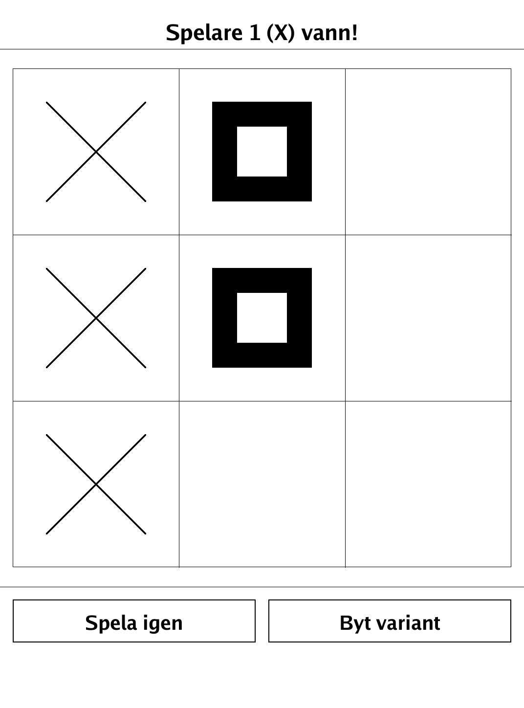
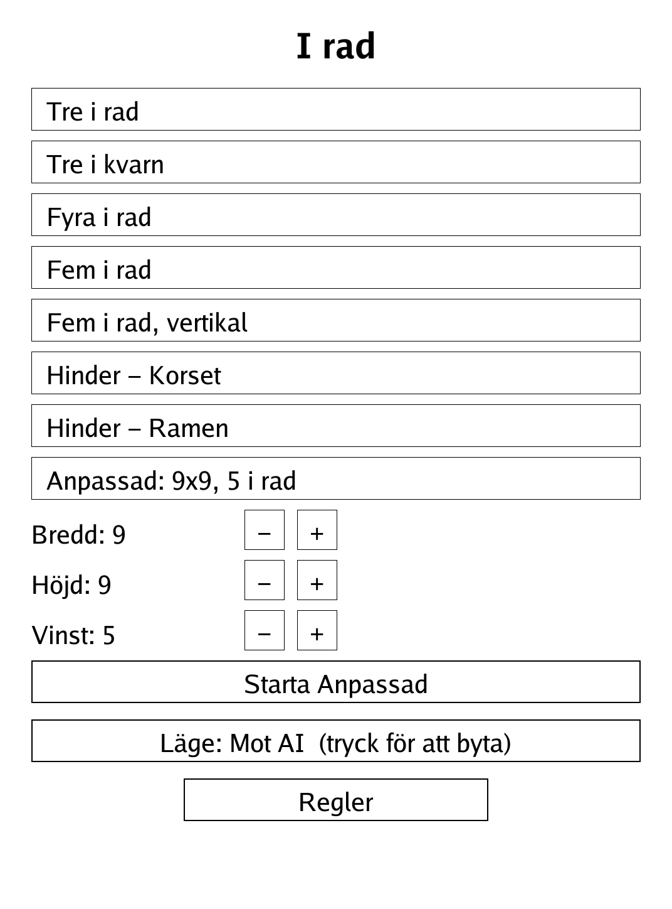
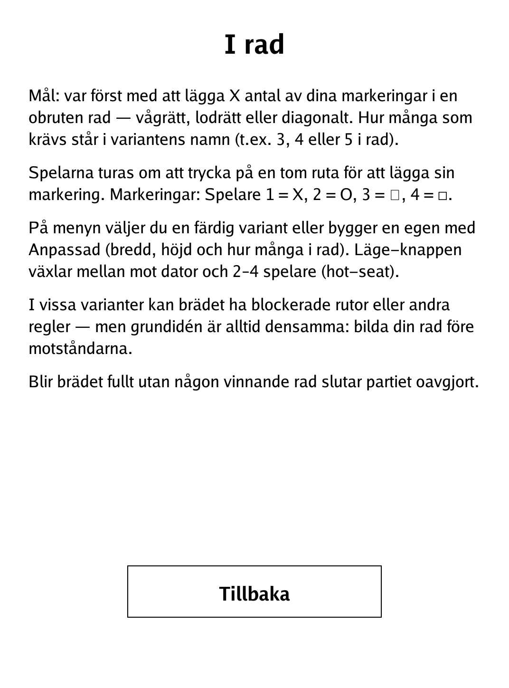

# I rad (`irad.app`)

A configurable "in-a-row" engine — tic-tac-toe, Connect Four, Gomoku and more — for the PocketBook Verse Pro.

<p align="center"></p>

## About

"I rad" ("in a row") is a single engine that covers the whole line-up family: get X marks in an unbroken line to win, where X and the board shape are set by the chosen variant. Built-in variants range from 3x3 tic-tac-toe up to 13x13 five-in-a-row (Gomoku), including a Connect-Four-style drop board, a "three men's morris" moving variant, and boards with blocked cells. Play against a heuristic AI (in the vs-computer mode) or 2–4 players hot-seat, and build your own board with the "Anpassad" (custom) option.

## How to play

- **Goal:** be first to place the required number of your marks in an unbroken line — horizontal, vertical or diagonal. The count is in the variant's name (e.g. 3, 4 or 5 in a row).
- **Marks:** Player 1 = X, 2 = O, 3 = triangle, 4 = square. Players take turns tapping an empty cell to place a mark.
- **Menu:** pick a ready-made variant or build one with "Anpassad" (width, height, win length). The "Läge" (mode) button toggles between vs-computer and 2–4 players hot-seat. The AI is only used in the vs-computer mode; with 3–4 players everyone is human.
- **Built-in variants:** Tre i rad (3x3), Tre i kvarn (3x3, 3 pieces each — a placement phase followed by sliding a stone to an adjacent empty), Fyra i rad (7x6 drop / Connect Four), Fem i rad and Fem i rad vertikal (Gomoku), and obstacle boards "Hinder – Korset" and "Hinder – Ramen" with blocked cells.
- **Drop variants:** tapping anywhere in a column drops your stone to the lowest empty cell.
- **Draw:** if the board fills with no winning line, the game is a draw.
- **Controls:** tap a cell to place (or tap a column to drop); in moving variants tap your stone then an adjacent empty cell. "Byt variant" returns to the menu; "Spela igen" restarts a finished game.

## Screenshots

<table>
  <tr>
    <td align="center"><br><sub>Tre i rad in progress</sub></td>
    <td align="center"><br><sub>Player 1 wins a column</sub></td>
  </tr>
  <tr>
    <td align="center"><br><sub>Variant and mode selection</sub></td>
    <td align="center"><br><sub>In-app rules (Swedish)</sub></td>
  </tr>
</table>

## Building

Built against the PocketBook Go SDK — see the repo [README](../README.md) and [POCKETBOOK_GAMEDEV_GUIDE.md](../POCKETBOOK_GAMEDEV_GUIDE.md).

```bash
docker run --rm -v "$PWD/irad:/app" -w /app sunsung/pocketbook-go-sdk:latest build -o irad.app .
```

Copy `irad.app` into the device's `applications/` folder. Headless tests: `playtest/play.sh irad`.

Based on the traditional m,n,k-game family (tic-tac-toe, Connect Four, Gomoku, three men's morris) — all in the public domain.
