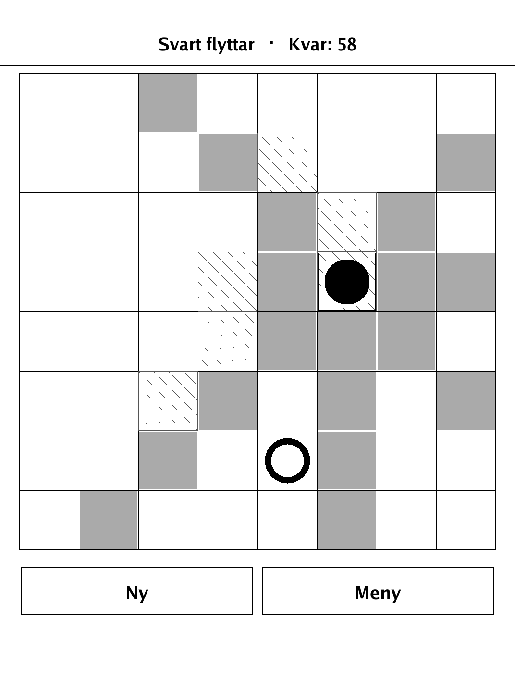
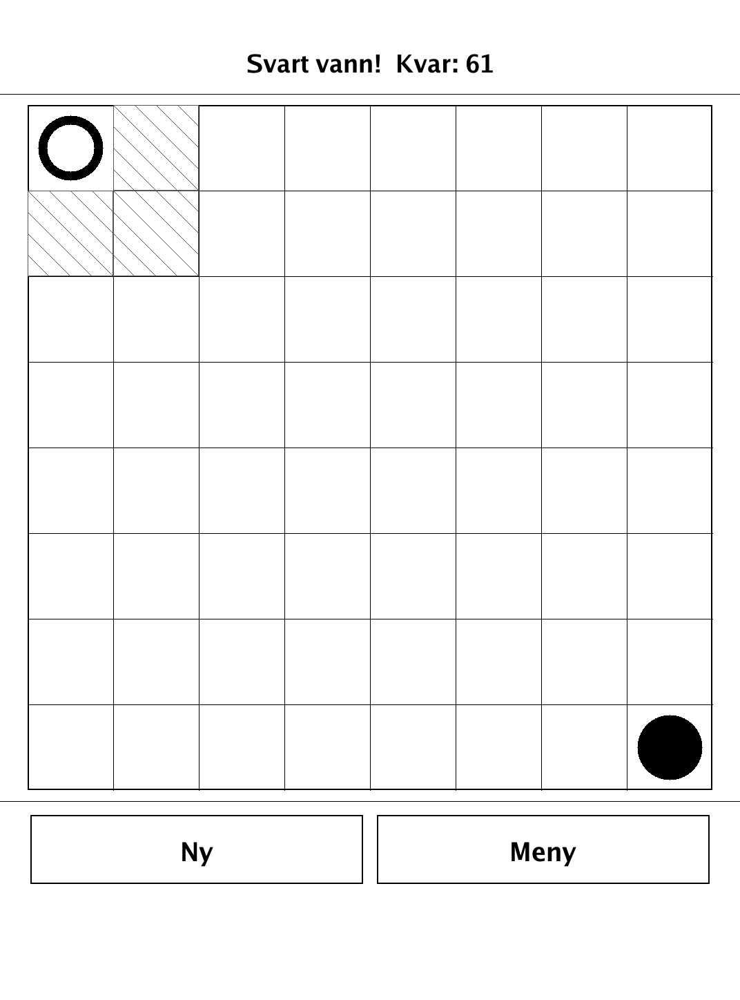
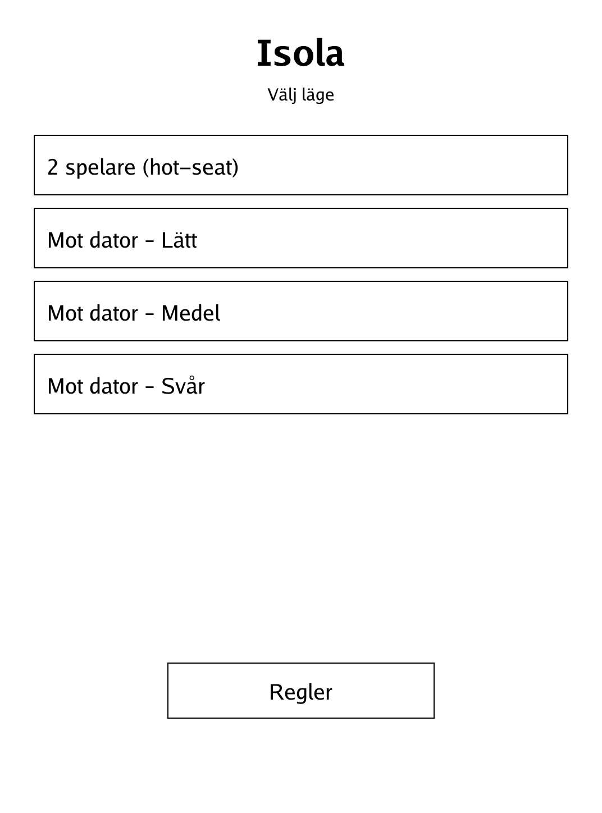
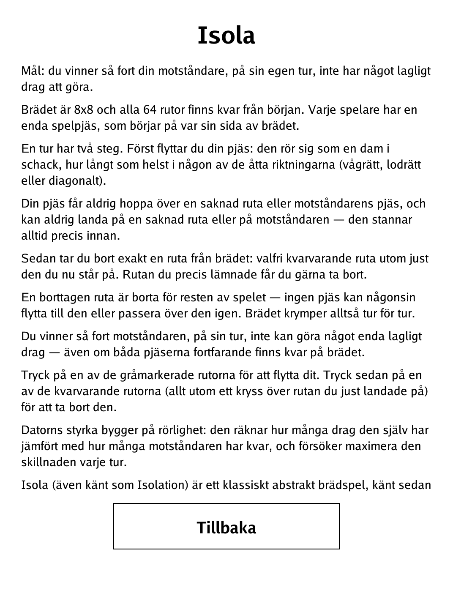

# Isola (`isola.app`)

A shrinking-board pursuit game where you strand your opponent, for the PocketBook Verse Pro.

<p align="center"></p>

## About

Isola (also known as Isolation) is a classic abstract board game, known since the 1970s. Each player has a single pawn on an 8x8 board of tiles; every turn you move your pawn and then destroy one tile, and the board slowly shrinks until one side is trapped. Play hot-seat against a friend or against a built-in AI at three difficulty levels — the AI evaluates mobility, maximizing its own remaining moves relative to yours.

## How to play

- **Goal:** you win the moment your opponent, on their own turn, has no legal move — even if both pawns are still on the board.
- **Setup:** the 8x8 board starts with all 64 tiles present; each player has one pawn, starting on opposite sides.
- **A turn has two steps.** First move your pawn: it travels like a chess queen, any distance in any of the eight directions (horizontal, vertical or diagonal).
- **Movement limits:** your pawn may never jump over a missing tile or the opponent's pawn, and can never land on a missing tile or on the opponent — it stops just before.
- **Then remove a tile:** take away exactly one remaining tile, any tile except the one you are now standing on. The tile you just left is fair game.
- **Removed tiles are gone for good** — no pawn can ever move onto or across them again, so the board shrinks turn by turn.
- **Controls:** tap one of the highlighted grey squares to move there, then tap any remaining tile (everything except the crossed-out square you just landed on) to remove it. Choose "2 spelare (hot-seat)" or "Mot dator – Lätt / Medel / Svår" on the menu.

## Screenshots

<table>
  <tr>
    <td align="center"><br><sub>The board shrinking mid-game</sub></td>
    <td align="center"><br><sub>A player is trapped — game over</sub></td>
  </tr>
  <tr>
    <td align="center"><br><sub>Opponent and difficulty selection</sub></td>
    <td align="center"><br><sub>In-app rules (Swedish)</sub></td>
  </tr>
</table>

## Building

Built against the PocketBook Go SDK — see the repo [README](../README.md) and [POCKETBOOK_GAMEDEV_GUIDE.md](../POCKETBOOK_GAMEDEV_GUIDE.md).

```bash
docker run --rm -v "$PWD/isola:/app" -w /app sunsung/pocketbook-go-sdk:latest build -o isola.app .
```

Copy `isola.app` into the device's `applications/` folder. Headless tests: `playtest/play.sh isola`.

Based on Isola (Isolation), a classic abstract board game in the public domain.
