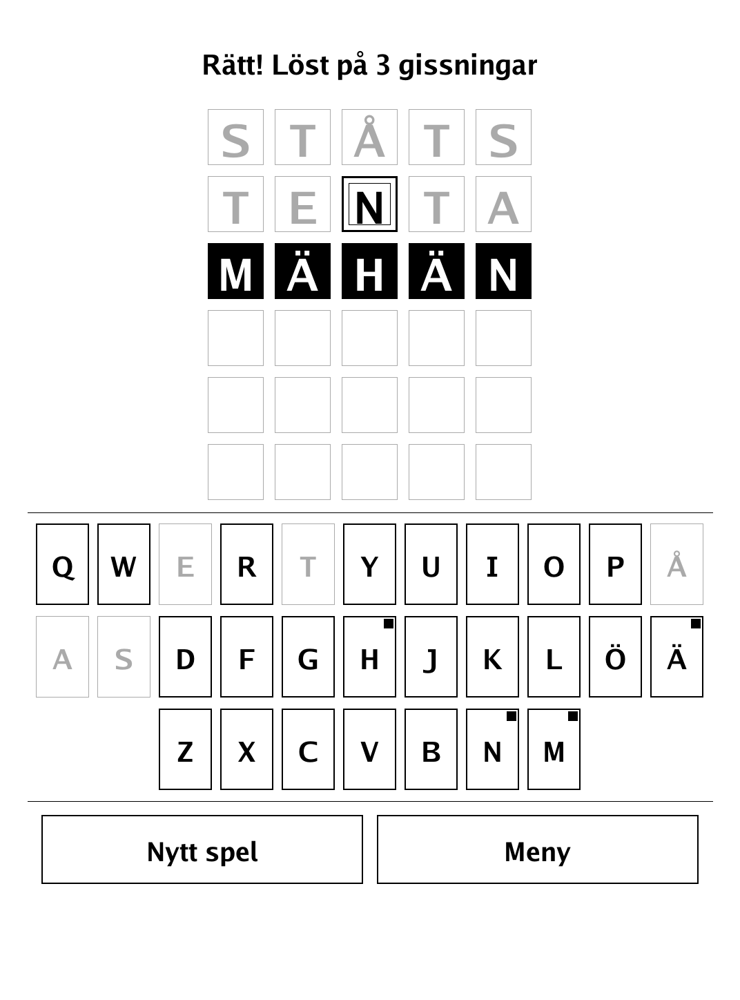
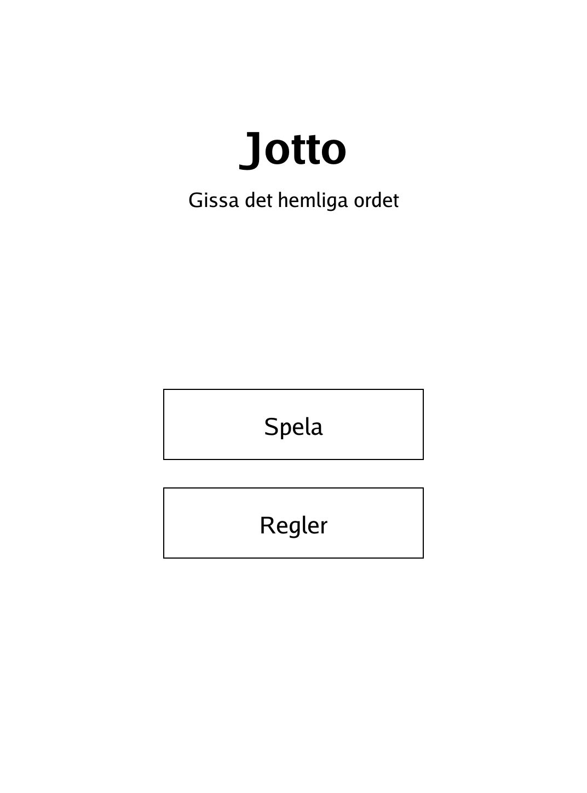
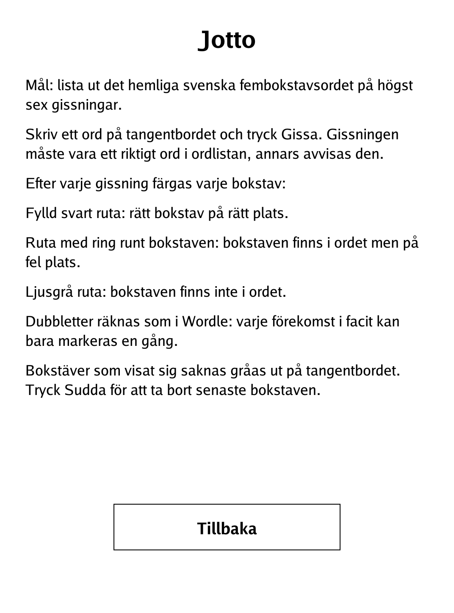

# Jotto (`jotto.app`)

A Swedish five-letter word-guessing game, Wordle style, for the PocketBook Verse Pro.

<p align="center"></p>

## About

Jotto is a Swedish word-guessing game in the Jotto / Wordle tradition: the computer picks a secret five-letter Swedish word and you have six tries to find it. Because the screen is greyscale e-ink, per-letter feedback uses shapes rather than colours — a filled black tile, a hollow ringed tile, or a light tile. Duplicate letters follow the usual Wordle scoring, and every guess must be a real dictionary word.

## How to play

- **Goal:** work out the hidden five-letter Swedish word in at most six guesses.
- **Guessing:** type a word on the on-screen keyboard and tap "Gissa". The guess must be a real word in the dictionary, otherwise it is rejected.
- **Feedback per letter:**
  - **Filled black tile** — right letter in the right place.
  - **Tile with a ring around the letter** — the letter is in the word but in the wrong place.
  - **Light grey tile** — the letter is not in the word.
- **Duplicates** are scored as in Wordle: each occurrence in the answer can only be matched once.
- **Keyboard aids:** letters shown to be absent are greyed out on the keyboard. Tap "Sudda" to delete the last letter.
- **After a game:** "Nytt spel" starts a fresh word; "Meny" returns to the menu.

## Screenshots

<table>
  <tr>
    <td align="center"><br><sub>Guesses in progress with tile feedback</sub></td>
    <td align="center"><br><sub>Solved — all tiles correct</sub></td>
  </tr>
  <tr>
    <td align="center"><br><sub>Start menu</sub></td>
    <td align="center"><br><sub>In-app rules (Swedish)</sub></td>
  </tr>
</table>

## Building

Built against the PocketBook Go SDK — see the repo [README](../README.md) and [POCKETBOOK_GAMEDEV_GUIDE.md](../POCKETBOOK_GAMEDEV_GUIDE.md).

```bash
docker run --rm -v "$PWD/jotto:/app" -w /app sunsung/pocketbook-go-sdk:latest build -o jotto.app .
```

Copy `jotto.app` into the device's `applications/` folder. Headless tests: `playtest/play.sh jotto`.

Inspired by Jotto and Wordle-style word games; this is an original Swedish-dictionary implementation.
