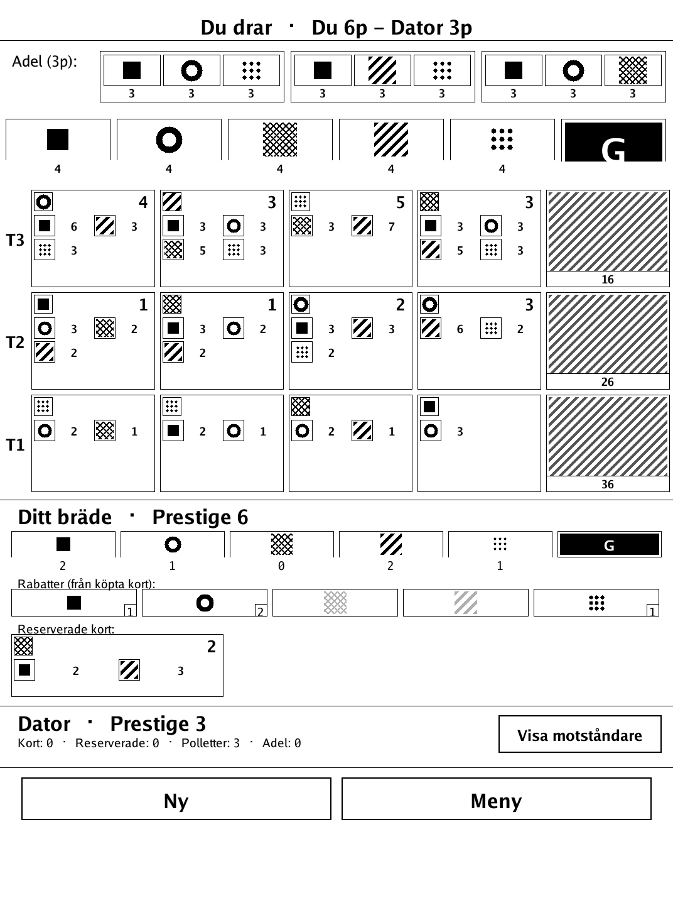
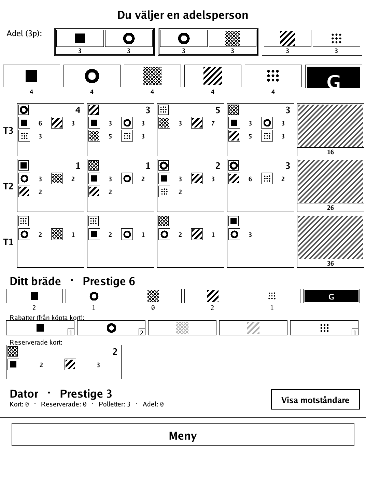
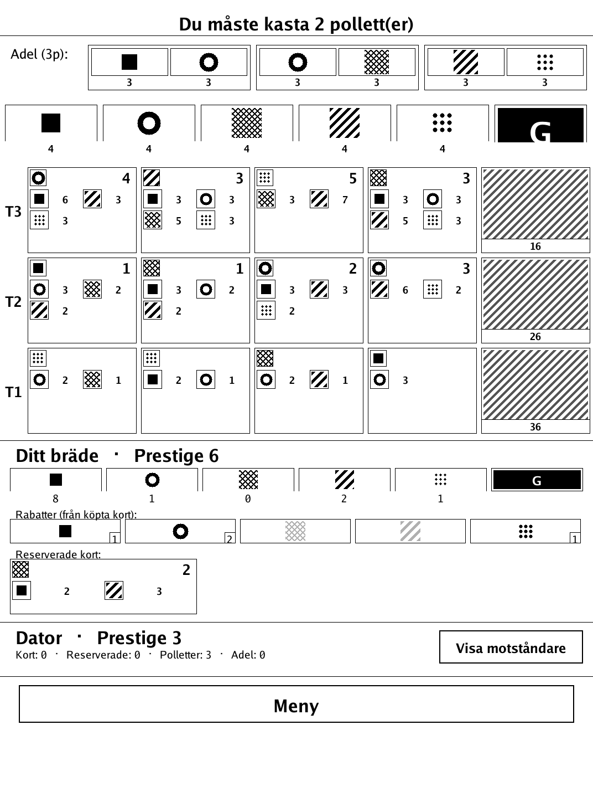
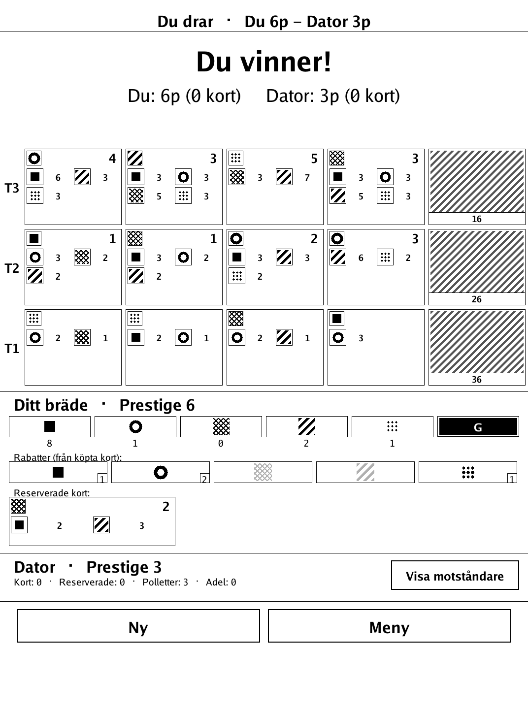

# Juvelerna (`juvelerna.app`)

A two-player gem-collecting engine-builder — a Splendor-like race to 15 prestige — for the PocketBook Verse Pro.

<p align="center"></p>

## About

Juvelerna ("The Gems") is a two-player engine-building game based on Splendor (Marc André, Space Cowboys), reimplemented here with original card and noble values and a neutral working title. Players collect gem tokens and spend them — plus the permanent discounts earned from cards they own — to buy development cards, racing to 15 prestige. Every game state (the token bank, both players' cards, tokens and reserves, the face-up tableau and the nobles) is fully visible, so it plays as a perfect-information engine-builder in either hot-seat or vs-AI mode, all on one shared screen.

## How to play

- **Goal:** build up gem discounts by buying development cards and collecting prestige. The first player to reach at least 15 prestige (checked at the end of a turn) triggers the end of the game.
- **Your four turn actions** (Splendor's action set): take 3 different gem tokens; take 2 of the same colour (only if that colour's pile has at least 4); reserve a card (and gain a gold/wild token when available); or buy a card from the tableau or from your reserve.
- **Discounts:** each card you own gives a permanent discount in its colour, lowering the token cost of future cards.
- **Nobles:** 3 are laid out, each worth 3 prestige. A noble automatically visits a player whose card colour discounts meet its requirement at the end of the turn. If several nobles qualify at once, the active player chooses which one visits.
- **Token limit:** you may not end a turn holding more than 10 tokens; the excess must be discarded.
- **End of game:** as soon as a player reaches at least 15 prestige at the end of their turn, the round is finished (the other player still gets their turn) and then play stops. Highest prestige wins; on a tie, the player with fewer purchased cards wins (more efficient).
- **Modes:** hot-seat (2 humans) or vs-computer at three difficulty levels ("Mot dator – Lätt / Medel / Svår"). A toggle lets you show or hide the opponent's detail.

## Screenshots

<table>
  <tr>
    <td align="center"><br><sub>Tableau, bank, nobles and both players</sub></td>
    <td align="center"><br><sub>Choosing between qualifying nobles</sub></td>
  </tr>
  <tr>
    <td align="center"><br><sub>Discarding down to the 10-token limit</sub></td>
    <td align="center"><br><sub>The race to 15 prestige decided</sub></td>
  </tr>
</table>

## Building

Built against the PocketBook Go SDK — see the repo [README](../README.md) and [POCKETBOOK_GAMEDEV_GUIDE.md](../POCKETBOOK_GAMEDEV_GUIDE.md).

```bash
docker run --rm -v "$PWD/juvelerna:/app" -w /app sunsung/pocketbook-go-sdk:latest build -o juvelerna.app .
```

Copy `juvelerna.app` into the device's `applications/` folder. Headless tests: `playtest/play.sh juvelerna`.

Based on Splendor by Marc André (Space Cowboys), reimplemented with original card/noble values under a neutral working title.
