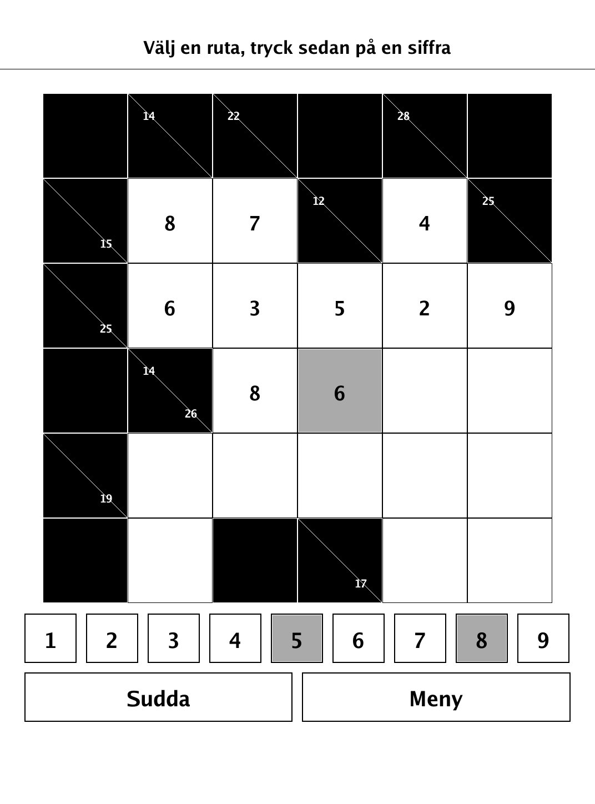
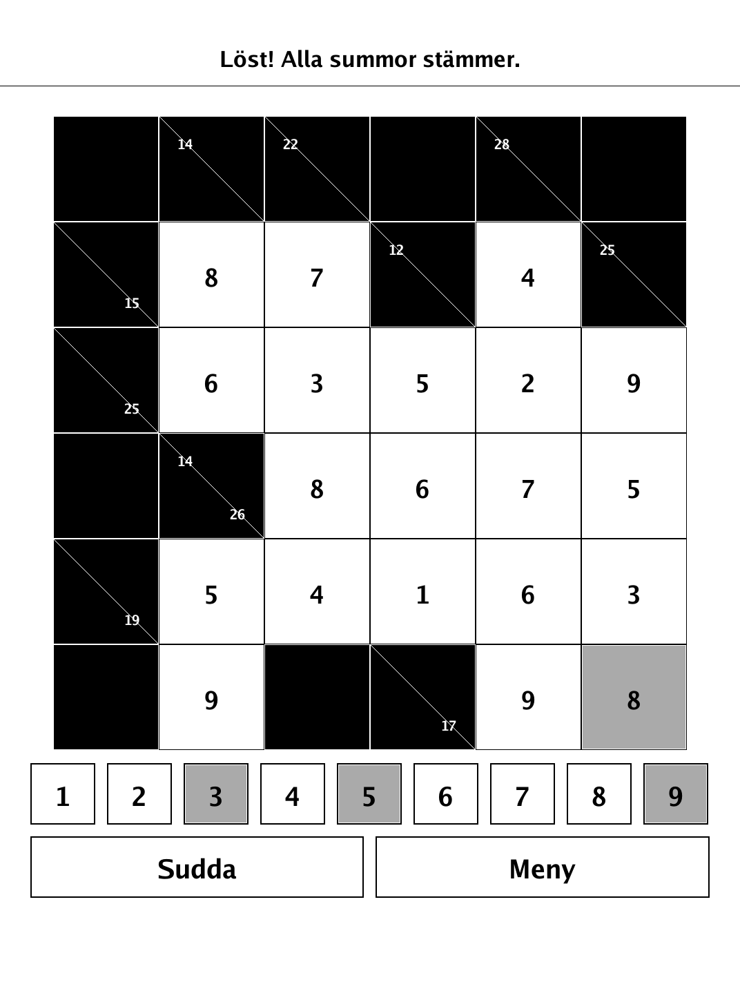
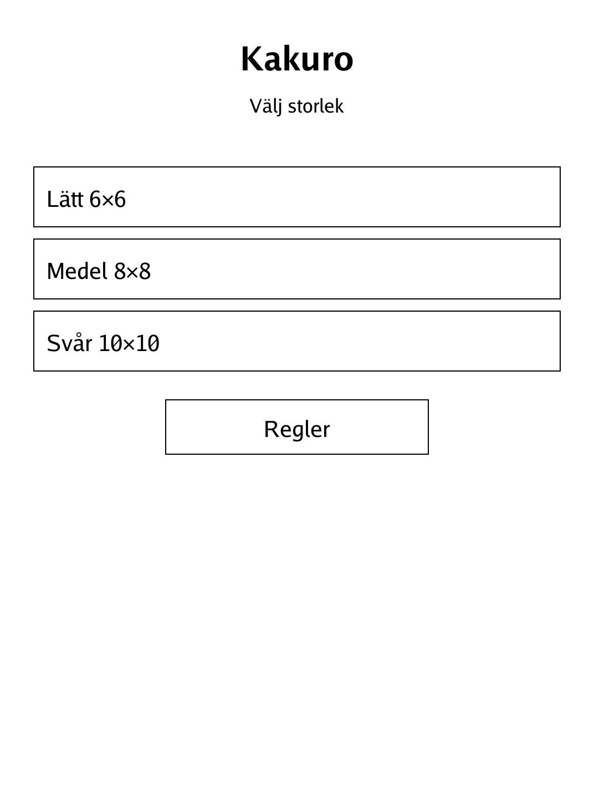

# Kakuro (`kakuro.app`)

The sum-crossword logic puzzle, with a built-in generator, for the PocketBook Verse Pro.

<p align="center"></p>

## About

Kakuro is a "sum crossword" logic puzzle. The grid is made of black clue cells and white entry cells; the white cells form horizontal and vertical "words" (runs) that must each sum to the clue in the adjoining black cell, with no digit repeated inside a run. This app ships several preset puzzles from a generator, and every puzzle is solvable purely by logic. The keypad greys out digits already used in the selected run to help you avoid repeats.

## How to play

- **Goal:** fill every white cell with a digit 1–9 so that each "word" (a contiguous horizontal or vertical run of white cells) sums to the number in the adjoining black cell.
- **Reading clues:** a number in the upper-right of a black cell gives the total for the vertical run of white cells below it; a number in the lower-left gives the total for the horizontal run to its right.
- **No repeats:** no digit may appear twice within the same run.
- **Controls:** tap a white cell to select it, then tap a digit 1–9 in the keypad row to fill it in. "Sudda" clears the digit in the selected cell.
- **Logic only:** every puzzle can be solved with reasoning — use the sums together with the no-repeat rule to deduce which digits must go where. The keypad greys out digits already present in the selected run.
- **Winning:** the puzzle is solved ("Löst") once every white cell holds the correct digit.

## Screenshots

<table>
  <tr>
    <td align="center"><br><sub>A puzzle partway solved</sub></td>
    <td align="center"><br><sub>Solved grid</sub></td>
  </tr>
  <tr>
    <td align="center"><br><sub>Puzzle selection</sub></td>
    <td align="center"><br><sub>In-app rules (Swedish)</sub></td>
  </tr>
</table>

## Building

Built against the PocketBook Go SDK — see the repo [README](../README.md) and [POCKETBOOK_GAMEDEV_GUIDE.md](../POCKETBOOK_GAMEDEV_GUIDE.md).

```bash
docker run --rm -v "$PWD/kakuro:/app" -w /app sunsung/pocketbook-go-sdk:latest build -o kakuro.app .
```

Copy `kakuro.app` into the device's `applications/` folder. Headless tests: `playtest/play.sh kakuro`.

Kakuro is a traditional logic-puzzle format in the public domain; puzzles here are produced by an original generator.
