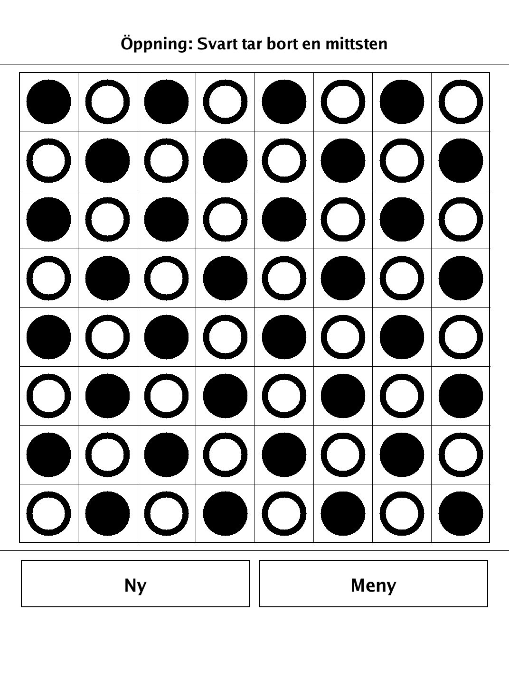
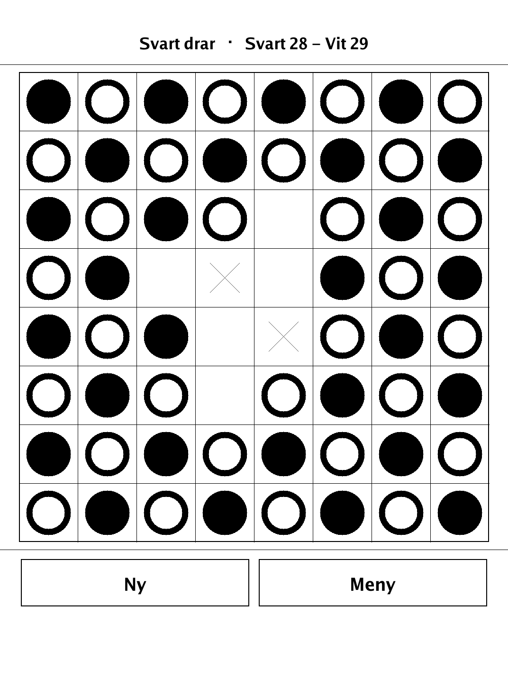
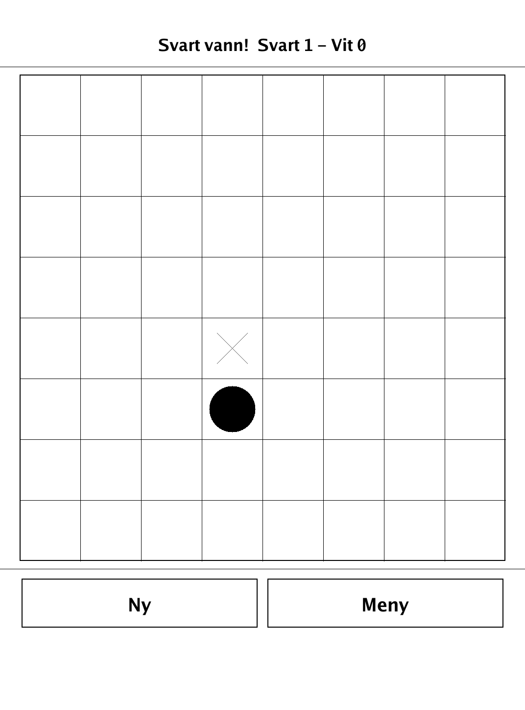
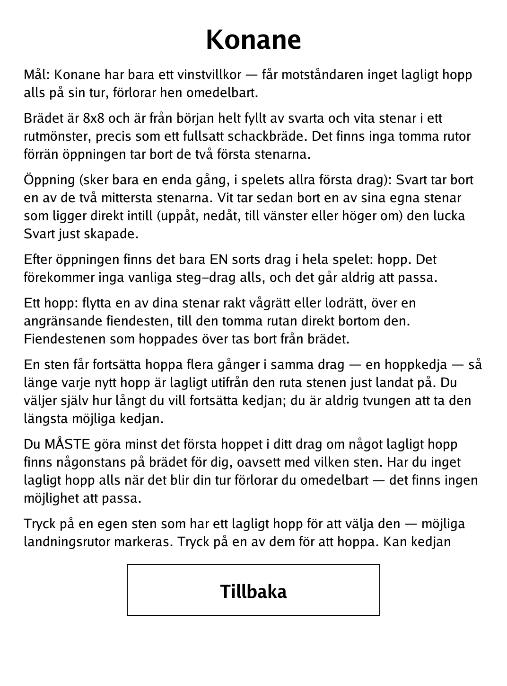

# Kōnane (`konane.app`)

The traditional Hawaiian jump-capture game, "stone jumping", for the PocketBook Verse Pro.

<p align="center"></p>

## About

Kōnane is a traditional Hawaiian board game — the name means roughly "stone jumping" — historically played outdoors on a board carved into lava rock, with black lava pebbles and white coral pieces. The 8x8 board starts completely full of alternating black and white stones; after a one-time opening that removes two stones, the *only* move in the game is a jump-capture. Play hot-seat against a friend or against a built-in AI at three difficulty levels.

## How to play

- **Goal:** Kōnane has a single win condition — if your opponent has no legal jump at all on their turn, they lose immediately.
- **Setup:** the 8x8 board begins completely filled with black and white stones in a checkerboard pattern; there are no empty squares until the opening removes the first two stones.
- **Opening (happens exactly once, on the very first move):** Black removes one of the two centre stones. White then removes one of its own stones directly adjacent (up, down, left or right) to the gap Black just created.
- **The only move is a jump:** move one of your stones straight horizontally or vertically over an adjacent enemy stone into the empty cell directly beyond it. The jumped enemy stone is removed.
- **Chains:** one stone may keep jumping several times in a single turn — a jump chain — as long as each new jump is legal from the cell it just landed on. You choose how far to continue; you are never forced to take the longest chain.
- **No passing:** if any legal jump exists anywhere on the board you must make at least the first jump. With no legal jump on your turn, you lose at once — there is no pass.
- **Controls:** tap one of your stones that has a legal jump to select it (landing squares are highlighted), then tap a highlighted square to jump. If the chain can continue, tap the next highlighted square to jump again, or tap "Klart" to end your turn early.

## Screenshots

<table>
  <tr>
    <td align="center"><br><sub>The one-time opening removals</sub></td>
    <td align="center"><br><sub>Jump-captures thinning the board</sub></td>
  </tr>
  <tr>
    <td align="center"><br><sub>A side with no legal jump loses</sub></td>
    <td align="center"><br><sub>In-app rules (Swedish)</sub></td>
  </tr>
</table>

## Building

Built against the PocketBook Go SDK — see the repo [README](../README.md) and [POCKETBOOK_GAMEDEV_GUIDE.md](../POCKETBOOK_GAMEDEV_GUIDE.md).

```bash
docker run --rm -v "$PWD/konane:/app" -w /app sunsung/pocketbook-go-sdk:latest build -o konane.app .
```

Copy `konane.app` into the device's `applications/` folder. Headless tests: `playtest/play.sh konane`.

Based on Kōnane, a traditional Hawaiian game in the public domain.
