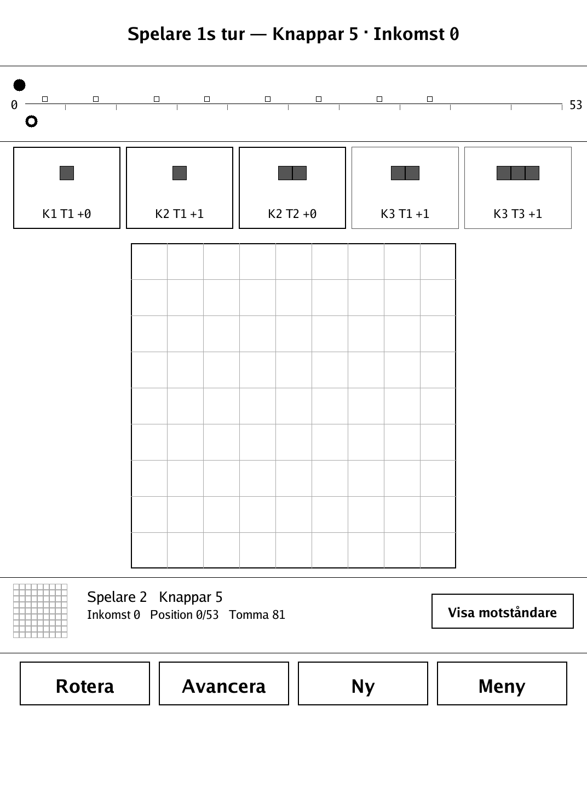
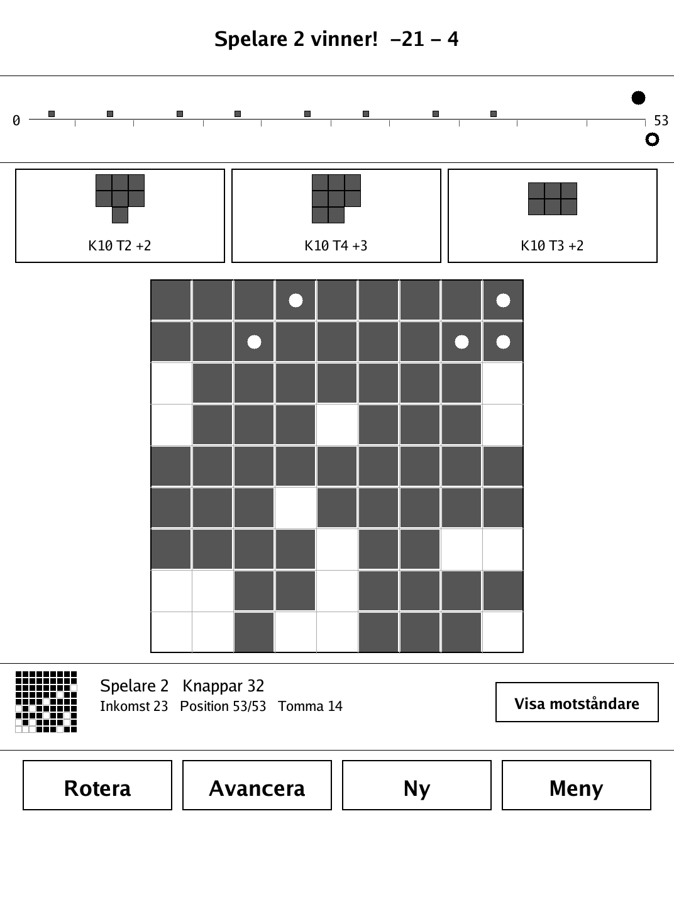
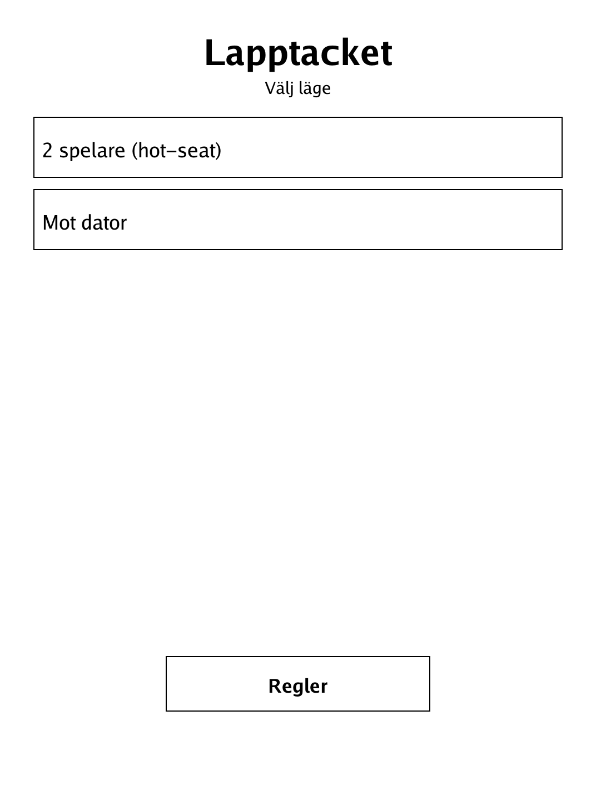
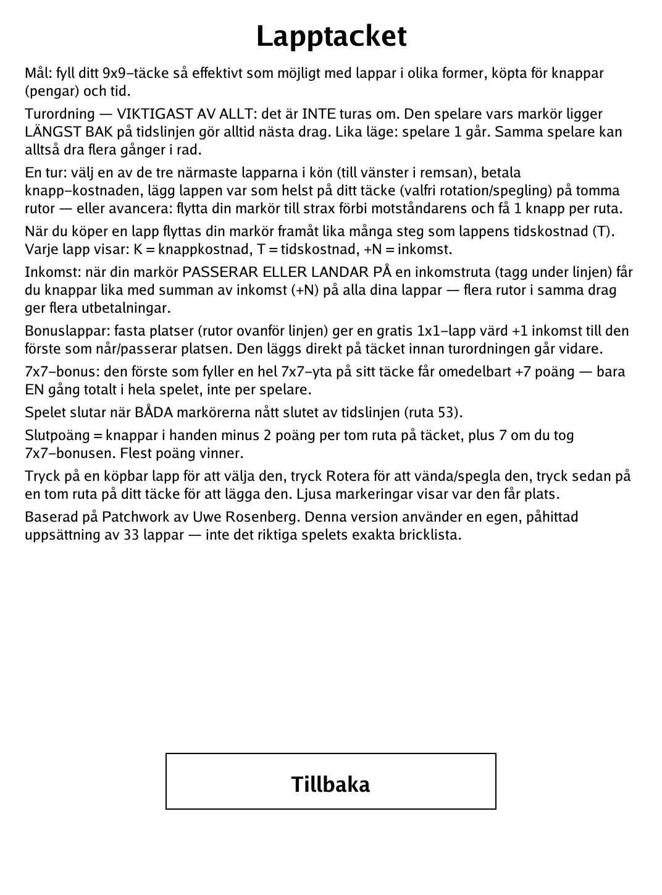

# Lapptäcket (The Quilt) (`lapptacket.app`)

Race to stitch the most efficient 9x9 quilt, buying patches with buttons and time.

<p align="center"></p>

## About

Lapptäcket ("The Quilt") is a two-player quilt-building economy race, loosely based on Uwe Rosenberg's *Patchwork*. Each player fills their own 9x9 board by buying polyomino patches off a shared queue using buttons (the currency) and time. This PocketBook build uses an original, invented roster of 33 patches — their shapes, button costs, time costs, and income values are not the real game's tile list. It is perfect information: nothing is hidden, so you can play hot-seat against a friend or against a built-in greedy-heuristic AI. The whole game is rendered in greyscale for the e-ink screen, with the patch "circle" laid out as a horizontal strip for easier tapping.

## How to play

- **Goal:** fill your 9x9 quilt as efficiently as possible. Final score = buttons in hand, minus 2 points per empty square on your quilt, plus 7 if you claimed the 7x7 bonus. Most points wins.
- **Turn order (the key rule):** turns are NOT strictly alternating. Whichever player's marker sits furthest back on the 0–53 time track always acts next — so the same player can move several times in a row. On a tie, player 1 goes.
- **A turn** — do one of:
  - **Buy a patch:** choose one of the three nearest patches in the queue, pay its button cost (K), and place it anywhere on empty squares of your quilt in any rotation or reflection. Your marker then advances by the patch's time cost (T). Each patch shows K = button cost, T = time cost, +N = income.
  - **Advance:** move your marker just past the opponent's and collect 1 button per square skipped.
- **Income:** when your marker passes or lands on an income square (a tag under the track), you earn buttons equal to the sum of the +N income values on all your placed patches. Several income squares in one move pay out several times.
- **Bonus patches:** fixed spots above the track hand a free 1x1 patch (worth +1 income) to the first player to reach or pass them.
- **7x7 bonus:** the first player to fill a complete 7x7 area of their quilt immediately scores +7 — once only, for the whole game, not per player.
- **Controls:** tap a buyable patch to select it, tap **Rotera** to rotate/flip it, then tap an empty square on your quilt to place it. Highlighted squares show where it fits. **Avancera** advances your marker.
- **Game ends** when both markers reach the end of the track (square 53).

## Screenshots

<table>
  <tr>
    <td align="center"><br><sub>Mid-game: the patch tray, time track and a filling quilt</sub></td>
    <td align="center"><br><sub>Both markers reach 53 — final score</sub></td>
  </tr>
  <tr>
    <td align="center"><br><sub>Menu: hot-seat or AI</sub></td>
    <td align="center"><br><sub>In-app rules</sub></td>
  </tr>
</table>

## Building

Built against the PocketBook Go SDK — see the repo [README](../README.md) and [POCKETBOOK_GAMEDEV_GUIDE.md](../POCKETBOOK_GAMEDEV_GUIDE.md).

```bash
docker run --rm -v "$PWD/lapptacket:/app" -w /app sunsung/pocketbook-go-sdk:latest build -o lapptacket.app .
```

Copy `lapptacket.app` into the device's `applications/` folder. Headless tests: `playtest/play.sh lapptacket`.

*Loosely based on Patchwork by Uwe Rosenberg. This version uses an original, invented set of 33 patches, not the real game's tile list.*
