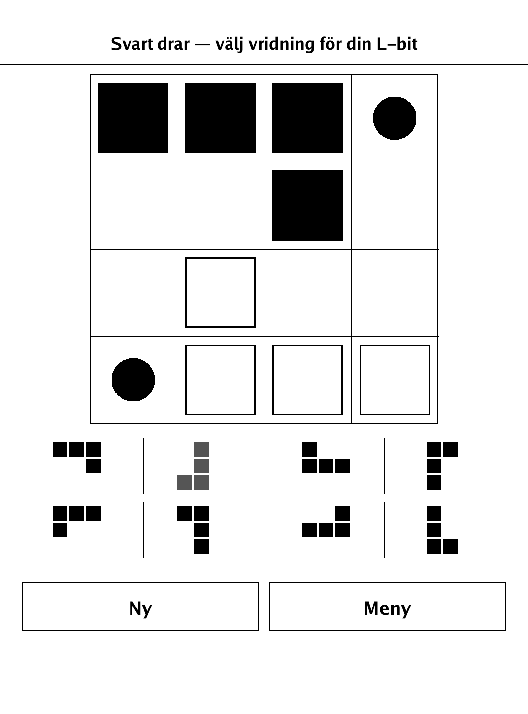
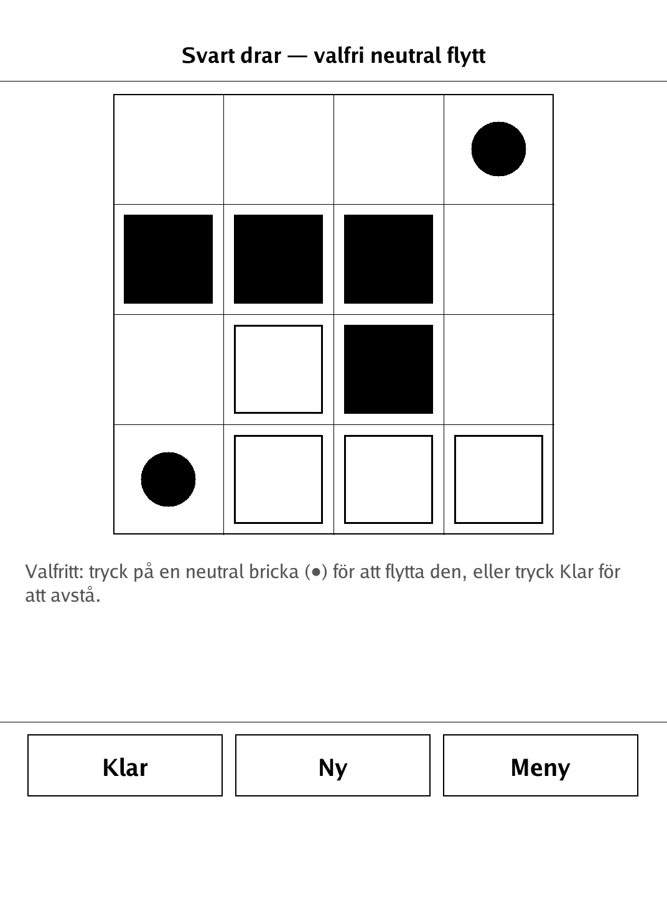
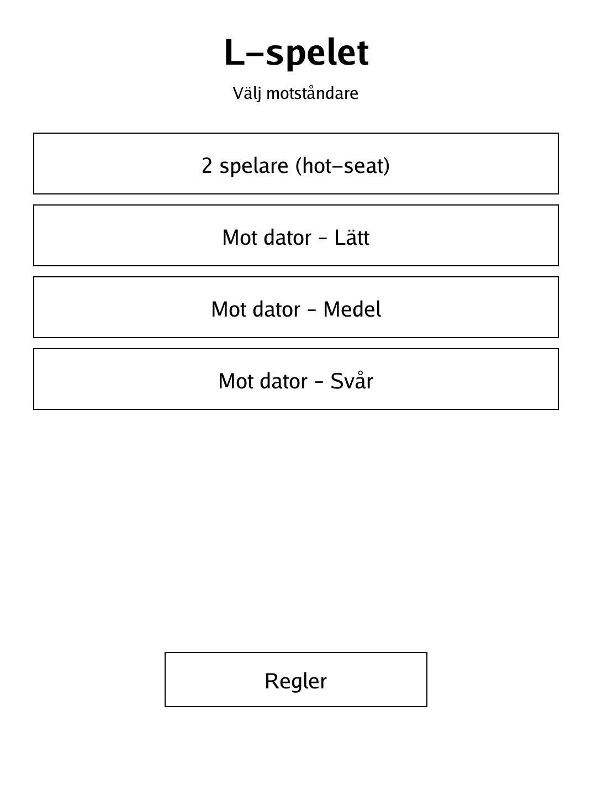
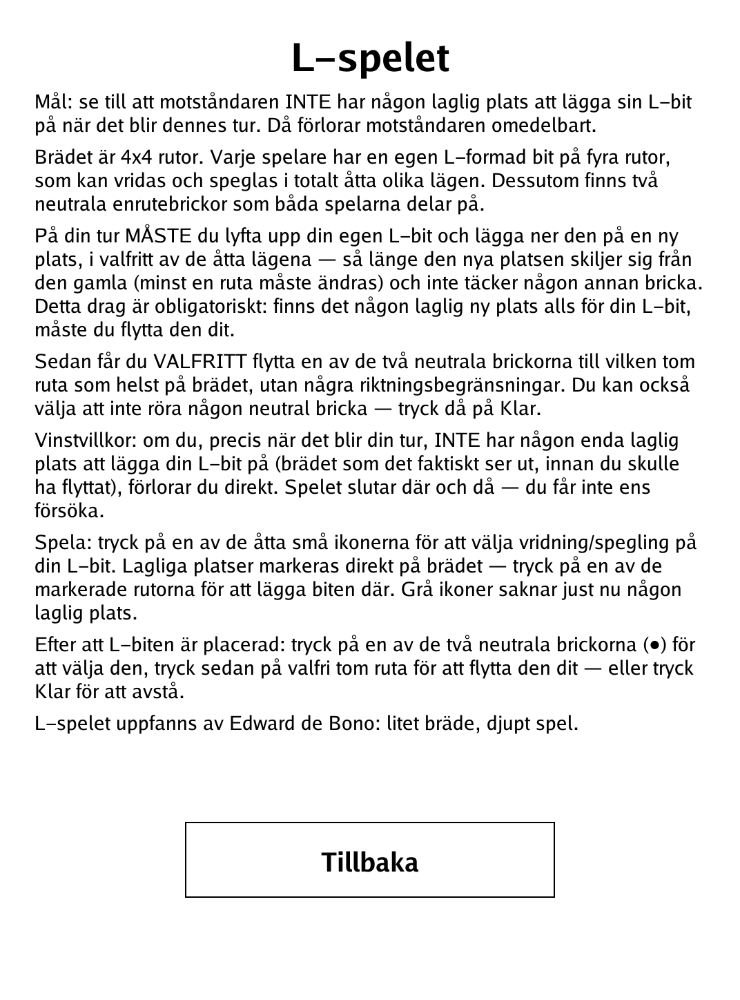

# L-spelet (L-Game) (`lgame.app`)

Edward de Bono's tiny 4x4 game of trapping your opponent's L-piece — small board, deep play.

<p align="center"></p>

## About

L-spelet is a PocketBook port of Edward de Bono's *L-Game*, a minimalist abstract for two players on a 4x4 board. Each side owns a single L-tetromino, and both share two neutral single-cell pieces. Despite the tiny board the game is surprisingly deep. Play hot-seat against a friend or against a built-in AI at three strengths (Lätt / Medel / Svår).

## How to play

- **Goal:** leave your opponent with no legal place to put their L-piece when their turn begins — they lose immediately.
- **Setup:** the board is 4x4. Each player has one L-shaped piece (four cells, placeable in any of its 8 rotations/reflections), plus two neutral single-cell pieces shared by both players. Black starts.
- **A turn:**
  - **You must move your L-piece:** lift it and place it in a new position (any of the 8 orientations) that differs from where it was — at least one cell must change — without covering another piece. This move is compulsory.
  - **Then, optionally, nudge one neutral piece** to any empty square, with no direction restrictions. You may also leave both neutrals alone — tap **Klar**.
- **Losing:** if, right as your turn begins, there is no legal placement at all for your L-piece (on the board as it actually stands, before you would move a neutral), you lose on the spot.
- **Controls:** tap one of the eight small icons to choose your L-piece's orientation; legal placements light up on the board — tap one to place. Greyed-out icons currently have no legal placement. After placing the L, tap a neutral piece (●) to select it, then tap any empty square to move it there, or tap **Klar** to pass.

## Screenshots

<table>
  <tr>
    <td align="center"><br><sub>Choosing an L-piece orientation; legal squares highlighted</sub></td>
    <td align="center"><br><sub>Optionally nudging a neutral piece</sub></td>
  </tr>
  <tr>
    <td align="center"><br><sub>Menu: hot-seat or AI (Lätt/Medel/Svår)</sub></td>
    <td align="center"><br><sub>In-app rules</sub></td>
  </tr>
</table>

## Building

Built against the PocketBook Go SDK — see the repo [README](../README.md) and [POCKETBOOK_GAMEDEV_GUIDE.md](../POCKETBOOK_GAMEDEV_GUIDE.md).

```bash
docker run --rm -v "$PWD/lgame:/app" -w /app sunsung/pocketbook-go-sdk:latest build -o lgame.app .
```

Copy `lgame.app` into the device's `applications/` folder. Headless tests: `playtest/play.sh lgame`.

*Based on the L-Game, invented by Edward de Bono.*
