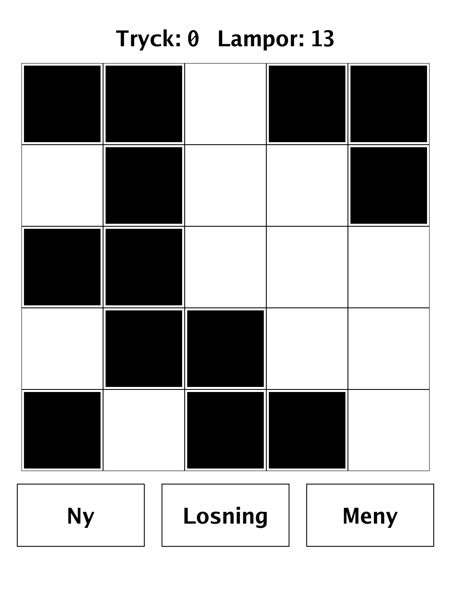
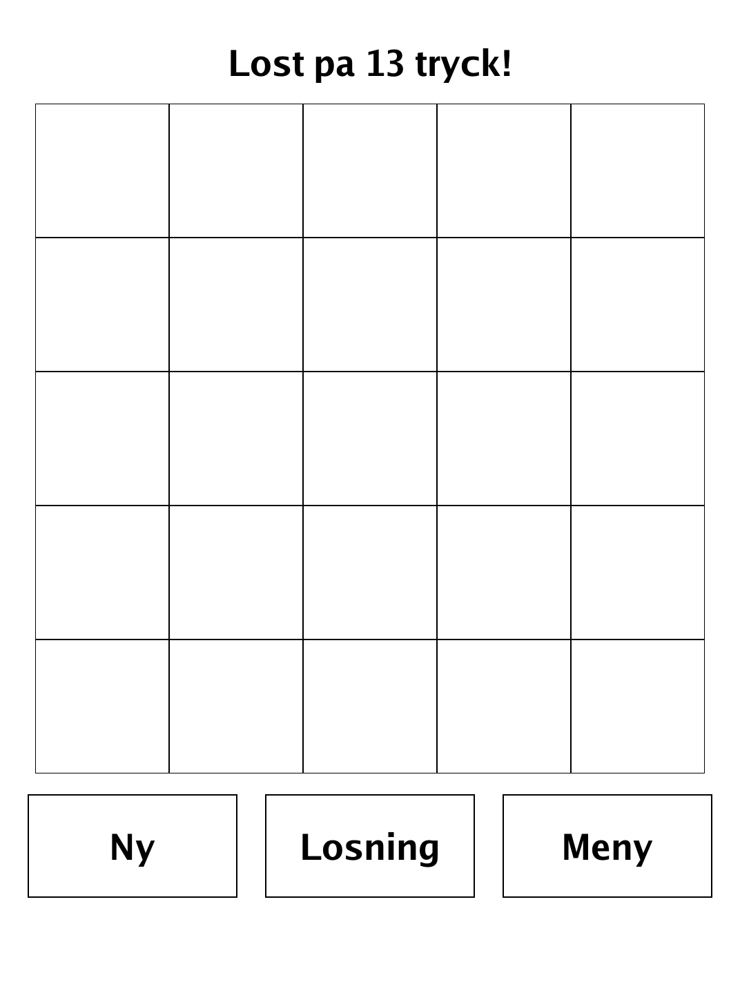
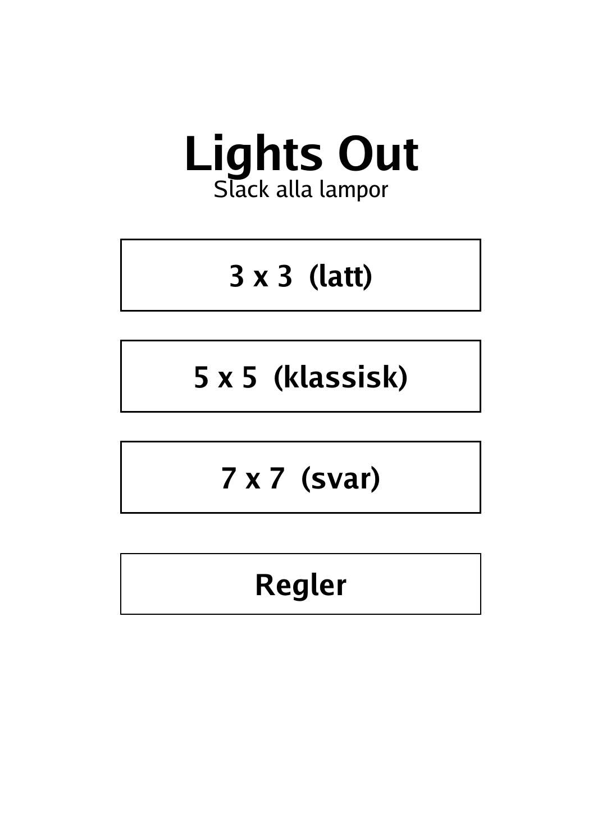
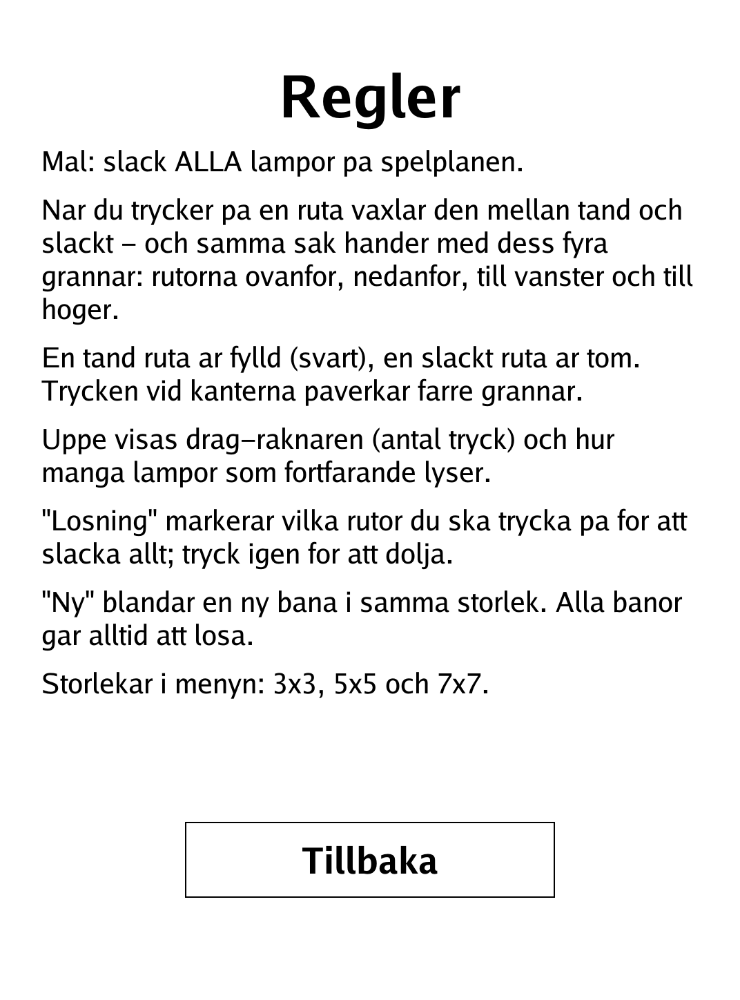

# Lights Out (`lightsout.app`)

Switch off every light — but each tap flips a cell and all four of its neighbours.

<p align="center"></p>

## About

Lights Out is a PocketBook build of the classic single-player toggle puzzle. Every press flips a cell and its orthogonal neighbours, and the challenge is to turn the whole board off. Puzzles come in three sizes (3x3, 5x5, 7x7); every board dealt is guaranteed solvable, and a built-in GF(2) solver can reveal exactly which cells to press. There is no loss condition — only the satisfaction of a dark board.

## How to play

- **Goal:** turn OFF every light on the board.
- **Toggle rule:** pressing a cell flips it between lit and unlit — and does the same to its four orthogonal neighbours (above, below, left, right). A lit cell is filled (black); an unlit cell is empty. Presses at the edges affect fewer neighbours.
- **Readouts:** the top of the screen shows the move counter (number of presses) and how many lights are still on.
- **Losning (Solution):** highlights exactly which cells to press to clear the board; tap it again to hide.
- **Ny (New):** shuffles a fresh puzzle of the same size. Every puzzle is always solvable.
- **Sizes:** choose 3x3, 5x5 or 7x7 from the menu.

## Screenshots

<table>
  <tr>
    <td align="center"><br><sub>A fresh 5x5 puzzle to switch off</sub></td>
    <td align="center"><br><sub>All lights out — solved</sub></td>
  </tr>
  <tr>
    <td align="center"><br><sub>Menu: 3x3, 5x5 or 7x7</sub></td>
    <td align="center"><br><sub>In-app rules</sub></td>
  </tr>
</table>

## Building

Built against the PocketBook Go SDK — see the repo [README](../README.md) and [POCKETBOOK_GAMEDEV_GUIDE.md](../POCKETBOOK_GAMEDEV_GUIDE.md).

```bash
docker run --rm -v "$PWD/lightsout:/app" -w /app sunsung/pocketbook-go-sdk:latest build -o lightsout.app .
```

Copy `lightsout.app` into the device's `applications/` folder. Headless tests: `playtest/play.sh lightsout`.

*Based on Lights Out, the classic electronic toggle puzzle.*
