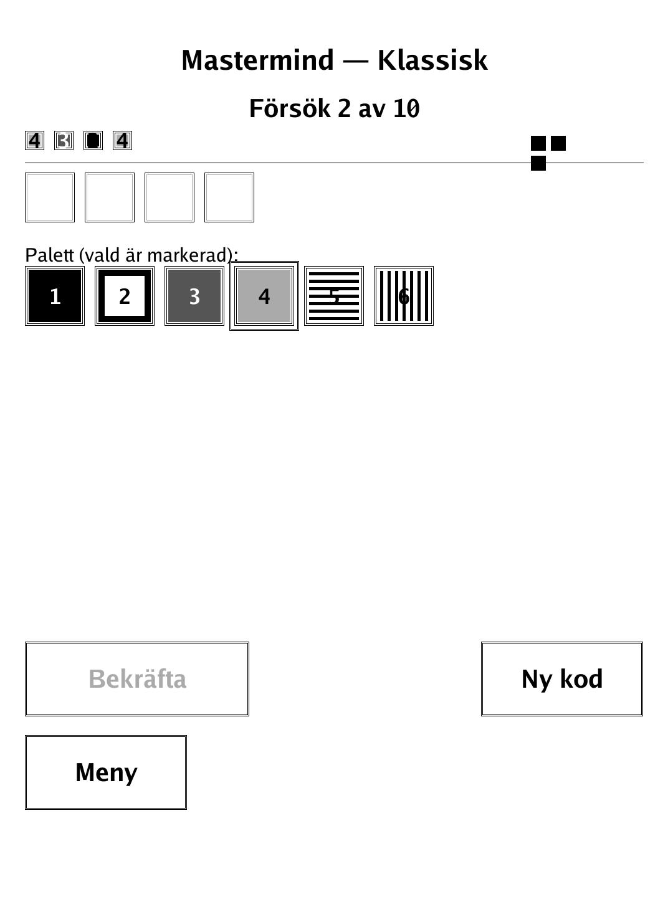
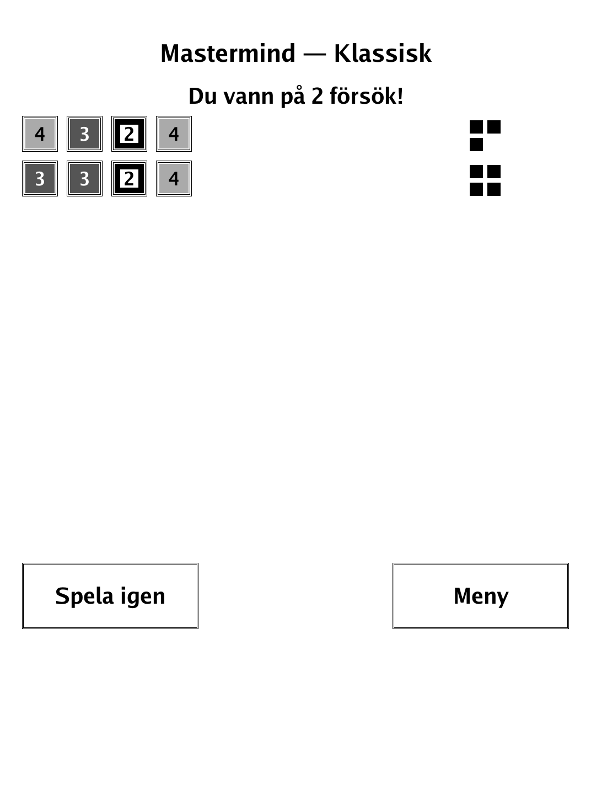
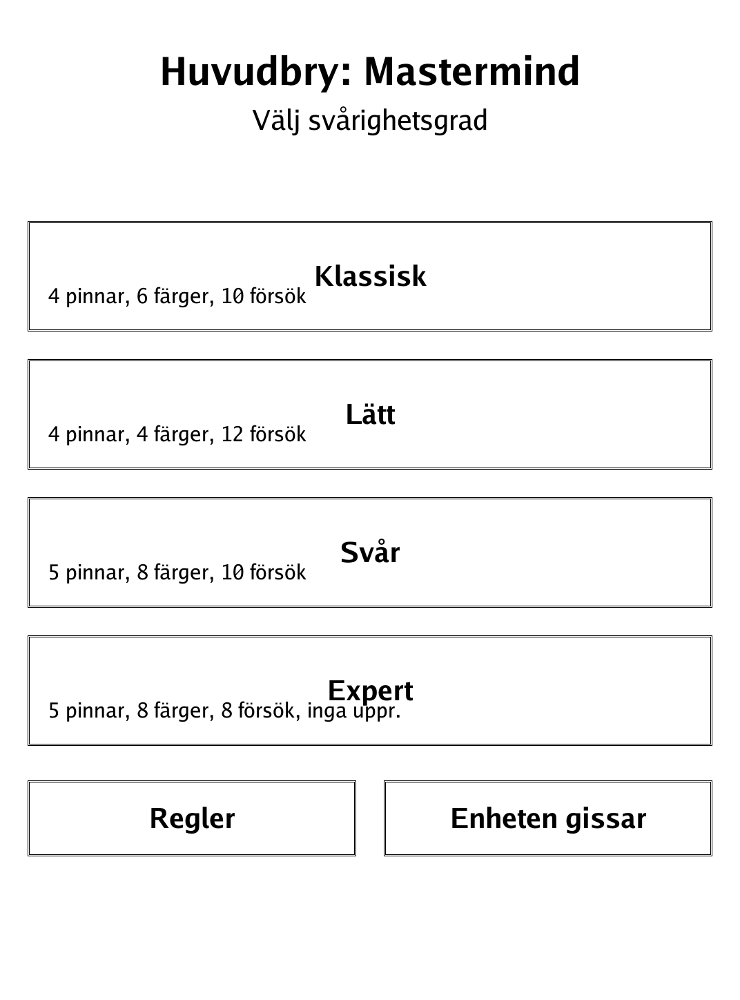
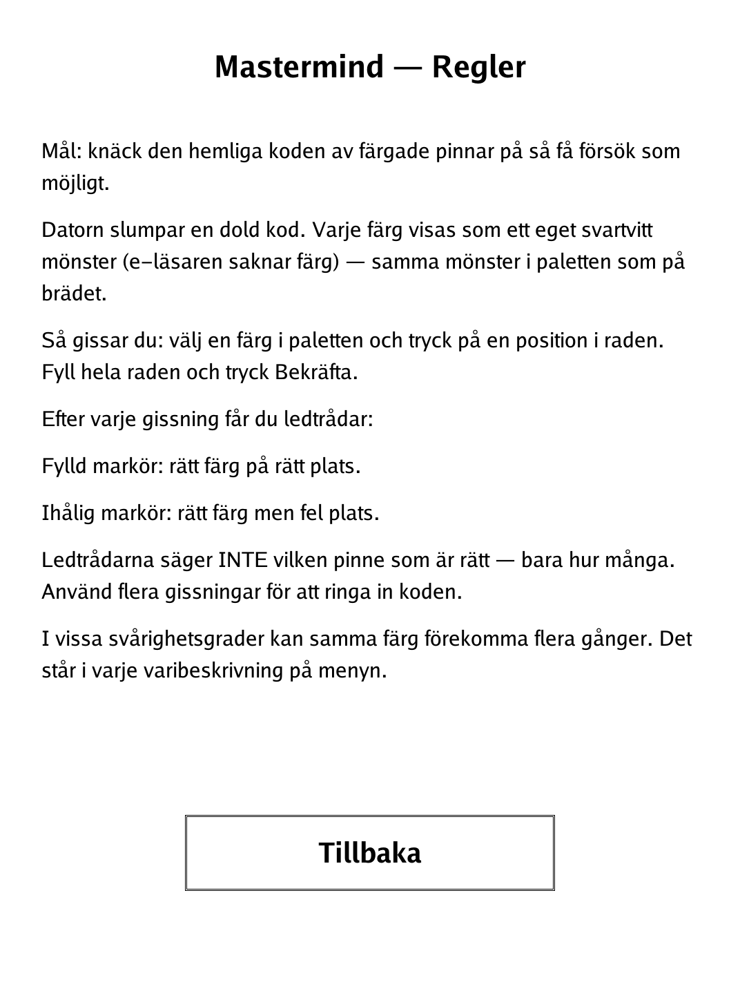

# Mastermind (`mastermind.app`)

Crack the hidden colour code in as few guesses as you can — or let the device crack yours.

<p align="center"></p>

## About

Mastermind is a PocketBook build of the classic code-breaking game. The device hides a code of coloured pegs and scores each of your guesses; since e-ink has no colour, every "colour" is drawn as its own distinct greyscale pattern, matching between the palette and the board. Four difficulty presets vary the number of pegs, colours, allowed guesses, and whether repeats are permitted. A second mode, **Enheten gissar** ("the device guesses"), flips the roles: a Knuth minimax solver guesses YOUR secret code from the feedback you give it.

## How to play

- **Goal:** crack the hidden code of coloured pegs in as few guesses as possible.
- **Making a guess:** pick a colour from the palette, then tap a position in the row. Fill the whole row and tap **Bekräfta** (Confirm).
- **Feedback after each guess:**
  - **Filled marker** — right colour in the right place.
  - **Hollow marker** — right colour but wrong place.
  - The clues never say *which* peg is right, only how many — use several guesses to narrow the code down.
- **Winning and losing:** you win when a guess is all-filled markers; you lose if you run out of guesses.
- **Difficulty presets:** Klassisk (4 pegs, 6 colours, 10 guesses, repeats allowed), Lätt (4 pegs, 4 colours, 12 guesses), Svår (5 pegs, 8 colours, 10 guesses), Expert (5 pegs, 8 colours, 8 guesses, no repeats). In presets that allow repeats, the same colour can appear more than once — each menu entry says which.
- **Enheten gissar:** the device runs a Knuth minimax solver to guess your chosen code; you give it truthful filled/hollow feedback each round.

## Screenshots

<table>
  <tr>
    <td align="center"><br><sub>A scored guess in progress</sub></td>
    <td align="center"><br><sub>Code cracked — won in two guesses</sub></td>
  </tr>
  <tr>
    <td align="center"><br><sub>Menu: presets and "Enheten gissar"</sub></td>
    <td align="center"><br><sub>In-app rules</sub></td>
  </tr>
</table>

## Building

Built against the PocketBook Go SDK — see the repo [README](../README.md) and [POCKETBOOK_GAMEDEV_GUIDE.md](../POCKETBOOK_GAMEDEV_GUIDE.md).

```bash
docker run --rm -v "$PWD/mastermind:/app" -w /app sunsung/pocketbook-go-sdk:latest build -o mastermind.app .
```

Copy `mastermind.app` into the device's `applications/` folder. Headless tests: `playtest/play.sh mastermind`.

*Based on Mastermind, the classic code-breaking board game.*
