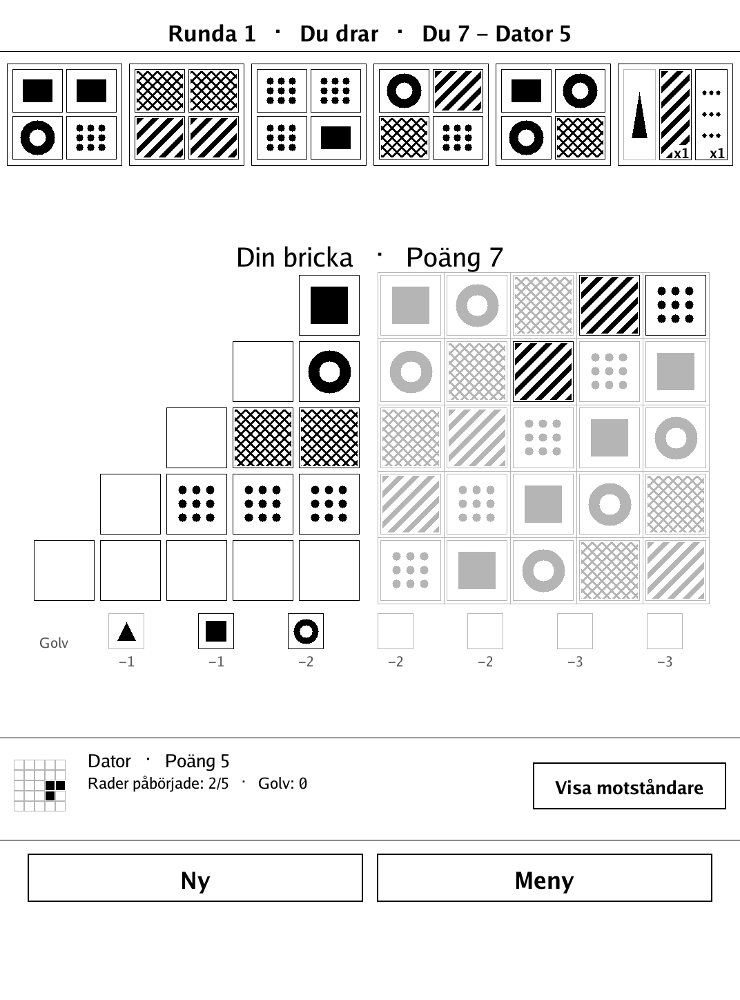
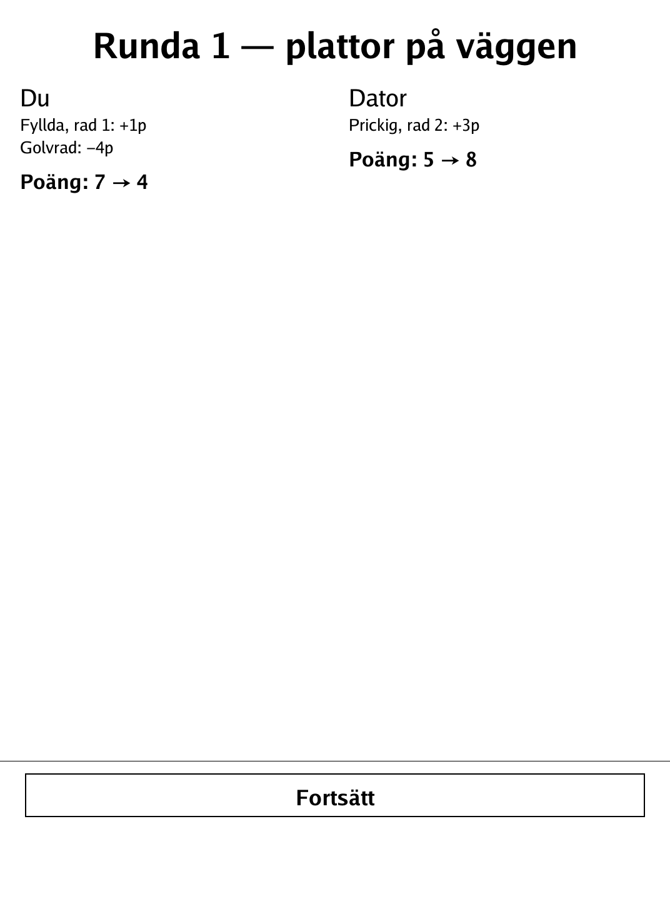
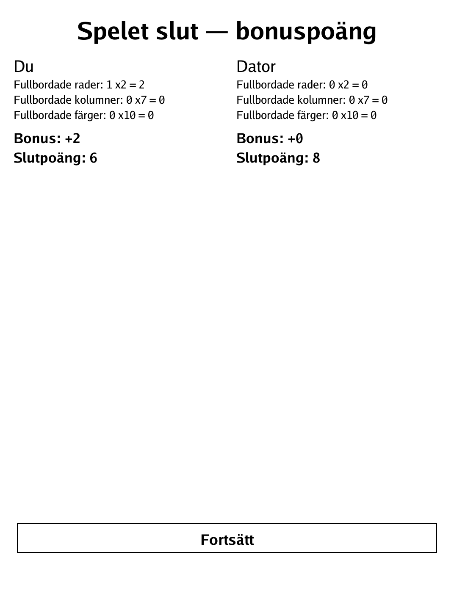
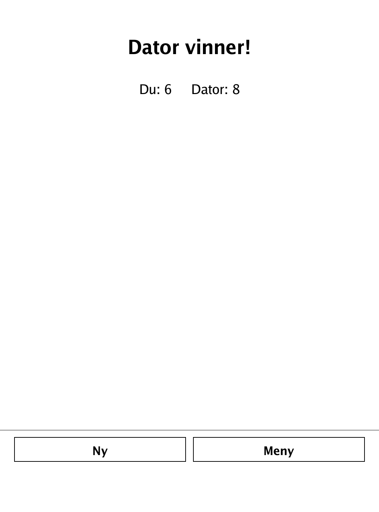
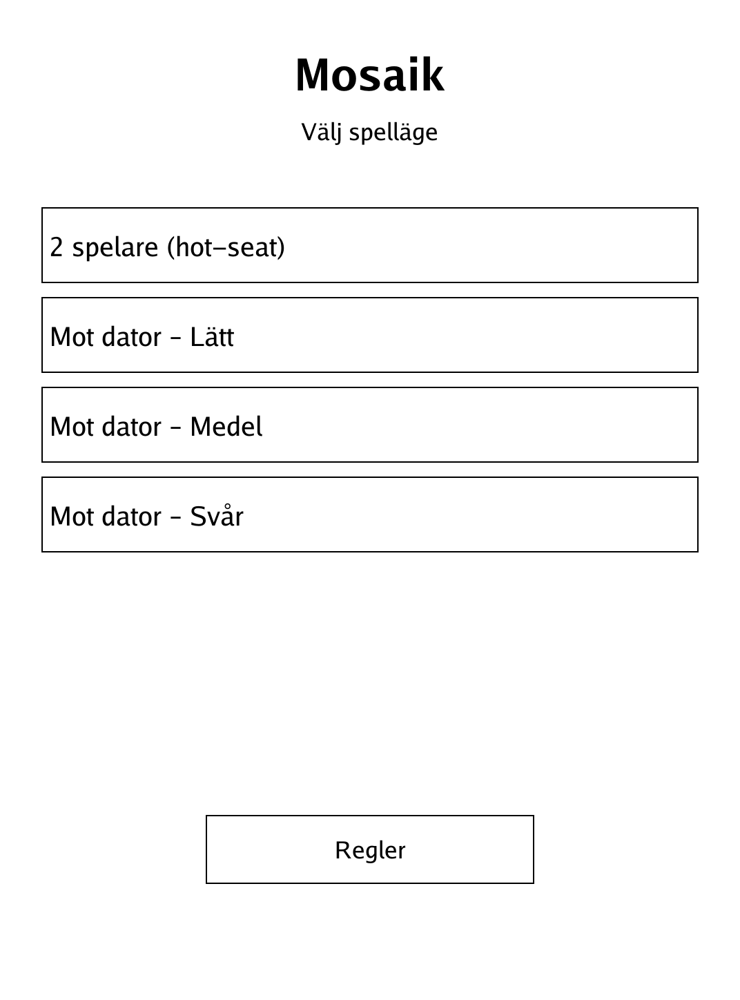
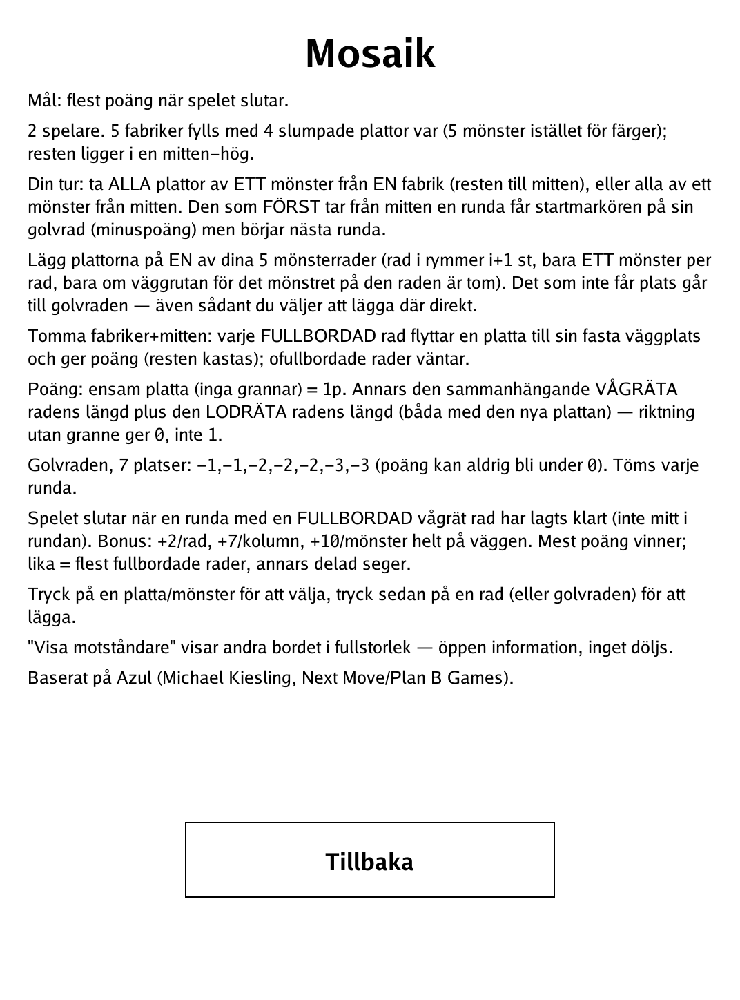

# Mosaik (`mosaik.app`)

Draft coloured tiles from the factories and tile your wall for points — but overflow costs you.

<p align="center"></p>

## About

Mosaik is a simplified two-player tile-drafting game based on Michael Kiesling's *Azul*, reimplemented here with original greyscale-pattern art and a neutral name. Players draft tiles from shared factory displays onto their pattern lines, then tile completed lines onto a fixed 5x5 wall to score. Play hot-seat against a friend or against a built-in AI at three strengths (Lätt / Medel / Svår).

## How to play

- **Goal:** score the most points by tiling your wall. The game ends after the round in which either player completes a full horizontal wall row; end-game bonuses are added once, and the highest total wins.
- **Drafting:** on your turn, take all tiles of one colour from a factory display (or from the central pool) and place them on one of your board's pattern lines. Tapping a tile swatch picks both the source and the colour in one gesture.
- **Wall-tiling:** once every factory and the central pool are empty, each completed pattern line moves one tile onto the matching wall spot and scores; leftover tiles are discarded.
- **The floor line:** tiles you can't (or won't) fit onto a pattern line spill onto the floor line and cost you points.
- **End-game bonuses:** completed wall rows, columns, and full colour sets each award bonus points, added once at the end.
- **Show opponent:** a toggle lets you peek at the opponent's board.

## Screenshots

<table>
  <tr>
    <td align="center"><br><sub>Drafting from the factories onto pattern lines</sub></td>
    <td align="center"><br><sub>Round end: completed lines tile onto the wall</sub></td>
  </tr>
  <tr>
    <td align="center"><br><sub>End-game row/column/colour bonuses</sub></td>
    <td align="center"><br><sub>Final totals and the winner</sub></td>
  </tr>
  <tr>
    <td align="center"><br><sub>Menu: hot-seat or AI (Lätt/Medel/Svår)</sub></td>
    <td align="center"><br><sub>In-app rules</sub></td>
  </tr>
</table>

## Building

Built against the PocketBook Go SDK — see the repo [README](../README.md) and [POCKETBOOK_GAMEDEV_GUIDE.md](../POCKETBOOK_GAMEDEV_GUIDE.md).

```bash
docker run --rm -v "$PWD/mosaik:/app" -w /app sunsung/pocketbook-go-sdk:latest build -o mosaik.app .
```

Copy `mosaik.app` into the device's `applications/` folder. Headless tests: `playtest/play.sh mosaik`.

*Based on Azul by Michael Kiesling (Next Move / Plan B Games), reimplemented with original art and a neutral name.*
