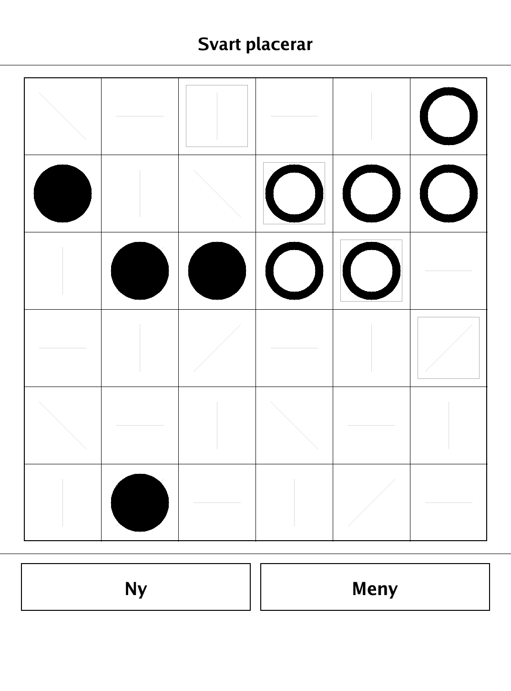
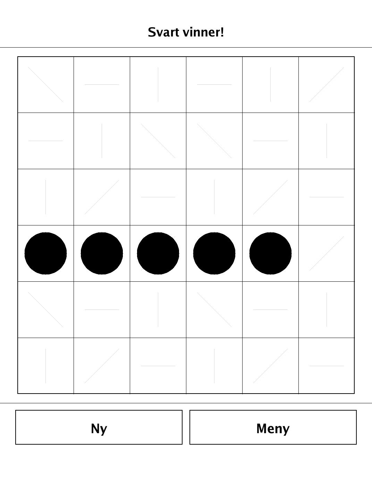
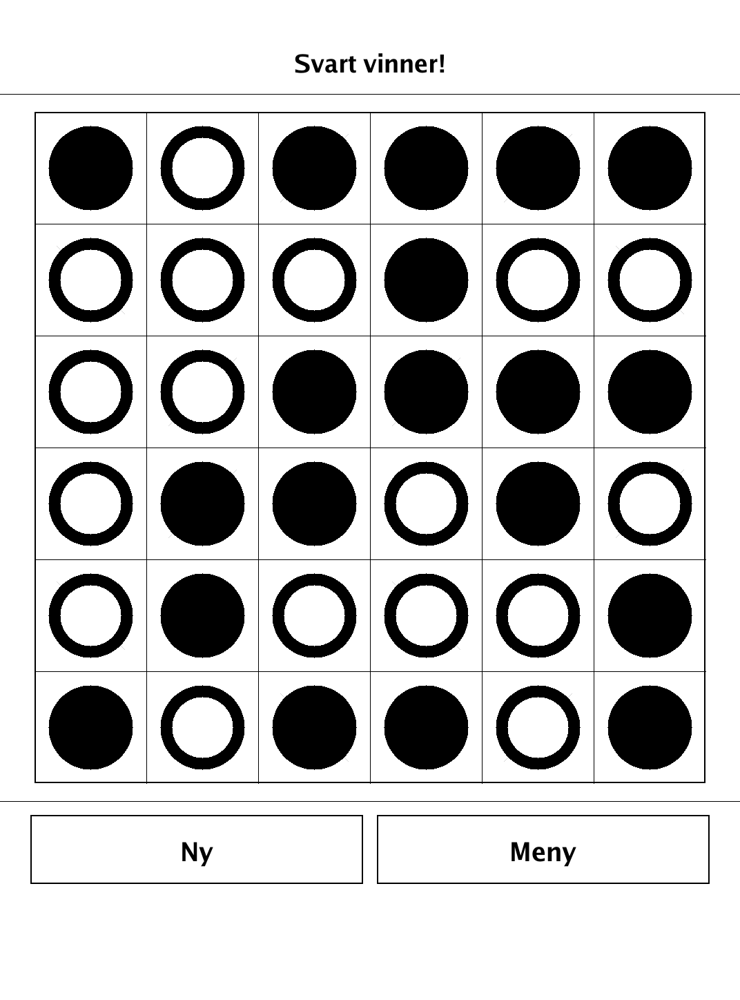
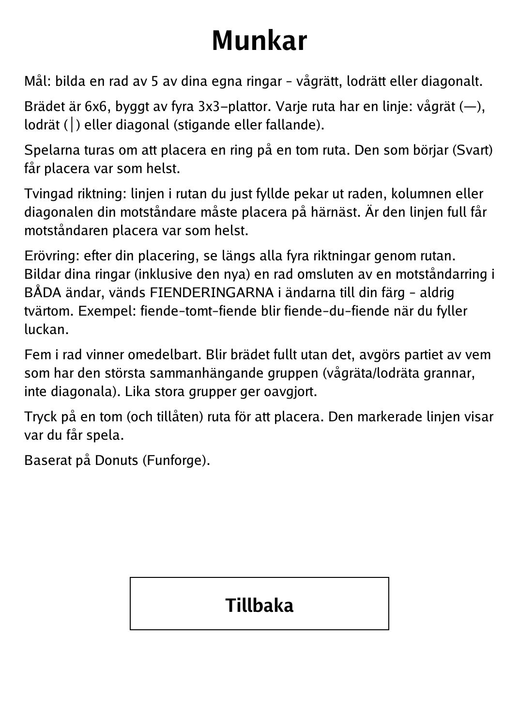

# Munkar (`munkar.app`)

Place rings where the line glyphs force you — capture the opponent's bookends and get five in a row.

<p align="center"></p>

## About

Munkar is a placement-and-capture board game based on *Donuts* (Funforge), reimplemented here with original art and a neutral name. The 6x6 board is built from four 3x3 tiles, and every cell carries a line glyph that dictates where your opponent must play next. Placing a ring can also flip the opponent's rings via a custodial capture. Play hot-seat against a friend or against a built-in AI at three strengths (Lätt / Medel / Svår).

## How to play

- **Goal:** form a line of 5 of your own rings — horizontal, vertical, or diagonal.
- **Board:** 6x6, built from four 3x3 tiles. Each cell shows a line: horizontal (—), vertical (│), or a rising or falling diagonal.
- **Placing:** players alternate placing a ring on an empty cell. The starting player (Black) may place anywhere on the first move.
- **Forced direction:** the line glyph on the cell you just filled points out the row, column, or diagonal your opponent must play on next. If that line is already full, the opponent may play anywhere.
- **Capture:** after your placement, look along all four axes through the new cell. If your rings (including the new one) form a run bounded immediately on BOTH ends by an opponent ring, those two enemy bookends flip to your colour — never the reverse. (Enemy–empty–enemy becomes enemy–you–enemy when you fill the gap.)
- **Winning:** five in a row wins immediately. If the board fills without a five, the winner is whoever has the largest orthogonally-connected group of rings (horizontal/vertical neighbours, not diagonal); equal groups are a draw.
- **Controls:** tap an empty, allowed cell to place. The highlighted line shows where you may play.

## Screenshots

<table>
  <tr>
    <td align="center"><br><sub>Rings placed under the line-direction constraint</sub></td>
    <td align="center"><br><sub>Five in a row — immediate win</sub></td>
  </tr>
  <tr>
    <td align="center"><br><sub>Full board decided by largest connected group</sub></td>
    <td align="center"><br><sub>In-app rules</sub></td>
  </tr>
</table>

## Building

Built against the PocketBook Go SDK — see the repo [README](../README.md) and [POCKETBOOK_GAMEDEV_GUIDE.md](../POCKETBOOK_GAMEDEV_GUIDE.md).

```bash
docker run --rm -v "$PWD/munkar:/app" -w /app sunsung/pocketbook-go-sdk:latest build -o munkar.app .
```

Copy `munkar.app` into the device's `applications/` folder. Headless tests: `playtest/play.sh munkar`.

*Based on Donuts (Funforge), reimplemented with original art and a neutral name.*
