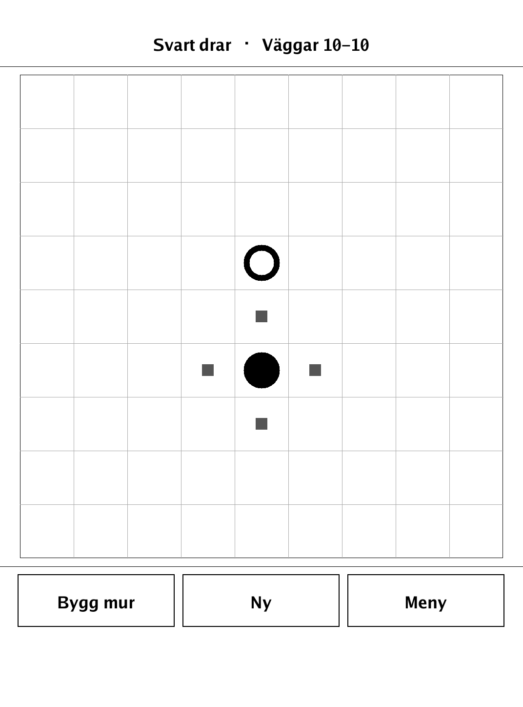
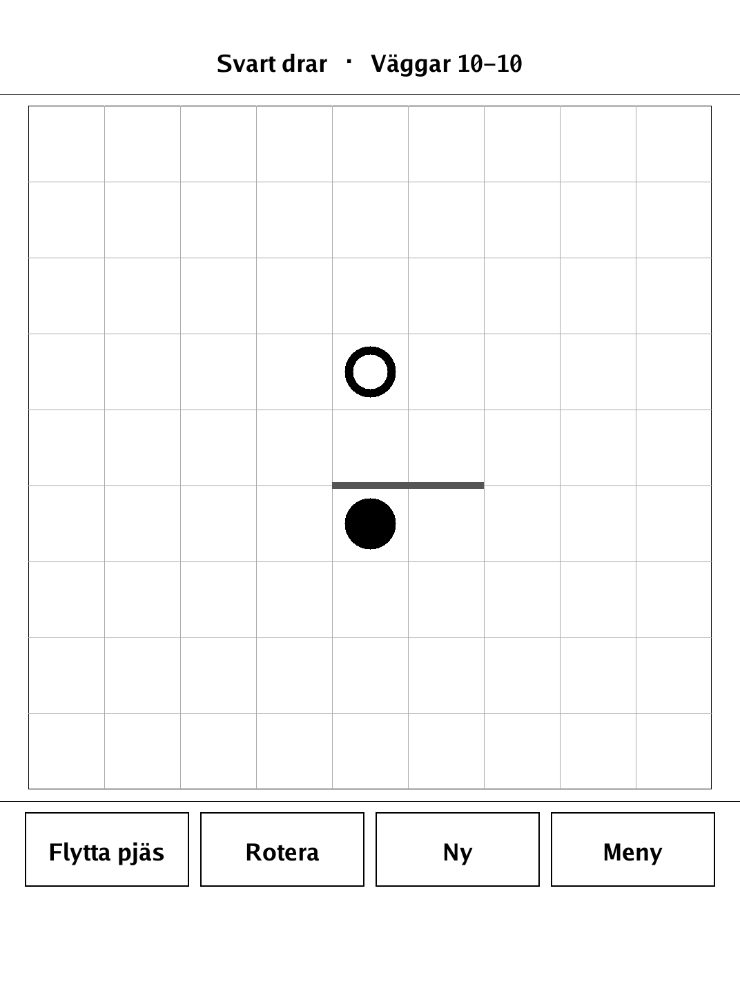
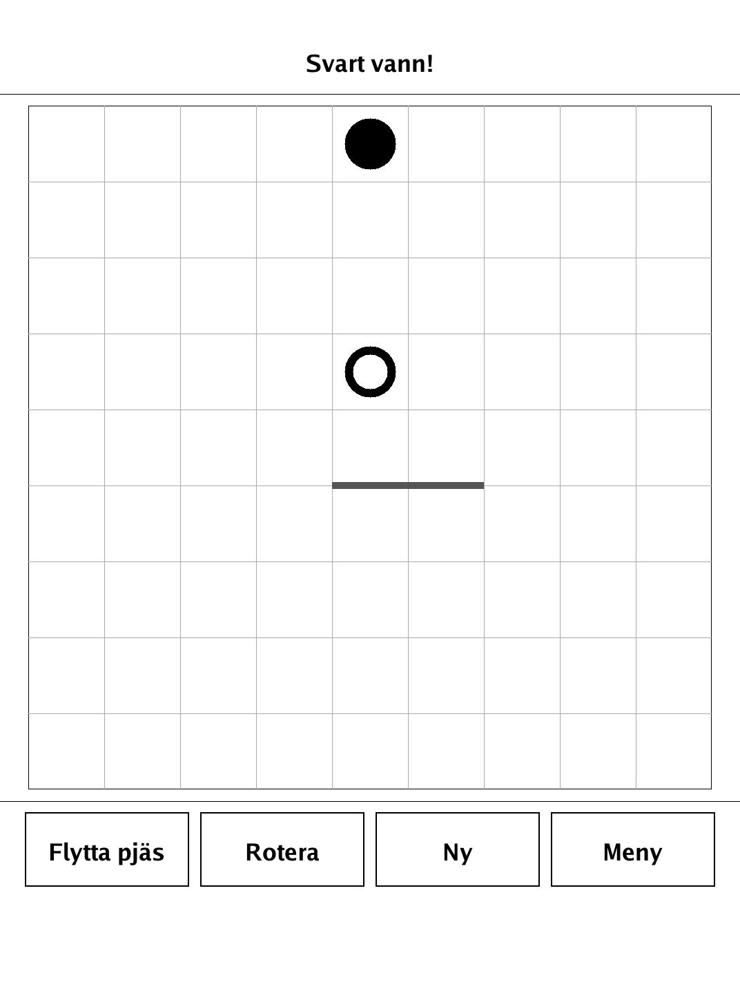
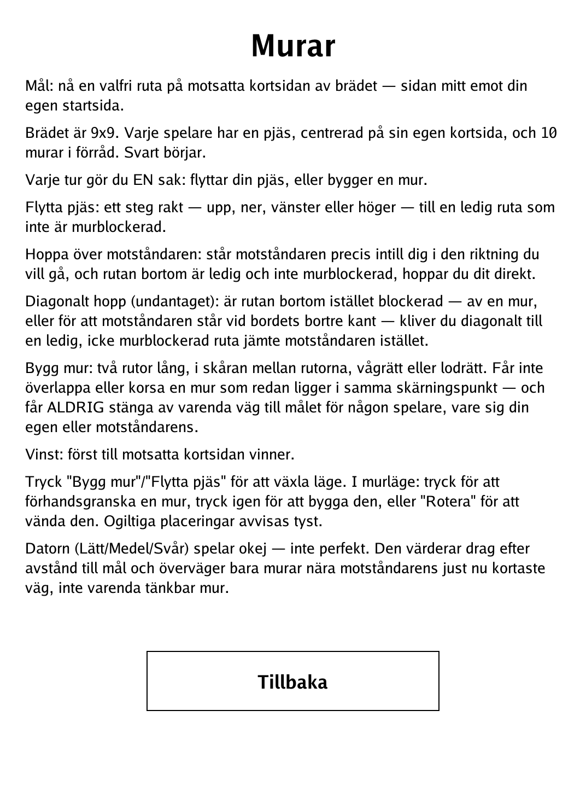

# Murar (Walls) (`murar.app`)

Race your pawn to the far side — or spend a wall to send the opponent the long way round.

<p align="center"></p>

## About

Murar (Swedish for "Walls") is a PocketBook port of *Quoridor*. Two players race pawns across a 9x9 board, each turn either stepping their pawn forward or spending one of their ten walls to slow the opponent — but no wall may ever completely seal off a player's path to their goal. Play hot-seat against a friend or against a built-in AI at three strengths (Lätt / Medel / Svår); the AI plays a decent, not perfect, game.

## How to play

- **Goal:** reach any cell on the opposite short edge of the board — the side across from your own start.
- **Setup:** the board is 9x9. Each player has one pawn, centred on their own short edge, and 10 walls in reserve. Black starts.
- **Each turn, do ONE thing:** move your pawn, or build a wall.
- **Move pawn:** one step straight — up, down, left, or right — to a free, unblocked cell.
- **Jump the opponent:** if the opponent stands right next to you in the direction you want to go and the cell beyond is free and unblocked, you jump straight over into it.
- **Diagonal jump (the exception):** if that cell beyond is instead blocked — by a wall, or because the opponent is against the far edge — you step diagonally to a free, unblocked cell alongside the opponent.
- **Build a wall:** two cells long, placed in the groove between cells, horizontal or vertical. It may not overlap or cross an existing wall at the same junction, and it may NEVER leave any player — you or the opponent — with no path at all to their goal.
- **Winning:** first pawn to the opposite short edge wins.
- **Controls:** tap **Bygg mur** / **Flytta pjäs** to switch modes. In wall mode: tap to preview a wall, tap again to build it, or **Rotera** to turn it. Invalid placements are silently rejected.

## Screenshots

<table>
  <tr>
    <td align="center"><br><sub>Pawns racing across the 9x9 board</sub></td>
    <td align="center"><br><sub>Previewing a wall before building it</sub></td>
  </tr>
  <tr>
    <td align="center"><br><sub>A pawn reaches the far edge — game over</sub></td>
    <td align="center"><br><sub>In-app rules</sub></td>
  </tr>
</table>

## Building

Built against the PocketBook Go SDK — see the repo [README](../README.md) and [POCKETBOOK_GAMEDEV_GUIDE.md](../POCKETBOOK_GAMEDEV_GUIDE.md).

```bash
docker run --rm -v "$PWD/murar:/app" -w /app sunsung/pocketbook-go-sdk:latest build -o murar.app .
```

Copy `murar.app` into the device's `applications/` folder. Headless tests: `playtest/play.sh murar`.

*Based on Quoridor.*
