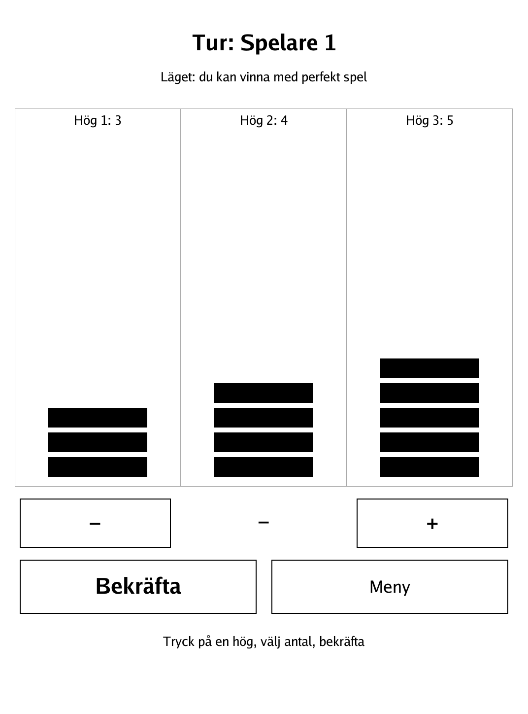
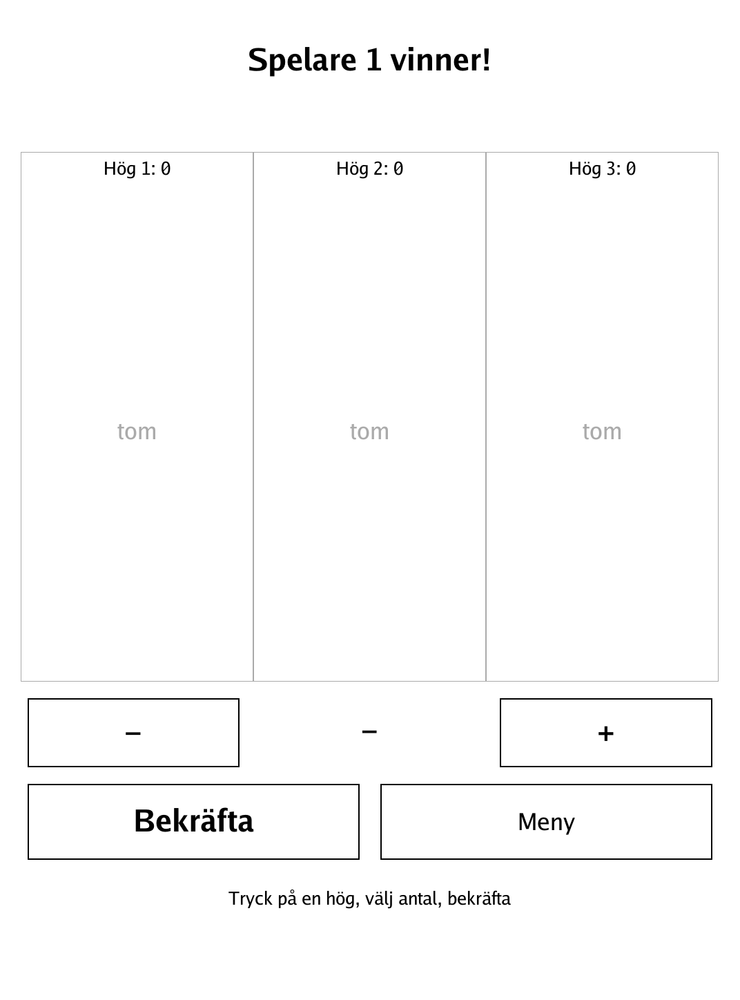
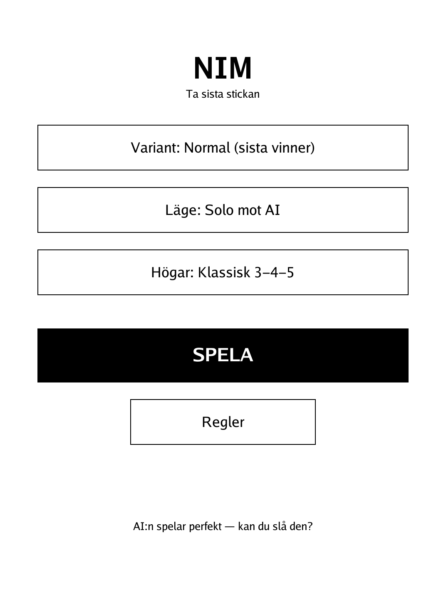
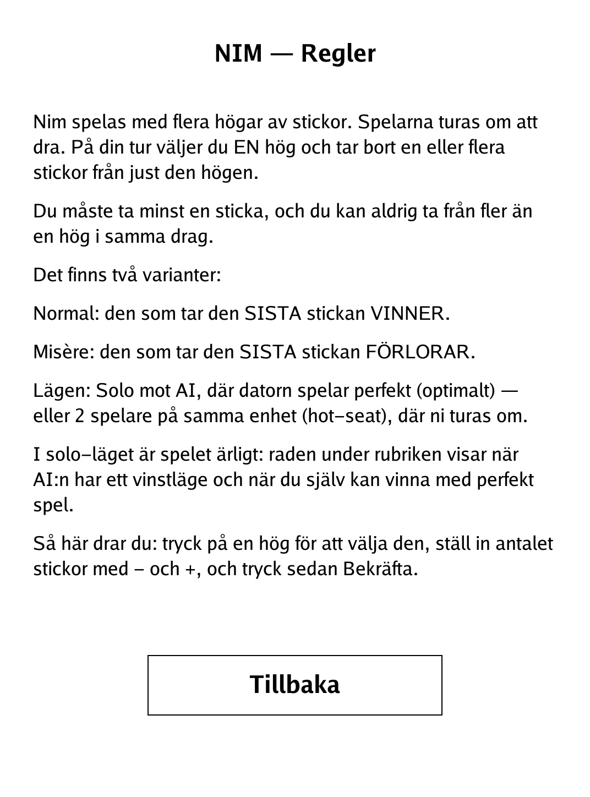

# Nim (`nim.app`)

Take matchsticks from the piles and force your opponent to take the last one — or grab it yourself, depending on the variant.

<p align="center"></p>

## About

Nim is the classic mathematical game of matchsticks laid out in several piles. This PocketBook build offers two-player hot-seat play or solo against an AI that plays perfectly — it uses the Sprague-Grundy (nim-sum) theory, so when the position is a win for the mover it never lets go of it. Both the Normal and Misère variants are included, and in solo mode the status line is honest: it tells you when the computer holds a winning position and when you yourself can still force the win with perfect play.

## How to play

- **Goal:** take sticks so the *last* stick falls the way the variant rewards.
  - **Normal:** whoever takes the last stick **wins**.
  - **Misère:** whoever takes the last stick **loses**.
- **Turn:** on your turn choose **one** pile and remove one or more sticks from just that pile. You must take at least one stick, and you can never take from more than one pile in a single move.
- **Input:** tap a pile to select it, dial the number of sticks with the **−** and **+** buttons, then tap **Bekräfta** to confirm. The count clamps between 1 and the pile size.
- **Modes:** Solo against the perfect AI, or 2 players on the same device (hot-seat).
- **Starting positions:** pick a preset from the menu — Classic 3-4-5, 1-3-5-7, or a randomised layout.

## Screenshots

<table>
  <tr>
    <td align="center"><br><sub>Three piles, dialling a move</sub></td>
    <td align="center"><br><sub>Game over — a winner declared</sub></td>
  </tr>
  <tr>
    <td align="center"><br><sub>Menu: variant, mode and starting piles</sub></td>
    <td align="center"><br><sub>In-app rules</sub></td>
  </tr>
</table>

## Building

Built against the PocketBook Go SDK — see the repo [README](../README.md) and [POCKETBOOK_GAMEDEV_GUIDE.md](../POCKETBOOK_GAMEDEV_GUIDE.md).

```bash
docker run --rm -v "$PWD/nim:/app" -w /app sunsung/pocketbook-go-sdk:latest build -o nim.app .
```

Copy `nim.app` into the device's `applications/` folder. Headless tests: `playtest/play.sh nim`.

*Based on Nim, the classic mathematical game of matchsticks, with a perfect Sprague-Grundy (nim-sum) AI.*
