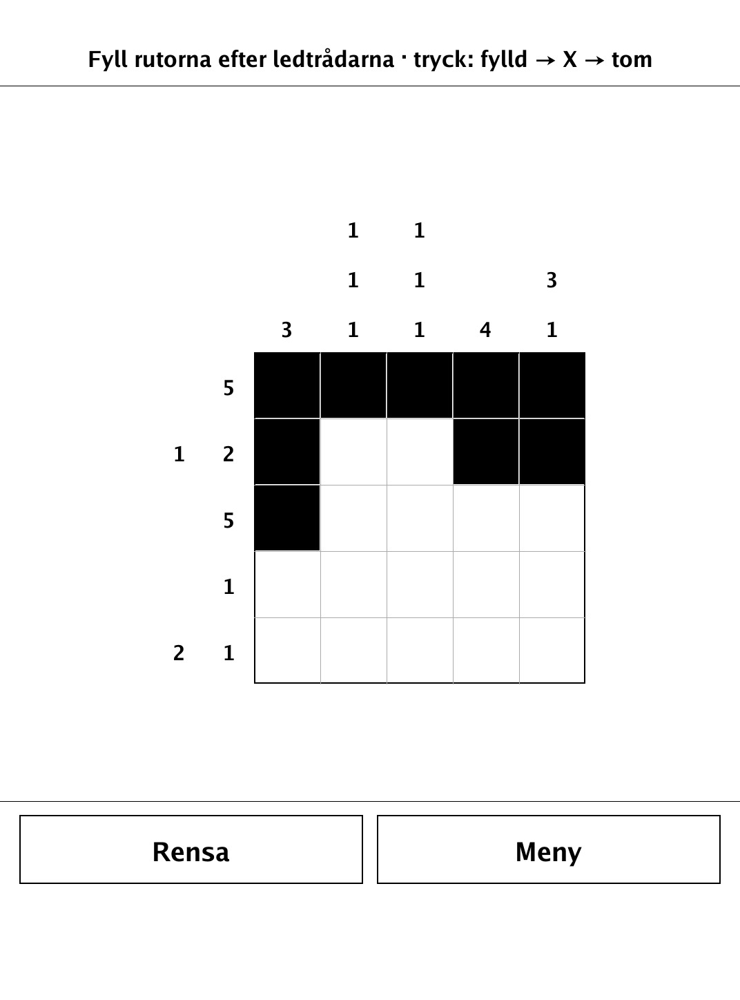
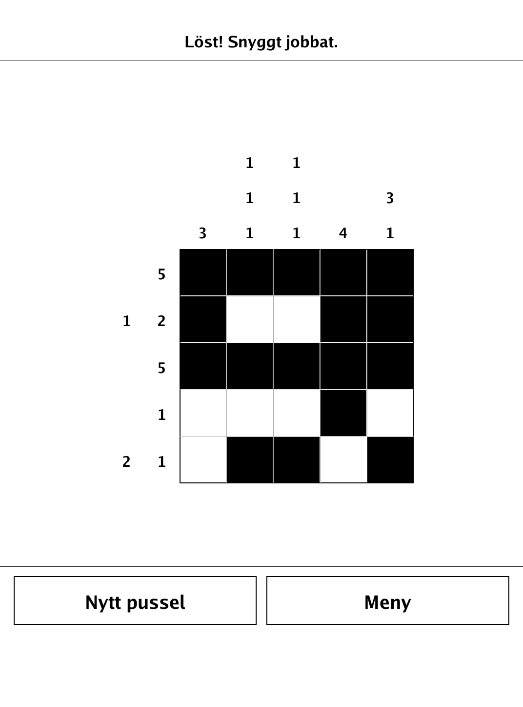
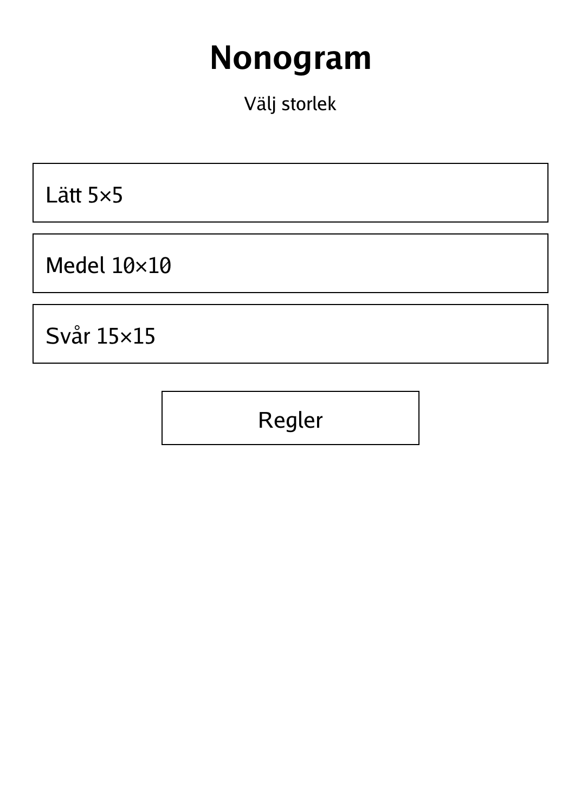
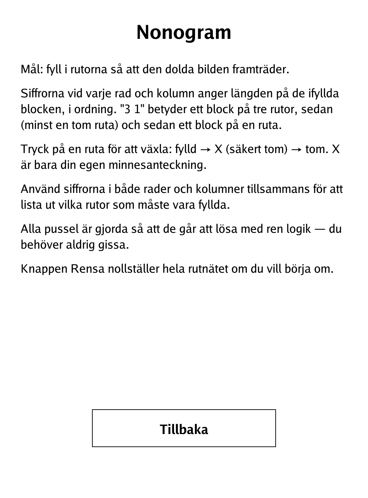

# Nonogram (`nonogram.app`)

Fill the grid by its row and column number clues to reveal a hidden picture.

<p align="center"></p>

## About

Nonogram (also known as Picross or Griddlers) is a picture-logic puzzle. Every generated board hides a picture, and the run-length numbers beside each row and column tell you the lengths of the filled blocks. Puzzles are generated so they are always solvable by pure logic — you never have to guess. This PocketBook build offers three sizes and generates a fresh puzzle each time.

## How to play

- **Goal:** fill the cells so the hidden picture appears.
- **Clues:** the numbers by each row and column give the lengths of the filled blocks, in order. "3 1" means a block of three cells, then at least one gap, then a block of one.
- **Input:** tap a cell to cycle it through **filled → X → empty**. The X is only your own memo for cells you have decided are blank; it never counts toward the solution.
- **Winning:** the board is solved the moment exactly the picture's cells are filled — over-filling extra cells or leaving cells blank will not count as a win.
- **Buttons:** **Rensa** clears the whole grid to start over; once solved, **Nytt pussel** generates a new one.
- **Sizes:** Easy 5×5, Medium 10×10, Hard 15×15.

## Screenshots

<table>
  <tr>
    <td align="center"><br><sub>A puzzle in progress</sub></td>
    <td align="center"><br><sub>Solved — the picture revealed</sub></td>
  </tr>
  <tr>
    <td align="center"><br><sub>Menu: pick a size</sub></td>
    <td align="center"><br><sub>In-app rules</sub></td>
  </tr>
</table>

## Building

Built against the PocketBook Go SDK — see the repo [README](../README.md) and [POCKETBOOK_GAMEDEV_GUIDE.md](../POCKETBOOK_GAMEDEV_GUIDE.md).

```bash
docker run --rm -v "$PWD/nonogram:/app" -w /app sunsung/pocketbook-go-sdk:latest build -o nonogram.app .
```

Copy `nonogram.app` into the device's `applications/` folder. Headless tests: `playtest/play.sh nonogram`.

*Based on the Nonogram / Picross picture-logic puzzle.*
