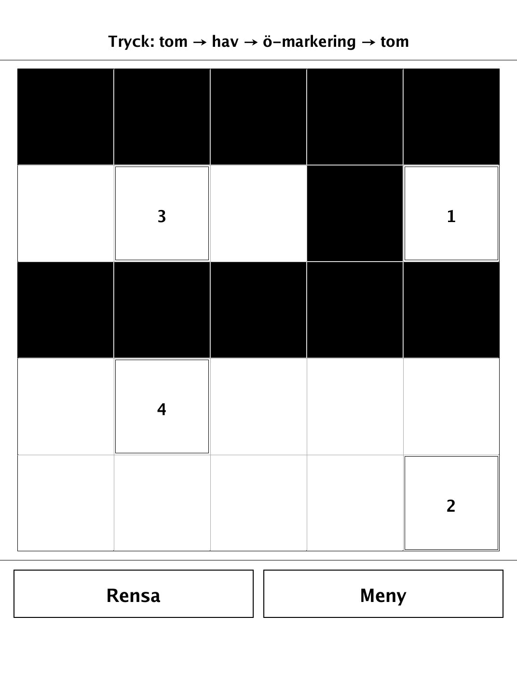
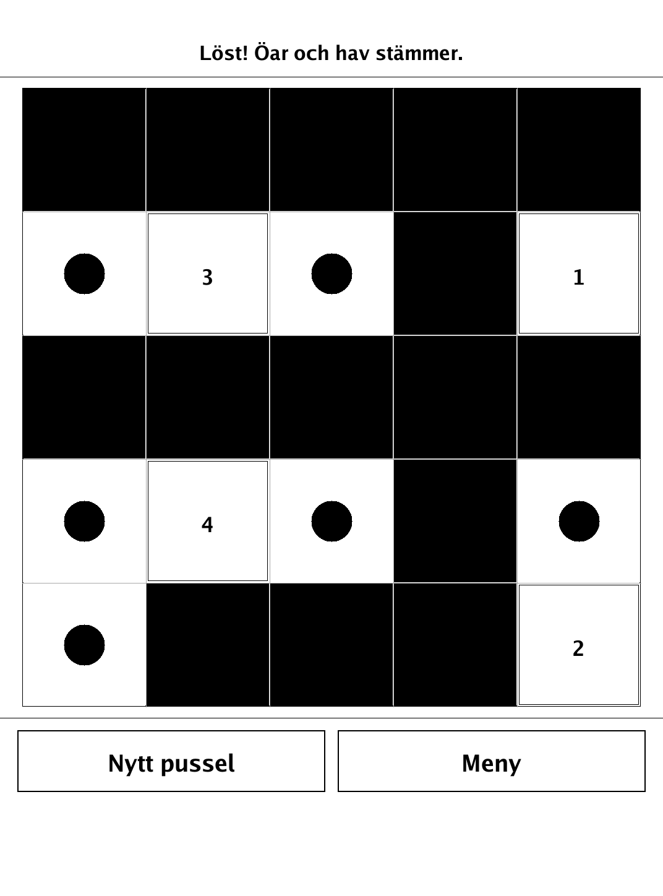
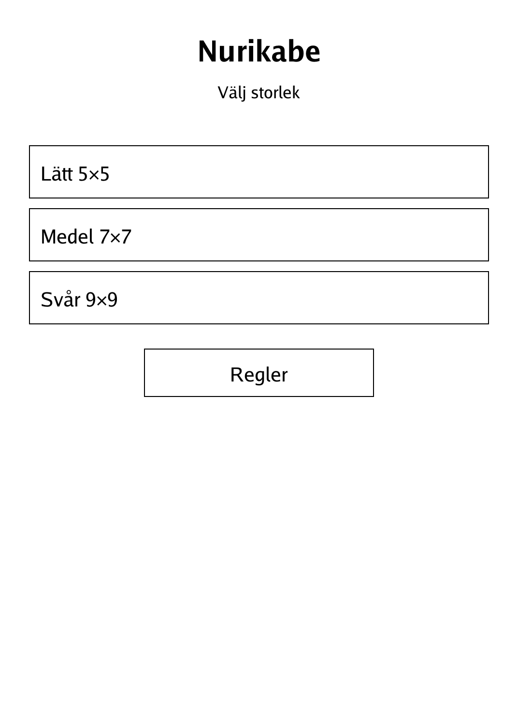
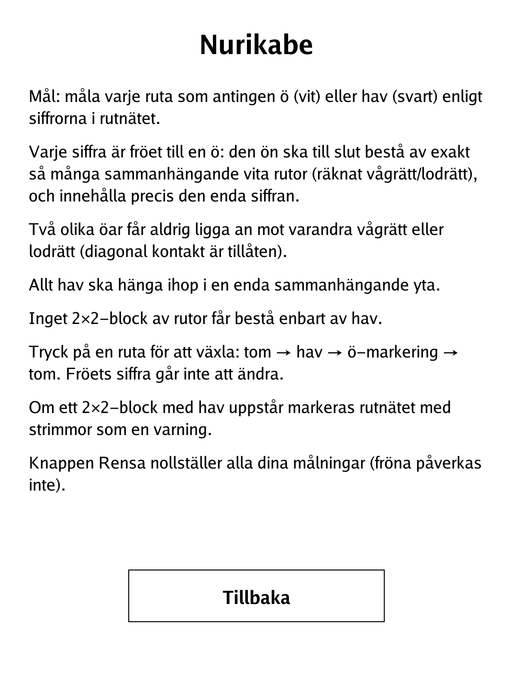

# Nurikabe (`nurikabe.app`)

Paint the grid into islands and sea so every numbered island reaches exactly its size and all the water connects.

<p align="center"></p>

## About

Nurikabe is a Japanese sea-and-island logic puzzle. The grid carries numbered seed cells, and you paint every other cell as either island (white) or sea (black) so the whole layout obeys the rules. Each generated board has a validated unique solution. This PocketBook build offers three sizes, and it visibly warns you with a hatch pattern the moment you create a forbidden 2×2 block of sea.

## How to play

- **Goal:** paint every cell as island or sea so the puzzle's constraints are all satisfied.
- **Islands:** each number is the seed of an island that must end up as exactly that many connected white cells (counted horizontally/vertically) and contain that one number.
- **Separation:** two different islands may never touch orthogonally (diagonal contact is fine).
- **Sea:** all the sea must join into a single connected region, and **no 2×2 block may be entirely sea**.
- **Input:** tap a non-seed cell to cycle it through **empty → sea → island-mark → empty**. Seed numbers are fixed and cannot be changed.
- **Warning:** if a 2×2 all-sea block appears, the grid is marked with stripes as a caution.
- **Buttons:** **Rensa** clears all of your painting (the seeds are untouched); once solved, **Nytt pussel** generates a new board.
- **Sizes:** Easy 5×5, Medium 7×7, Hard 9×9.

## Screenshots

<table>
  <tr>
    <td align="center"><br><sub>A puzzle in progress</sub></td>
    <td align="center"><br><sub>Solved — islands and sea agree</sub></td>
  </tr>
  <tr>
    <td align="center"><br><sub>Menu: pick a size</sub></td>
    <td align="center"><br><sub>In-app rules</sub></td>
  </tr>
</table>

## Building

Built against the PocketBook Go SDK — see the repo [README](../README.md) and [POCKETBOOK_GAMEDEV_GUIDE.md](../POCKETBOOK_GAMEDEV_GUIDE.md).

```bash
docker run --rm -v "$PWD/nurikabe:/app" -w /app sunsung/pocketbook-go-sdk:latest build -o nurikabe.app .
```

Copy `nurikabe.app` into the device's `applications/` folder. Headless tests: `playtest/play.sh nurikabe`.

*Based on Nurikabe, a Japanese sea-and-island logic puzzle.*
