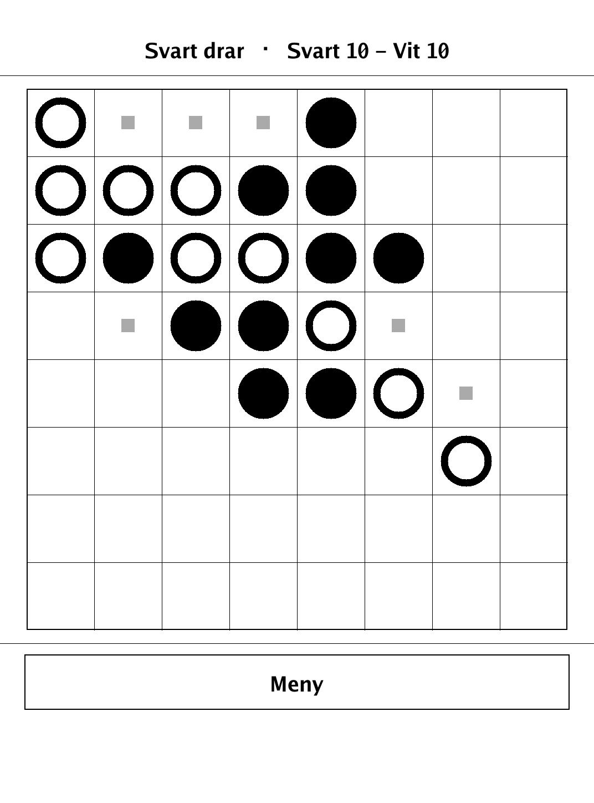
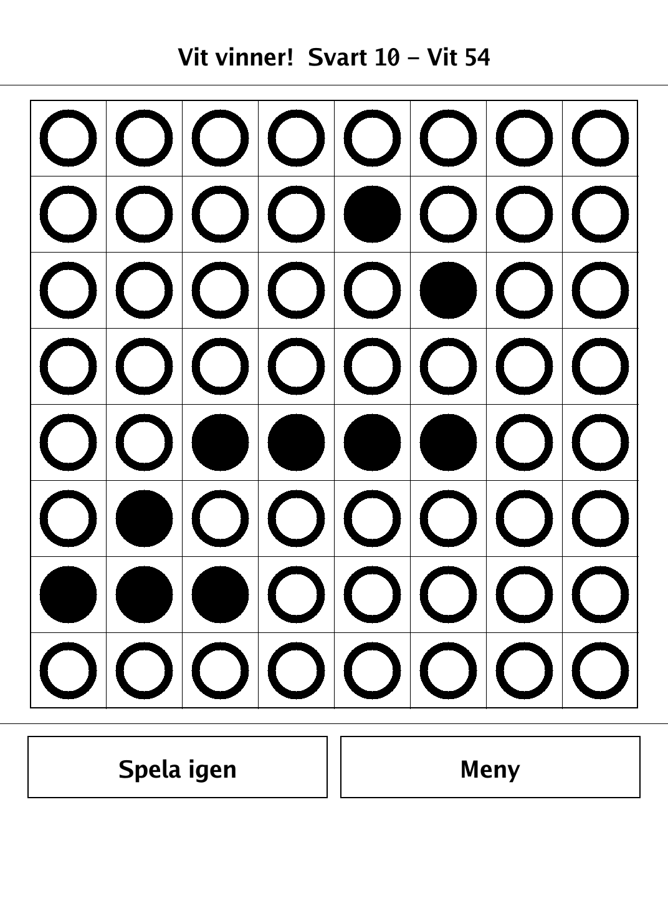
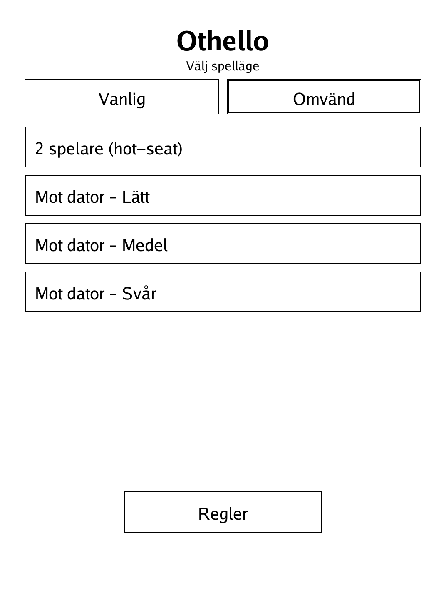
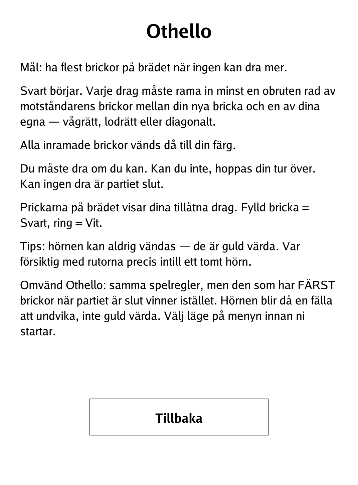

# Othello (`othello.app`)

Bracket your opponent's discs to flip them, and hold the most discs when the board fills up.

<p align="center"></p>

## About

Othello (also known as Reversi) is the classic disc-flipping strategy game on an 8×8 board. Each move must trap a line of the opponent's discs between your new disc and an existing one, flipping all the trapped discs to your colour. This PocketBook build supports hot-seat play or a built-in minimax AI at three strengths, and it includes an **Omvänd** (Anti-Othello) variant where the win condition is reversed — fewest discs wins.

## How to play

- **Goal:** have the most discs on the board when neither side can move.
- **Opening:** Black moves first. Each move must bracket at least one unbroken line of the opponent's discs — horizontally, vertically, or diagonally — between your new disc and one of your own. All bracketed discs then flip to your colour.
- **Passing:** you must move if you can; if you have no legal move your turn is skipped. When neither side can move the game ends.
- **Input:** the dots on the board mark your legal moves. Tap one to play there. A filled disc is Black, a ring is White.
- **Tip:** corners can never be flipped, so they are gold — be careful with the squares next to an empty corner.
- **Omvänd Othello (Anti-Othello):** same movement rules, but the player with the **fewest** discs at the end wins instead. Corners become a trap to avoid rather than a prize. Select **Vanlig** or **Omvänd** on the menu before starting.
- **Modes:** 2 players (hot-seat), or vs. the computer at Easy, Medium, or Hard.

## Screenshots

<table>
  <tr>
    <td align="center"><br><sub>A game in progress with move hints</sub></td>
    <td align="center"><br><sub>Board full — a winner declared</sub></td>
  </tr>
  <tr>
    <td align="center"><br><sub>Menu: modes and the Vanlig/Omvänd toggle</sub></td>
    <td align="center"><br><sub>In-app rules</sub></td>
  </tr>
</table>

## Building

Built against the PocketBook Go SDK — see the repo [README](../README.md) and [POCKETBOOK_GAMEDEV_GUIDE.md](../POCKETBOOK_GAMEDEV_GUIDE.md).

```bash
docker run --rm -v "$PWD/othello:/app" -w /app sunsung/pocketbook-go-sdk:latest build -o othello.app .
```

Copy `othello.app` into the device's `applications/` folder. Headless tests: `playtest/play.sh othello`.

*Based on Othello / Reversi, with an Anti-Othello ("Omvänd") reversed-win variant.*
