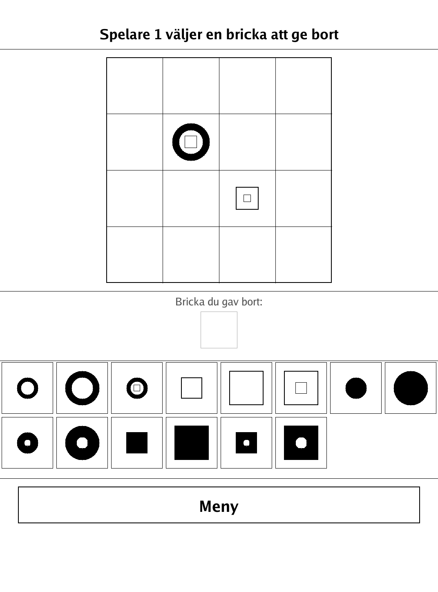
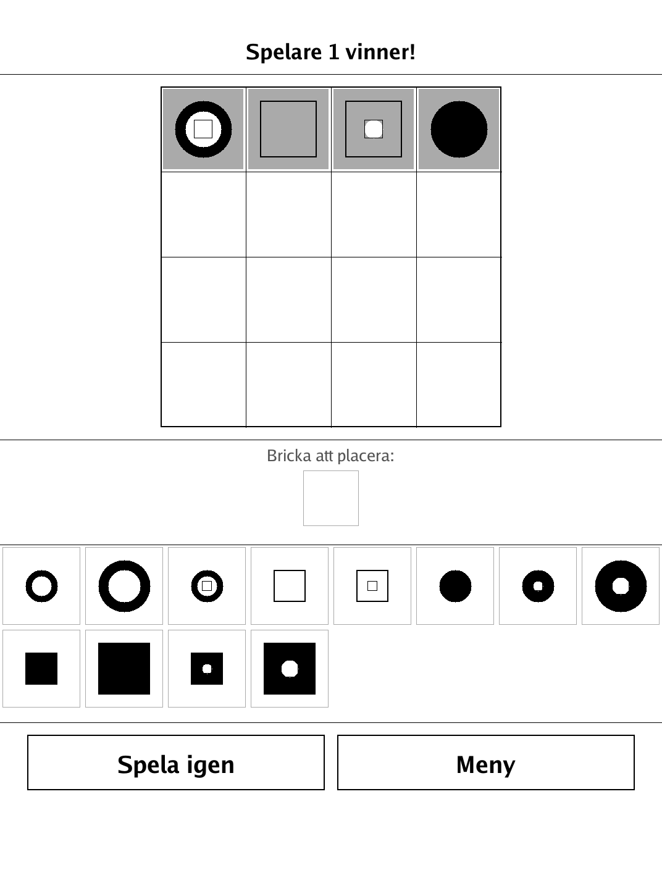
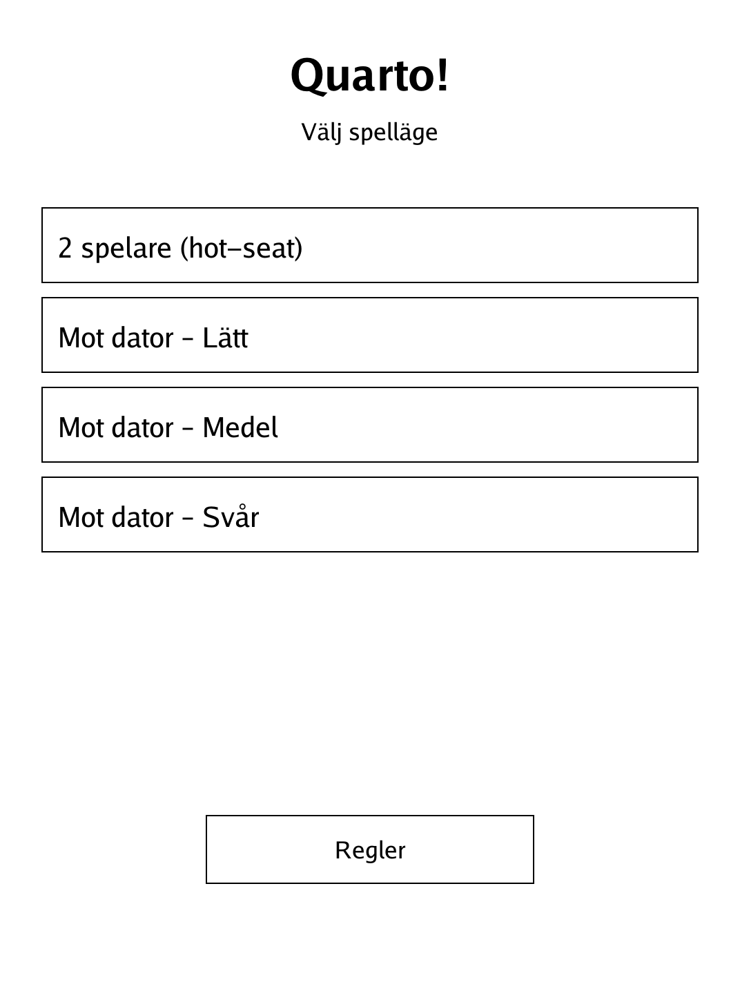
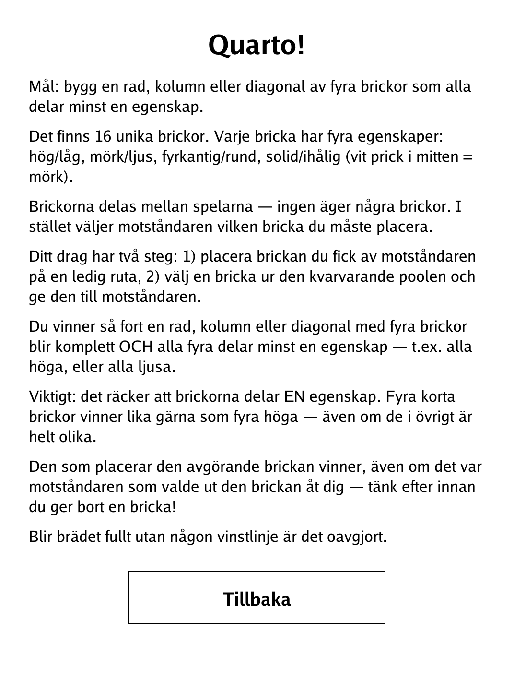

# Quarto! (`quarto.app`)

Complete a line of four pieces that share any attribute — but your opponent chooses which piece you must place.

<p align="center"></p>

## About

Quarto! is a sharp abstract strategy game played on a 4×4 board with 16 unique pieces. The twist is that nobody owns the pieces: on your turn you place the piece your opponent handed you, then you pick the piece your opponent must place next. This PocketBook build supports hot-seat play or a built-in minimax AI at three strengths.

## How to play

- **Goal:** complete a row, column, or diagonal of four pieces that all share **at least one** attribute.
- **Pieces:** there are 16 distinct pieces, each with four attributes — tall/short, dark/light, square/round, and solid/hollow (a white dot in the centre marks hollow on a dark piece).
- **Turn (two steps):** 1) place the piece your opponent gave you on any empty square, then 2) choose a piece from the remaining pool and hand it to your opponent.
- **Winning:** you win the instant a full line of four shares an attribute — for example all tall, or all light. Just one shared attribute is enough; four short pieces win as readily as four tall ones. The player who **places** the deciding piece wins, even if the opponent is the one who handed it over — so think before you give a piece away.
- **Draw:** if the board fills with no winning line, the game is a draw.
- **Input:** during the place step tap an empty square; during the give step tap a piece in the pool to hand it over.
- **Modes:** 2 players (hot-seat), or vs. the computer at Easy, Medium, or Hard.

## Screenshots

<table>
  <tr>
    <td align="center"><br><sub>A game in progress</sub></td>
    <td align="center"><br><sub>A winning line completed</sub></td>
  </tr>
  <tr>
    <td align="center"><br><sub>Menu: hot-seat or AI difficulty</sub></td>
    <td align="center"><br><sub>In-app rules</sub></td>
  </tr>
</table>

## Building

Built against the PocketBook Go SDK — see the repo [README](../README.md) and [POCKETBOOK_GAMEDEV_GUIDE.md](../POCKETBOOK_GAMEDEV_GUIDE.md).

```bash
docker run --rm -v "$PWD/quarto:/app" -w /app sunsung/pocketbook-go-sdk:latest build -o quarto.app .
```

Copy `quarto.app` into the device's `applications/` folder. Headless tests: `playtest/play.sh quarto`.

*Based on Quarto!, the abstract strategy game by Blaise Müller.*
