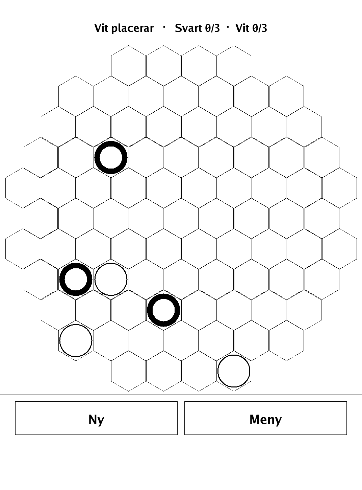
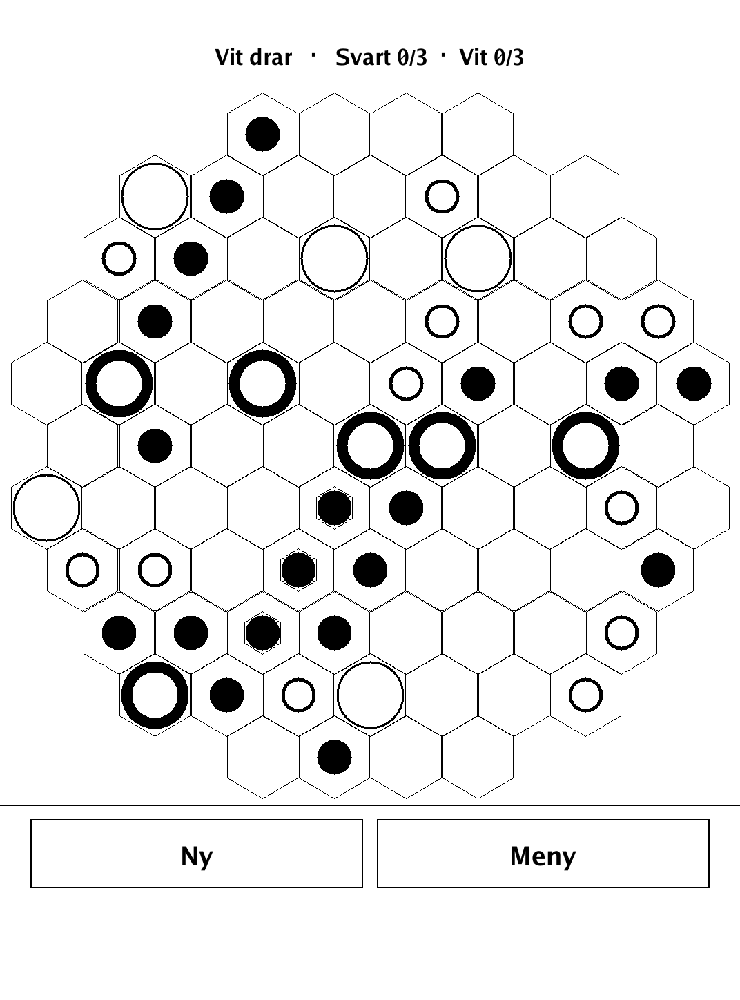
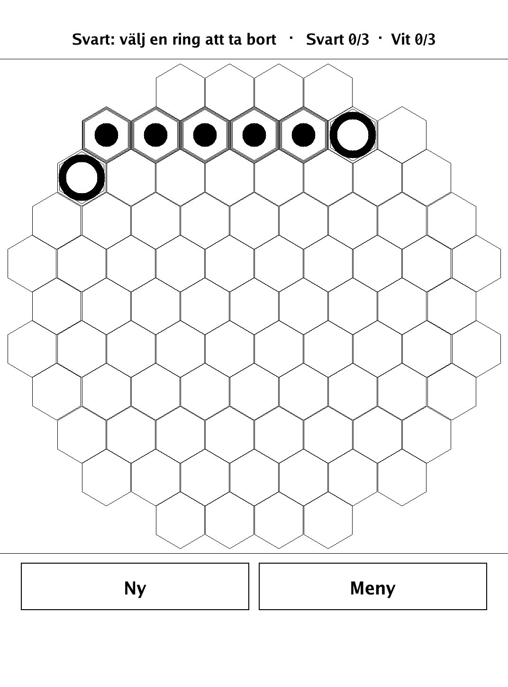
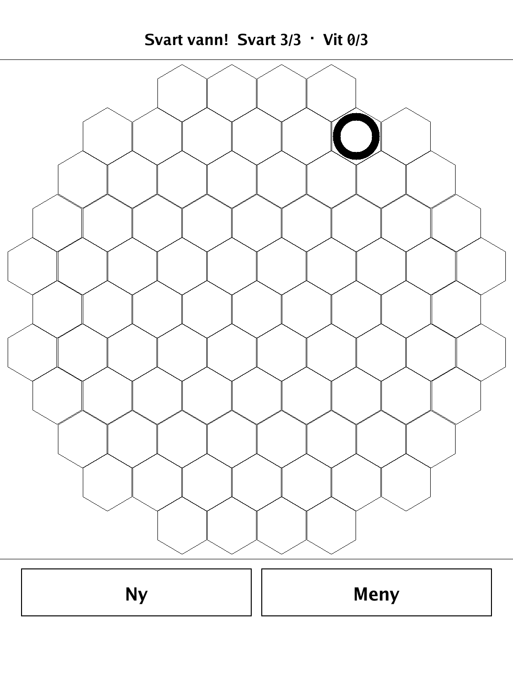

# Ringar (`ringar.app`)

Slide your rings across a hexagonal field, flip markers Othello-style, and be first to remove three of your own rings.

<p align="center"></p>

## About

Ringar is based on **YINSH** (Kris Burm, from the GIPF project of abstract strategy games), reimagined for the PocketBook Verse Pro. Two players each place five rings on a hexagonal 85-point board, then take turns sliding a ring in a straight line: a marker drops where the ring departs, and every marker jumped over flips to the mover's colour. Completing a row of five markers lets you remove them and one of your own rings — and removing your third ring wins. Hot-seat play against a friend is the main experience; a deliberately casual built-in AI is also available.

## How to play

- **Goal:** remove **3 of your own rings** from the board — the first to do so wins.
- **Board:** a hexagonal field of 85 points, with lines running along 3 directions (axes).
- **Placement phase:** White and Black take turns placing their five rings each on empty points. White begins.
- **Movement phase:** choose a ring. A marker in your colour drops on the ring's point, and the ring slides in a straight line along an axis to an empty point — any distance across empty points.
  - The ring may jump over a run of markers, but must land on the first empty point right after them, and may never jump over or land on another ring.
  - Every marker jumped over flips to your colour — like Othello, but as a direct result of the ring's slide.
- **Rows:** five markers of one colour in a row along an axis let that colour's owner remove those markers plus one of their own rings (any ring, anywhere).
- **Longer rows:** if the run is six or more markers, tap a marker to choose which five adjacent ones are removed; the rest stay in play.
- **Sacrifice:** the ring you give up can be any of yours — fewer rings means less mobility.
- **Input:** tap a ring to select it (legal targets are marked), then tap a target point to move there. Tap the selected ring again to deselect.
- **Modes:** 2 players (hot-seat), or vs. a relaxed computer opponent.

## Screenshots

<table>
  <tr>
    <td align="center"><br><sub>Placing rings on the hex board</sub></td>
    <td align="center"><br><sub>A ring selected, ready to slide</sub></td>
  </tr>
  <tr>
    <td align="center"><br><sub>A completed row being removed</sub></td>
    <td align="center"><br><sub>Game over — a winner declared</sub></td>
  </tr>
</table>

## Building

Built against the PocketBook Go SDK — see the repo [README](../README.md) and [POCKETBOOK_GAMEDEV_GUIDE.md](../POCKETBOOK_GAMEDEV_GUIDE.md).

```bash
docker run --rm -v "$PWD/ringar:/app" -w /app sunsung/pocketbook-go-sdk:latest build -o ringar.app .
```

Copy `ringar.app` into the device's `applications/` folder. Headless tests: `playtest/play.sh ringar`.

*Based on YINSH by Kris Burm (the GIPF project).*
