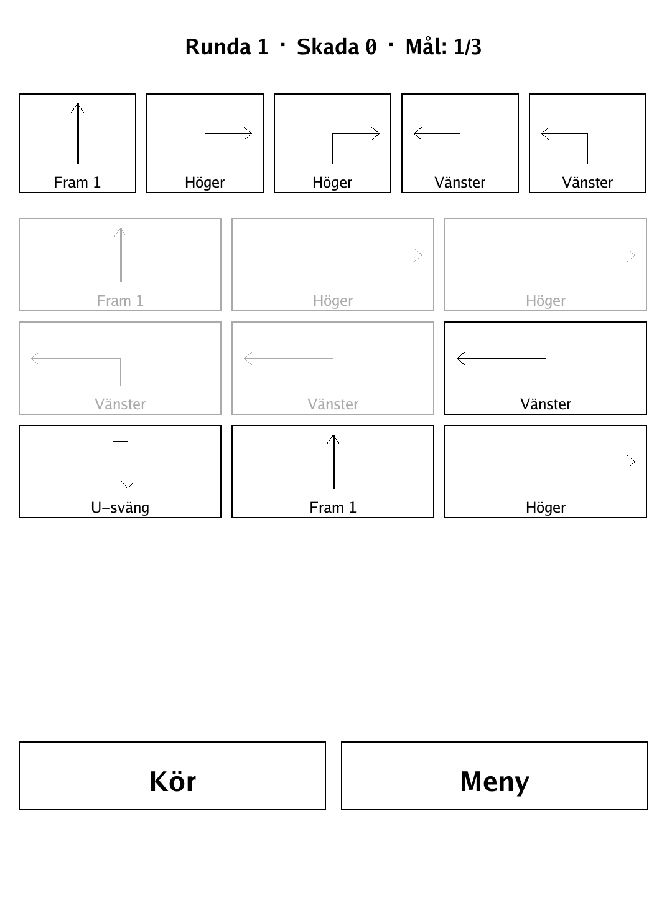
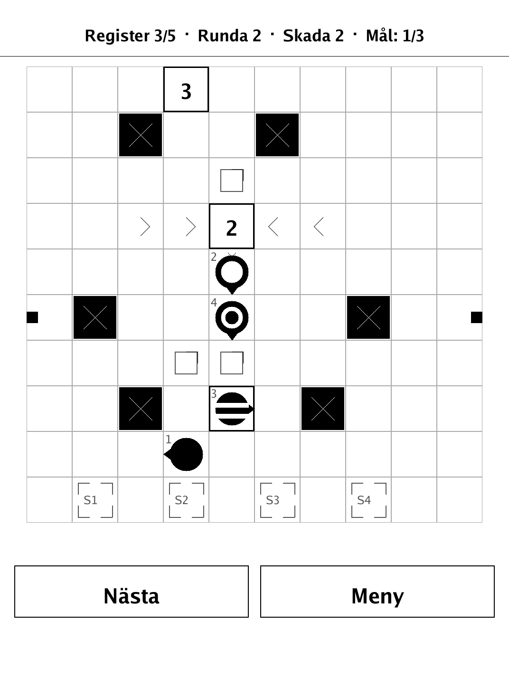
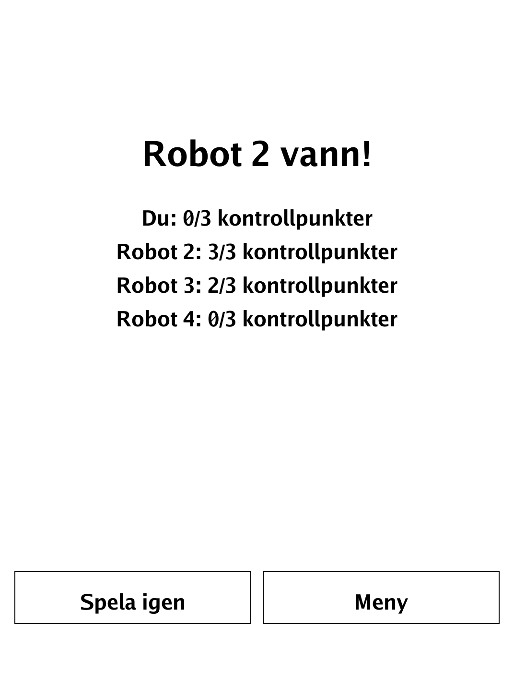
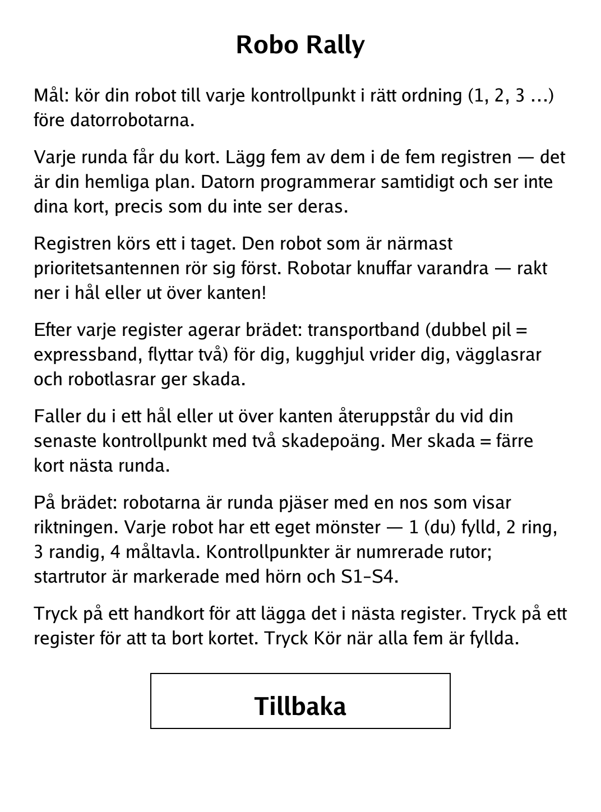

# Robo Rally (`roborally.app`)

Secretly program five movement cards each round and race your robot across a hazard-filled factory floor to every checkpoint.

<p align="center"></p>

## About

Robo Rally is a simplified, solo-vs-AI port of the board game where robots race across a conveyor-and-laser factory floor. Each round every robot secretly programs five movement cards into registers, then the registers resolve one at a time in priority order while conveyors, gears, and lasers shove and singe the robots. This PocketBook build pits one human against 1–3 blind AI robots on curated or randomly generated courses; all the rules, board physics, level generation, and AI live in a pure Go package. First to touch every checkpoint in order wins.

## How to play

- **Goal:** drive your robot to every checkpoint in order (1, 2, 3, …) before the AI robots do.
- **Programming:** each round you are dealt cards. Place five of them into the five registers — that is your secret plan. The computer programs at the same time and cannot see your cards, just as you cannot see theirs.
- **Resolution:** the registers run one at a time. The robot nearest the priority antenna moves first. Robots shove each other — straight into pits or off the edge.
- **Board elements:** after each register the board acts — conveyor belts move you (a double arrow is an express belt that moves two), gears rotate you, and wall/robot lasers deal damage.
- **Damage:** fall into a pit or off the edge and you respawn at your last checkpoint with two damage. More damage means fewer cards next round.
- **Reading the board:** robots are round pieces with a nose showing their facing; each has its own pattern — robot 1 (you) filled, 2 a ring, 3 striped, 4 a target. Checkpoints are numbered squares; start squares are corner-marked S1–S4.
- **Input:** tap a hand card to drop it into the next register; tap a filled register to return its card to your hand. Tap **Kör** once all five are placed, then **Nästa** to step through resolution.
- **Setup:** choose a course (curated Bana 1–3 by difficulty, or a random Slump tier), the number of AI opponents (1–3), and the AI strength on the menu.

## Screenshots

<table>
  <tr>
    <td align="center"><br><sub>Registers programmed, ready to run</sub></td>
    <td align="center"><br><sub>Mid-game: robots on the factory floor</sub></td>
  </tr>
  <tr>
    <td align="center"><br><sub>Final standings</sub></td>
    <td align="center"><br><sub>In-app rules</sub></td>
  </tr>
</table>

## Building

Built against the PocketBook Go SDK — see the repo [README](../README.md) and [POCKETBOOK_GAMEDEV_GUIDE.md](../POCKETBOOK_GAMEDEV_GUIDE.md), and the game design notes in [SPEC_ROBORALLY.md](../SPEC_ROBORALLY.md).

```bash
docker run --rm -v "$PWD/roborally:/app" -w /app sunsung/pocketbook-go-sdk:latest build -o roborally.app .
```

Copy `roborally.app` into the device's `applications/` folder. Headless tests: `playtest/play.sh roborally`.

*Based on Robo Rally (Richard Garfield / Wizards of the Coast), simplified as a solo race against AI robots.*
