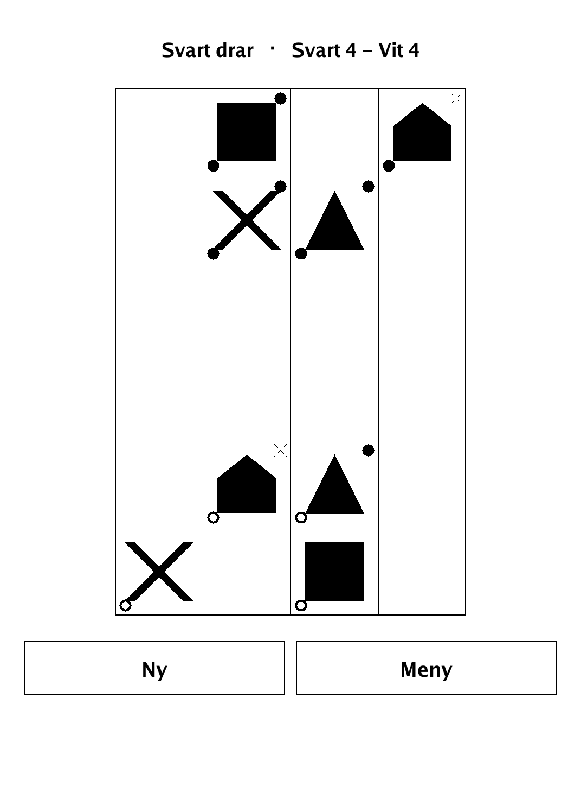
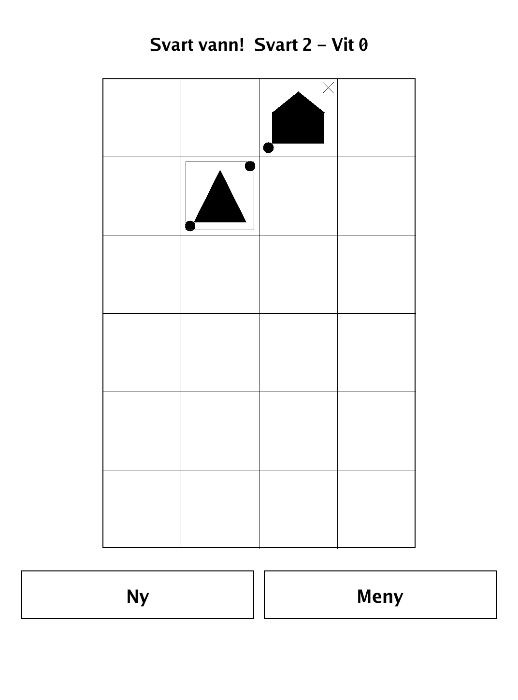
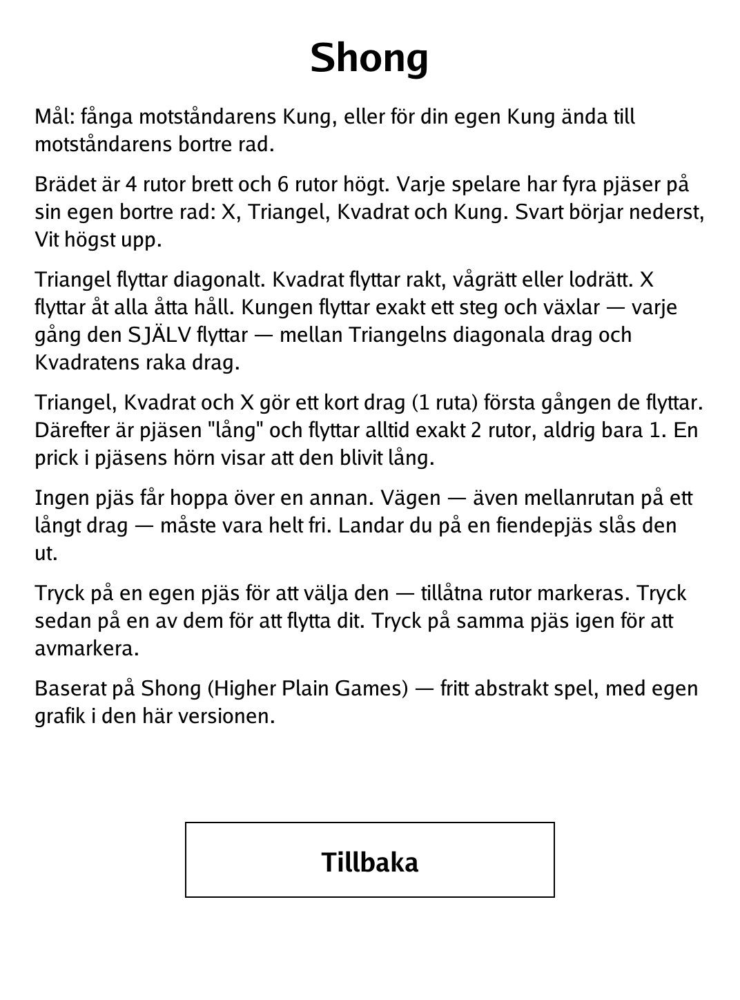

# Shong (`shong.app`)

A lightning chess-like duel on a narrow 4x6 board where every piece speeds up after its first move.

<p align="center"></p>

## About

Shong is a compact abstract two-player duel for the PocketBook Verse Pro, built on the `dennwc/inkview` SDK. It is based on Shong (Higher Plain Games), a free abstract game, reimplemented here with its own graphics. Play hot-seat against a friend or against a built-in alpha-beta AI. On the e-ink screen a small eye mark on a piece records that it has become "long", and selecting a piece highlights its legal destinations.

## How to play

- **Goal:** capture the opponent's King, or walk your own King all the way to the opponent's back rank.
- The board is 4 squares wide and 6 tall. Each side starts with four pieces on its own back rank: X, Triangle (Triangel), Square (Kvadrat) and King (Kung). Black starts at the bottom, White at the top.
- **Movement:** the Triangle moves diagonally; the Square moves orthogonally (straight); the X moves in all eight directions. The King moves exactly one step and alternates — each time it itself moves — between the Triangle's diagonal moves and the Square's straight moves.
- Triangle, Square and X make a **short move** (1 square) the first time they move. After that the piece is **"long"** and always moves exactly 2 squares, never just 1. A dot in the piece's corner shows it has become long.
- **No jumping:** the whole path, including the middle square of a long move, must be clear. Landing on an enemy piece captures it by displacement.
- **Controls:** tap one of your pieces to select it — legal squares are marked. Tap a marked square to move there. Tap the same piece again to deselect.

## Screenshots

<table>
  <tr>
    <td align="center"><br><sub>Mid-duel: a piece selected with its legal moves marked</sub></td>
    <td align="center"><br><sub>Win by capturing the enemy King</sub></td>
    <td align="center"><br><sub>In-app Swedish rules</sub></td>
  </tr>
</table>

## Building

Built against the PocketBook Go SDK — see the repo [README](../README.md) and [POCKETBOOK_GAMEDEV_GUIDE.md](../POCKETBOOK_GAMEDEV_GUIDE.md).

```bash
docker run --rm -v "$PWD/shong:/app" -w /app sunsung/pocketbook-go-sdk:latest build -o shong.app .
```

Copy `shong.app` into the device's `applications/` folder. Headless tests: `playtest/play.sh shong`.

Based on Shong (Higher Plain Games), a free abstract game, with original graphics in this version.
