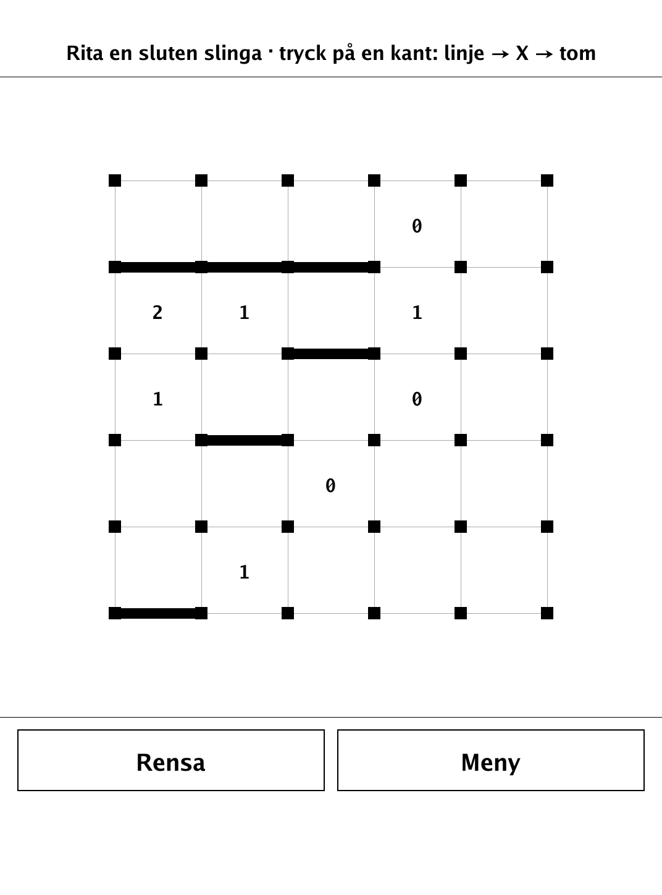
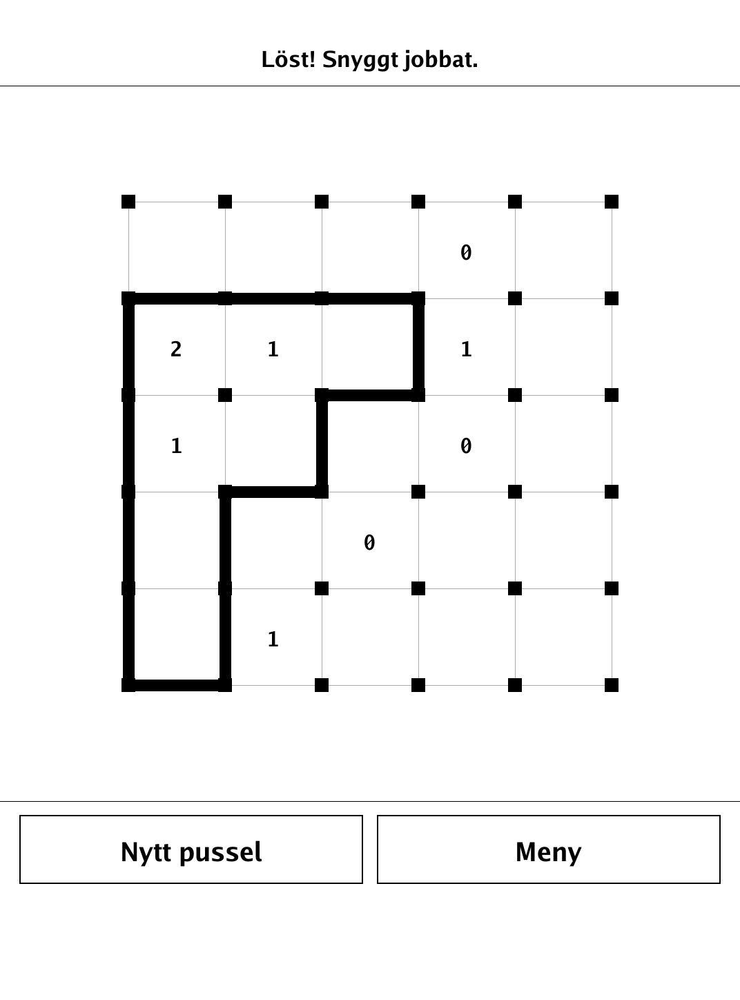
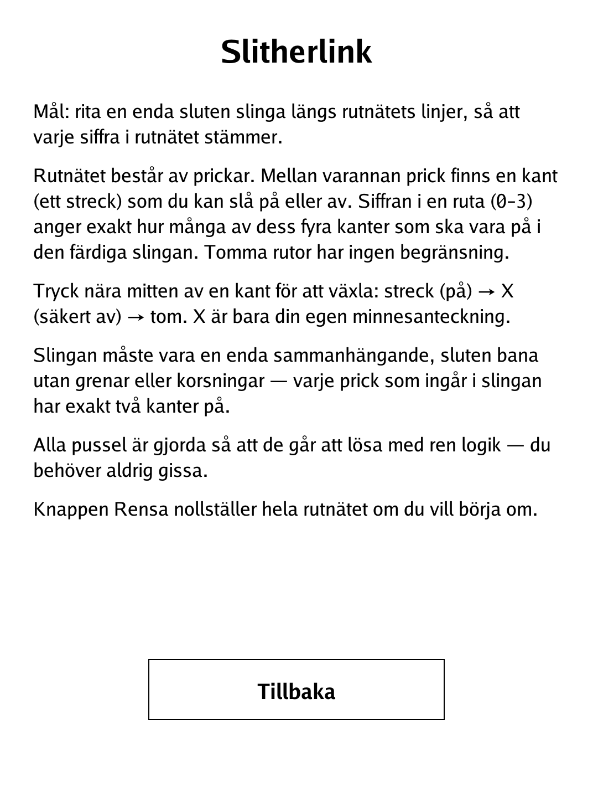

# Slitherlink (`slitherlink.app`)

Draw a single closed loop along a grid of dots so that every numbered cell has exactly that many of its edges used.

<p align="center"></p>

## About

Slitherlink is a classic loop-drawing logic puzzle for the PocketBook Verse Pro, built on the `dennwc/inkview` SDK. Puzzles are generated to be uniquely solvable by pure logic — you never need to guess. The pure puzzle logic (board, solver, generator, win check) lives in a separate, unit-tested `game` package. Several preset sizes are available from the menu.

## How to play

- **Goal:** draw one single closed loop along the grid lines so that every clue is satisfied.
- The grid is made of dots. Between adjacent dots is an edge you can switch on or off. A cell's number (0–3) states exactly how many of its four edges must be on in the finished loop. Empty cells have no constraint.
- **Controls:** tap near the middle of an edge to cycle it: **line (on) → X (definitely off) → empty**. The X is just your own memory note.
- The loop must be one single connected, closed path with no branches or crossings — every dot on the loop has exactly two edges on.
- The **Rensa** (Clear) button resets the whole grid if you want to start over.

## Screenshots

<table>
  <tr>
    <td align="center"><br><sub>Drawing the loop in progress</sub></td>
    <td align="center"><br><sub>Solved: one closed loop satisfying every clue</sub></td>
    <td align="center"><br><sub>In-app Swedish rules</sub></td>
  </tr>
</table>

## Building

Built against the PocketBook Go SDK — see the repo [README](../README.md) and [POCKETBOOK_GAMEDEV_GUIDE.md](../POCKETBOOK_GAMEDEV_GUIDE.md).

```bash
docker run --rm -v "$PWD/slitherlink:/app" -w /app sunsung/pocketbook-go-sdk:latest build -o slitherlink.app .
```

Copy `slitherlink.app` into the device's `applications/` folder. Headless tests: `playtest/play.sh slitherlink`.
