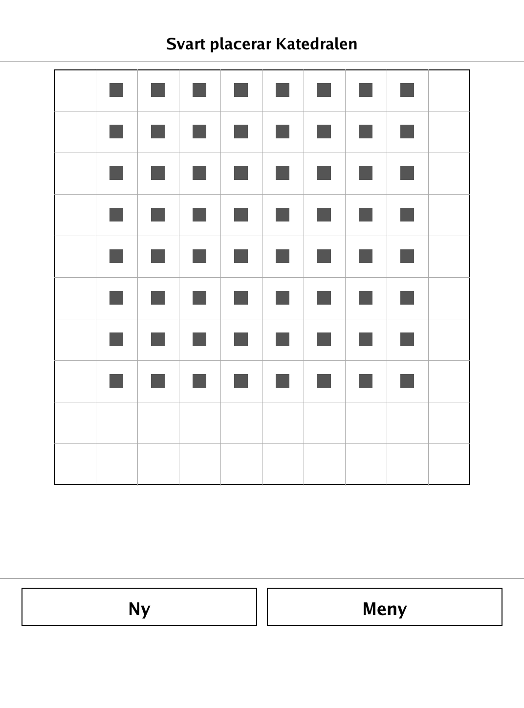
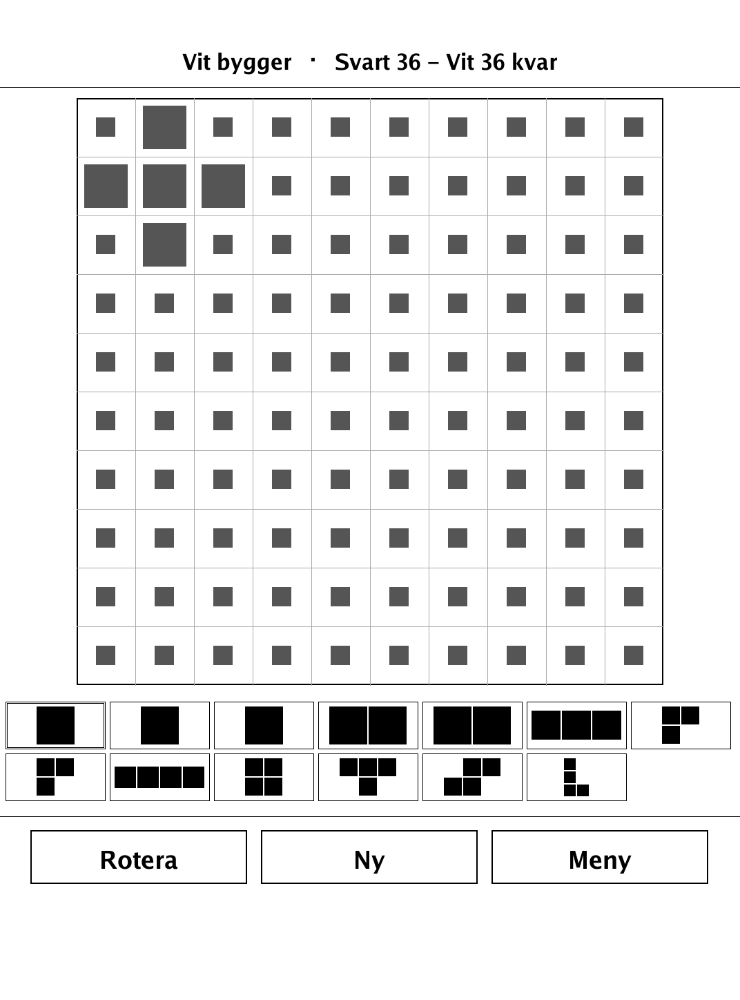
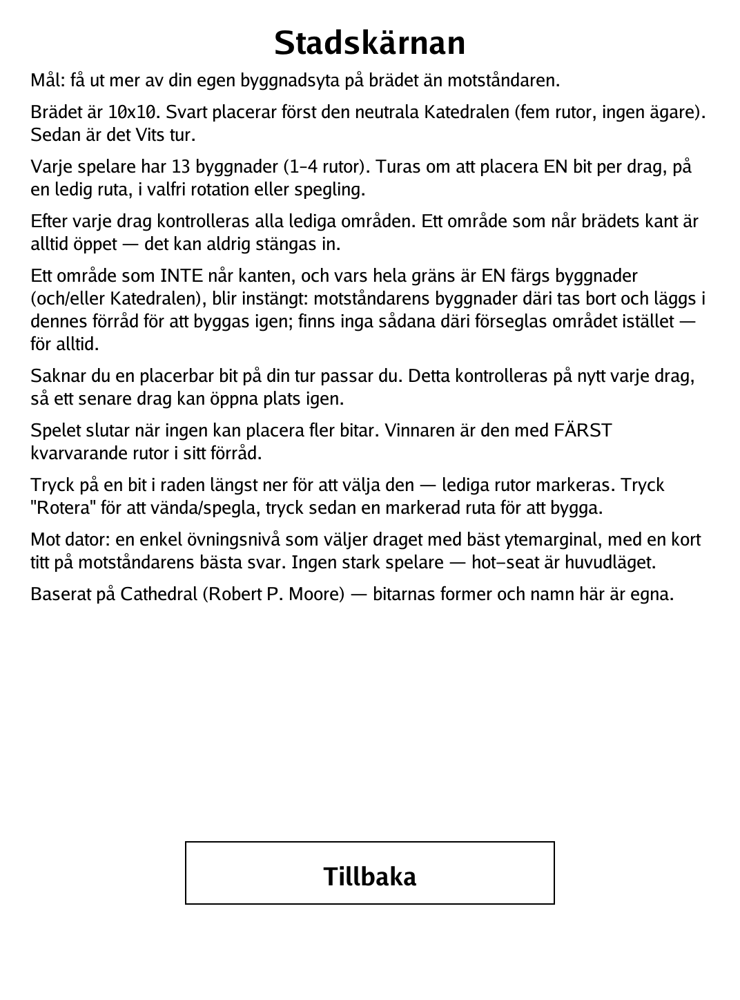

# Cathedral / Stadskärnan (`stadskarnan.app`)

A territory-enclosure building game: wall off regions of the town with your pieces to capture the opponent's.

<p align="center"></p>

## About

Stadskärnan ("The Town Core") is a two-player enclosure-and-capture building game for the PocketBook Verse Pro, built on the `dennwc/inkview` SDK. It is an original port of the enclosure/capture mechanic found in Cathedral (Robert P. Moore) — the piece geometry, names and art are original to this implementation. Play hot-seat against a friend, or against a simple practice-strength AI (hot-seat is the main mode). The pure game logic lives in a separate, unit-tested `game` package.

## How to play

- **Goal:** have fewer of your own squares left unplaced in hand than the opponent — i.e. get more of your building area onto the board.
- The board is 10x10. Black first places the neutral **Cathedral** (five squares, no owner). Then it is White's turn.
- Each player has 13 buildings (1–4 squares). Take turns placing **one** piece per move, on empty cells, in any rotation or reflection.
- After every move all free regions are checked. A region that reaches the board edge is always open and can never be sealed.
- A region that does **not** reach the edge, and whose entire border is one color's buildings (and/or the Cathedral), becomes enclosed: the opponent's buildings inside are removed and returned to their hand to be built again; if there are none inside, the region is simply sealed off forever.
- If you have no placeable piece on your turn, you pass. This is re-checked every move, so a later move can open space again.
- The game ends when neither side can place any piece. The winner has the **fewest** squares left in hand.
- **Controls:** tap a piece in the bottom tray to select it — legal cells are marked. Tap **Rotera** to rotate/reflect, then tap a marked cell to build.

## Screenshots

<table>
  <tr>
    <td align="center"><br><sub>The neutral Cathedral is placed first</sub></td>
    <td align="center"><br><sub>Placing building pieces from the tray</sub></td>
    <td align="center"><br><sub>In-app Swedish rules</sub></td>
  </tr>
</table>

## Building

Built against the PocketBook Go SDK — see the repo [README](../README.md) and [POCKETBOOK_GAMEDEV_GUIDE.md](../POCKETBOOK_GAMEDEV_GUIDE.md).

```bash
docker run --rm -v "$PWD/stadskarnan:/app" -w /app sunsung/pocketbook-go-sdk:latest build -o stadskarnan.app .
```

Copy `stadskarnan.app` into the device's `applications/` folder. Headless tests: `playtest/play.sh stadskarnan`.

Based on the enclosure/capture mechanic of Cathedral (Robert P. Moore); the piece shapes and names here are original.
