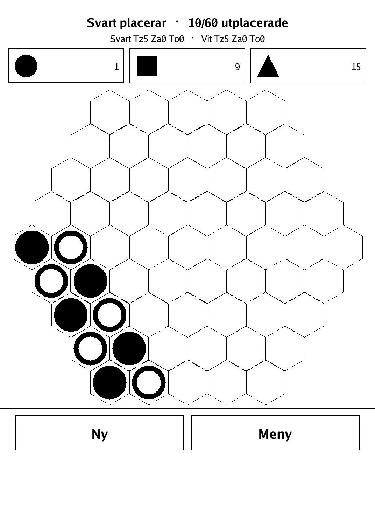
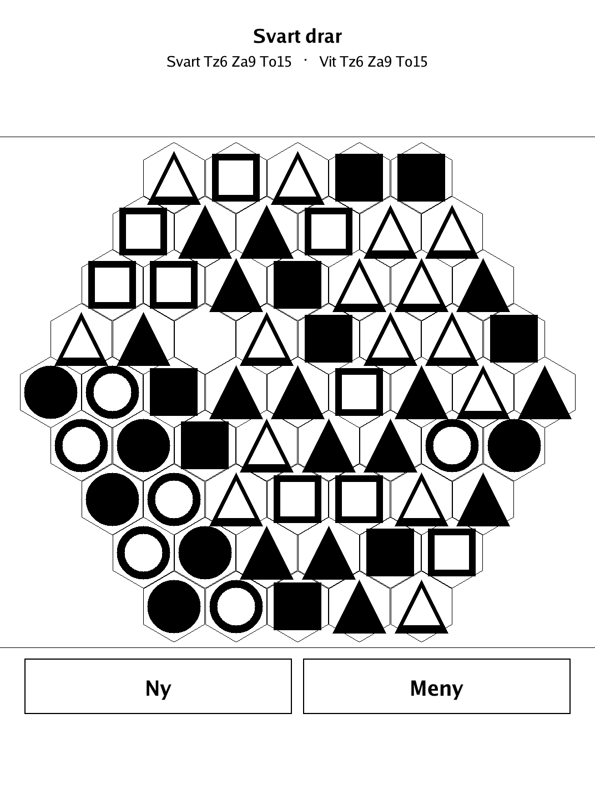
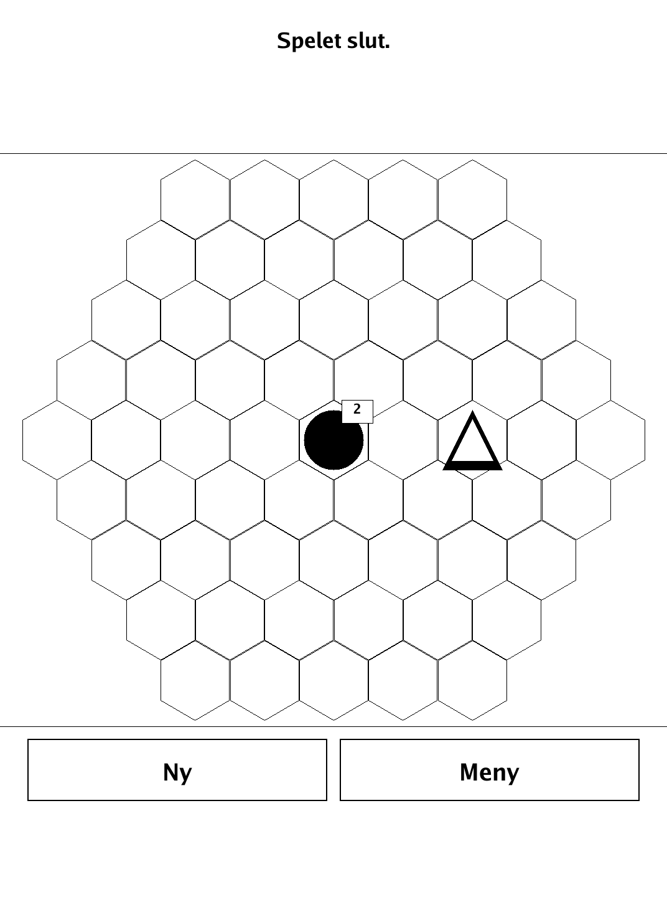

# TZAAR / Staplarna (`staplarna.app`)

Stack, move and capture on a hex board — win by wiping out any one of your opponent's three piece types.

<p align="center"></p>

## About

Staplarna ("The Stacks") is a two-player abstract capturing game for the PocketBook Verse Pro, built on the `dennwc/inkview` SDK. It is based on TZAAR (Kris Burm, the GIPF project). Play hot-seat against a friend or against a built-in alpha-beta AI. The pure game logic (hex geometry, setup, stack movement/capture, win detection, AI) lives in a separate, unit-tested `game` package.

## How to play

- **Goal:** reduce your opponent to zero pieces of **any one** of the three types (Tzaar, Tzarra or Tott) — or leave them with no legal move.
- The board is a hexagonal field of 61 cells (5 cells per edge).
- **Placement phase:** Black and White take turns placing their 30 pieces each (6 Tzaar, 9 Tzarra, 15 Tott) on empty cells in any pattern. Black starts.
- **Movement phase:** choose one of your stacks. It moves in a straight line, in one of 6 directions, **exactly** as many cells as the stack is tall — never shorter, never longer. A lone piece (height 1) thus moves only one cell.
- A stack may never pass through another stack, yours or the enemy's — every cell up to (but not including) the destination must be empty.
- Land on an empty cell for a normal move. Land on your own stack to **merge** into one taller stack. Land on an enemy stack that is **not taller** than yours to **capture** it whole — including pieces buried underneath.
- **Capture is not mandatory:** a plain move without a capture is still legal even when a capture is available elsewhere.
- **Controls:** in placement, tap a piece type at the top to choose what to place next (count shown), then tap an empty cell. In movement, tap one of your stacks to select it — legal destinations at exactly the right distance are marked — then tap one to move. Piece types show as shapes: Tzaar = large circle, Tzarra = square, Tott = triangle; a small corner number shows a stack's height when above 1.

## Screenshots

<table>
  <tr>
    <td align="center"><br><sub>Placement phase</sub></td>
    <td align="center"><br><sub>Stacks mid-game</sub></td>
    <td align="center"><br><sub>Game over</sub></td>
  </tr>
</table>

## Building

Built against the PocketBook Go SDK — see the repo [README](../README.md) and [POCKETBOOK_GAMEDEV_GUIDE.md](../POCKETBOOK_GAMEDEV_GUIDE.md).

```bash
docker run --rm -v "$PWD/staplarna:/app" -w /app sunsung/pocketbook-go-sdk:latest build -o staplarna.app .
```

Copy `staplarna.app` into the device's `applications/` folder. Headless tests: `playtest/play.sh staplarna`.

Based on TZAAR (Kris Burm, the GIPF project).
