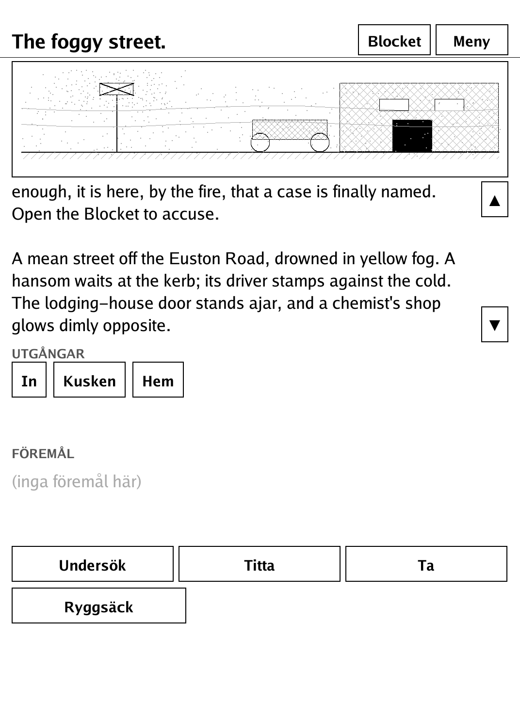
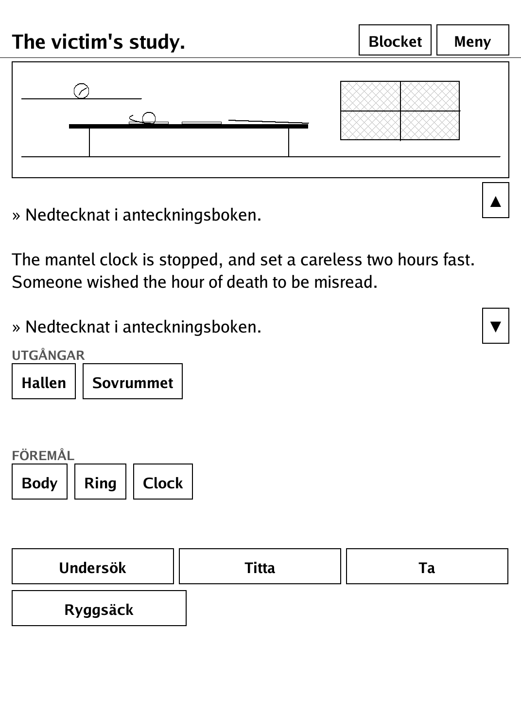
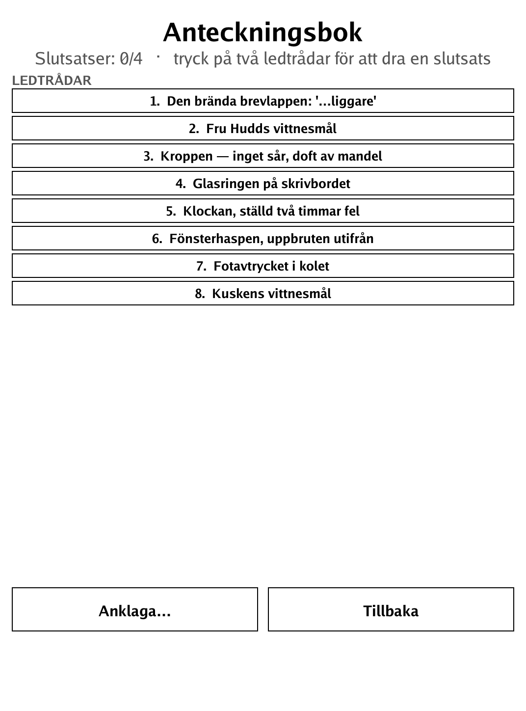
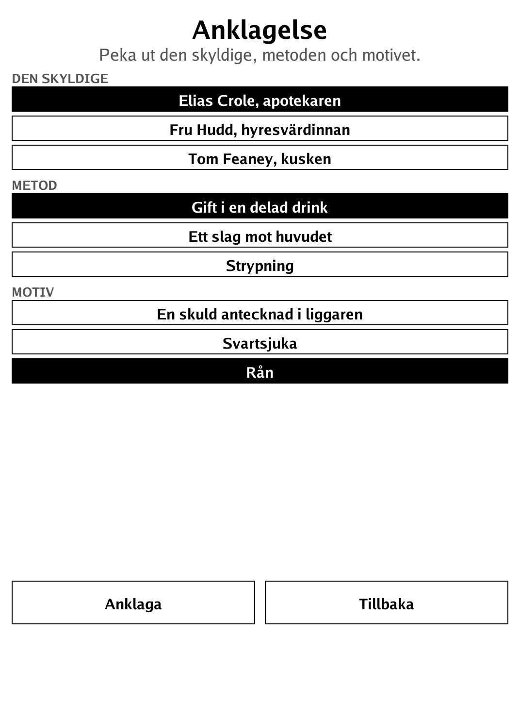

# En Studie i Grått (`studie.app`)

A tap-driven detective mystery: gather clues in the London fog and combine them in your notebook to crack a locked-room murder.

<p align="center"></p>

## About

"En Studie i Grått" (A Study in Grey) is an original tap-driven mystery for the PocketBook Verse Pro, and the second story on the Grottan adventure engine — it reuses Grottan's engine byte-for-byte, adding one extension (the Notebook) plus authored story data and themed chrome. The case is an original story freely inspired by Sherlock Holmes' debut (A Study in Scarlet, 1887, which is public domain), but with its own text, characters and plot. There is no typing: everything is played by tapping. The case saves automatically, and you resume it with **Fortsätt fallet** from the menu.

## How to play

- **Goal:** a man is dead in a locked room in the yellow fog. You are the detective — gather clues, weigh them against each other, and solve the case.
- Tap an **exit** to move between locations.
- Tap the verb **Undersök** (Examine) and then an **object** to inspect it; important findings are written into your notebook.
- **Titta** (Look) and **Ryggsäck** (Backpack) act immediately.
- Open the **notebook** (Blocket, top right), which lists your clues. Tap two of them to draw a **deduction** — if they fit, the picture clears; otherwise nothing happens. (For example, deducing the poison is what unlocks the chemist as a new location.)
- Collect all the deductions to understand **how, why and by whom** the deed was done, then make your accusation (culprit / method / motive). An unsupported charge is refused and named; the correct, supported charge closes the case.

## Screenshots

<table>
  <tr>
    <td align="center"><br><sub>Out in the foggy street</sub></td>
    <td align="center"><br><sub>Examining the study</sub></td>
  </tr>
  <tr>
    <td align="center"><br><sub>The notebook: combining clues into deductions</sub></td>
    <td align="center"><br><sub>Making the accusation</sub></td>
  </tr>
</table>

## Building

Built against the PocketBook Go SDK — see the repo [README](../README.md), [POCKETBOOK_GAMEDEV_GUIDE.md](../POCKETBOOK_GAMEDEV_GUIDE.md) and [SPEC_TEXT_ADVENTURE.md](../SPEC_TEXT_ADVENTURE.md).

```bash
docker run --rm -v "$PWD/studie:/app" -w /app sunsung/pocketbook-go-sdk:latest build -o studie.app .
```

Copy `studie.app` into the device's `applications/` folder. Headless tests: `playtest/play.sh studie`.

An original case freely inspired by A Study in Scarlet (Arthur Conan Doyle, 1887, public domain), with its own text, characters and plot.
