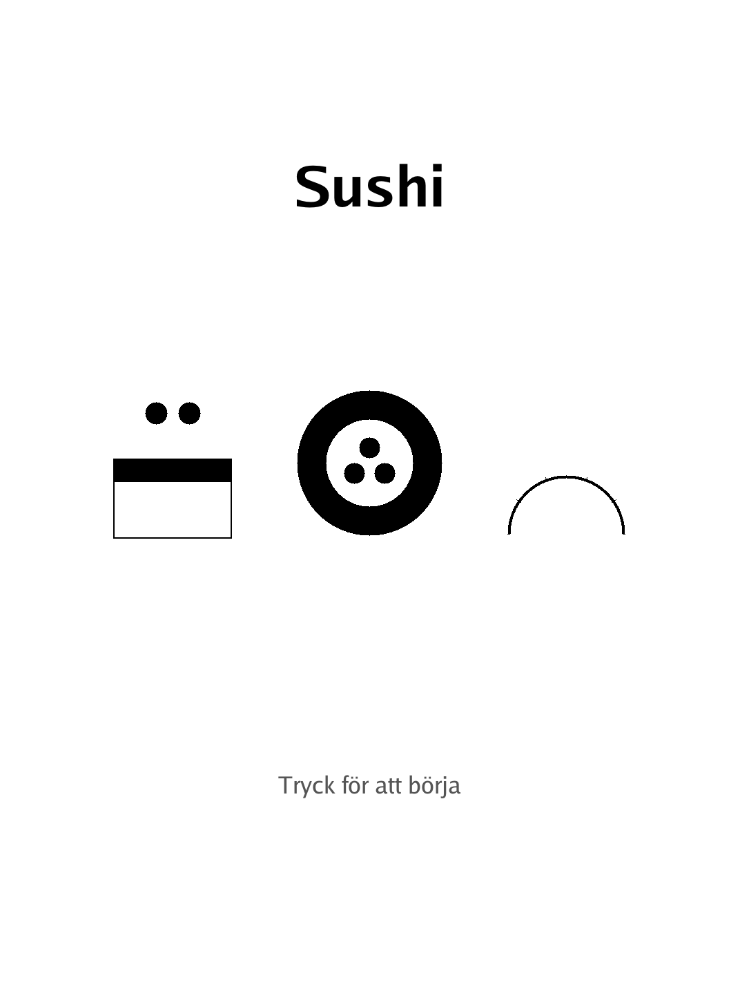
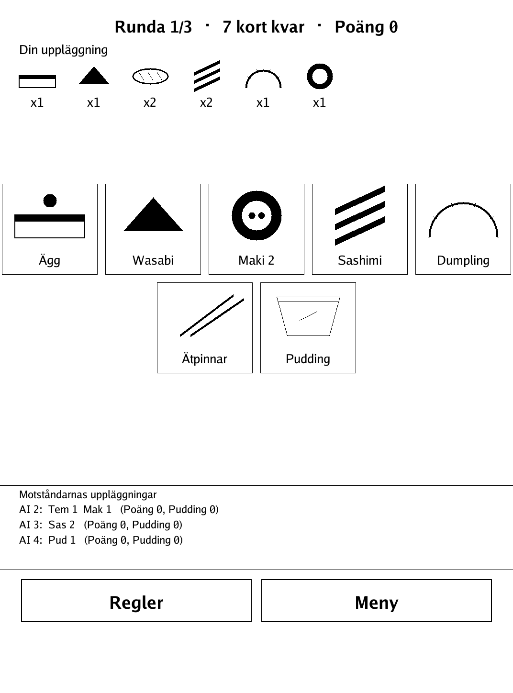
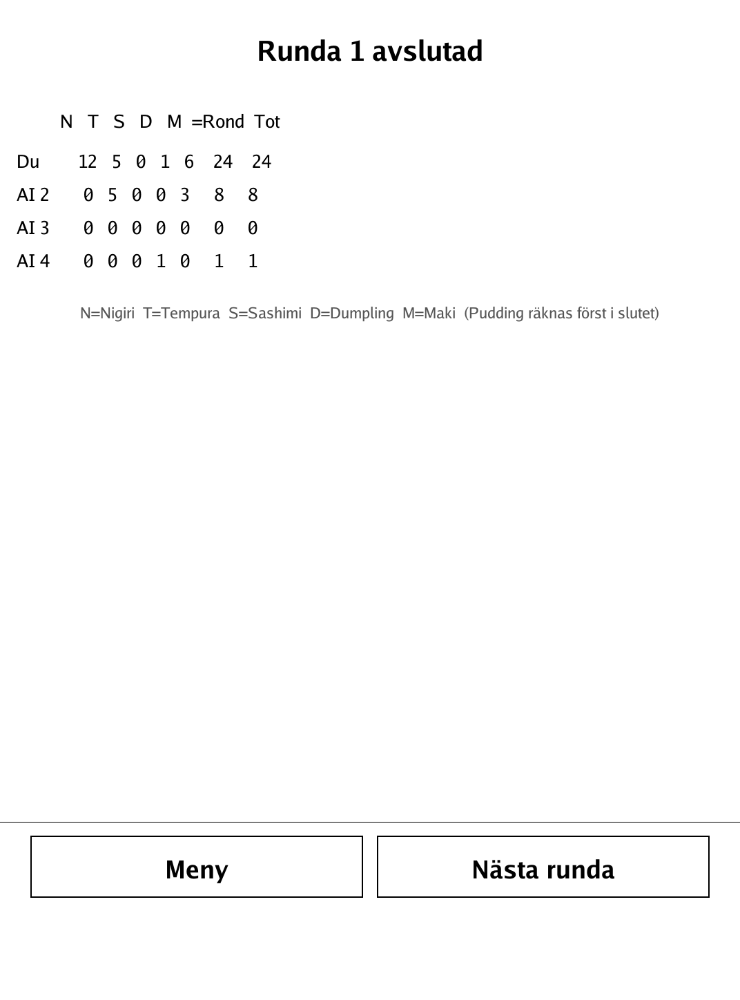
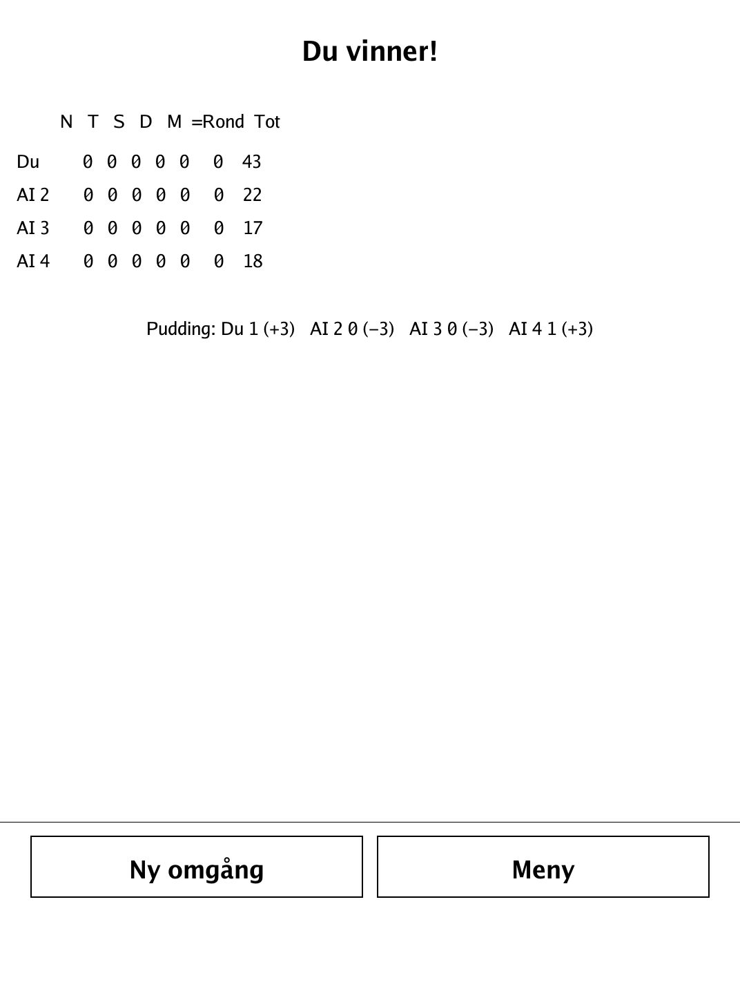

# Sushi (`sushi.app`)

A fast card-drafting game: keep a card, pass the rest, and build the tastiest tableau over three rounds.

<p align="center"></p>

## About

Sushi is a fast card-drafting game for the PocketBook Verse Pro, built on the `dennwc/inkview` SDK — the library's first card-drafting game rather than a board game. It is based on Sushi Go! (Gamewright), reimplemented here with original icons and a neutral name. One human plays against 1–4 AI opponents. The pure game logic (deck, drafting/passing engine, scoring, AI) lives in a separate, unit-tested `game` package. You only ever see opponents' laid-out cards, never their hands — just like at a real table.

## How to play

- **Goal:** most points after 3 rounds, plus Pudding.
- Everyone is dealt a hand. Each turn all players **simultaneously** keep one card and pass the rest to the next player, until every hand is empty; then the round is scored. Play 3 rounds.
- **Nigiri:** Egg 1p, Salmon 2p, Squid 3p.
- **Wasabi:** triples the next Nigiri you play **after** it (Egg 3p, Salmon 6p, Squid 9p). A Wasabi played after a Nigiri doesn't apply to it.
- **Tempura:** each **pair** scores 5p; a single leftover Tempura scores 0.
- **Sashimi:** each complete **set of 3** scores 10p; incomplete sets score 0.
- **Dumplings:** 1/2/3/4/5+ cards score 1/3/6/10/15p.
- **Maki rolls:** most Maki icons this round scores 6p, second-most scores 3p (split evenly, rounded down, on ties — and a tie for first cancels second place). With only 2 players there is no second-place award.
- **Chopsticks (Ätpinnar):** when you already have an unused Chopsticks card in your tableau, on a later turn you may take **two** cards instead of one; the Chopsticks card returns to your hand to be used again.
- **Pudding** is counted only **once**, at the end of the game: most Pudding gives +6, fewest gives -6 (split on ties). With only 2 players there is no -6 — only the leader gets the plus.

## Screenshots

<table>
  <tr>
    <td align="center"><br><sub>Your hand and tableau during the draft</sub></td>
    <td align="center"><br><sub>Round-end scoring breakdown</sub></td>
    <td align="center"><br><sub>Final ranking after three rounds</sub></td>
  </tr>
</table>

## Building

Built against the PocketBook Go SDK — see the repo [README](../README.md) and [POCKETBOOK_GAMEDEV_GUIDE.md](../POCKETBOOK_GAMEDEV_GUIDE.md).

```bash
docker run --rm -v "$PWD/sushi:/app" -w /app sunsung/pocketbook-go-sdk:latest build -o sushi.app .
```

Copy `sushi.app` into the device's `applications/` folder. Headless tests: `playtest/play.sh sushi`.

Based on Sushi Go! (Gamewright), reimplemented with original icons and a neutral name.
